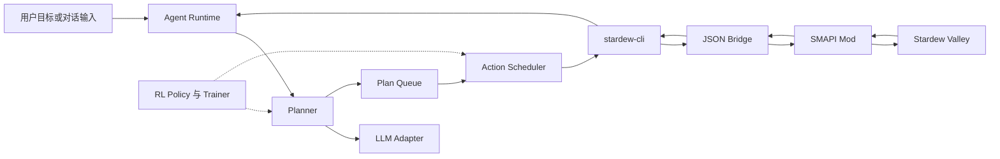
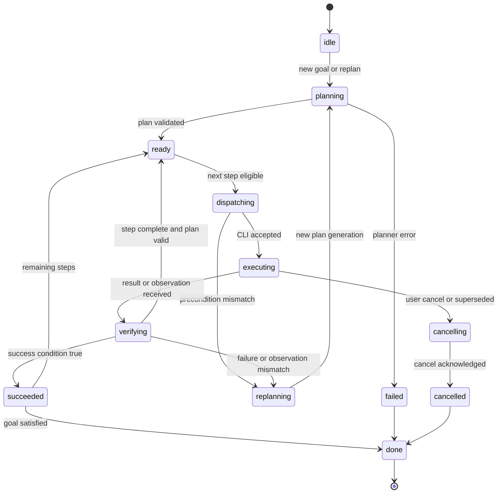
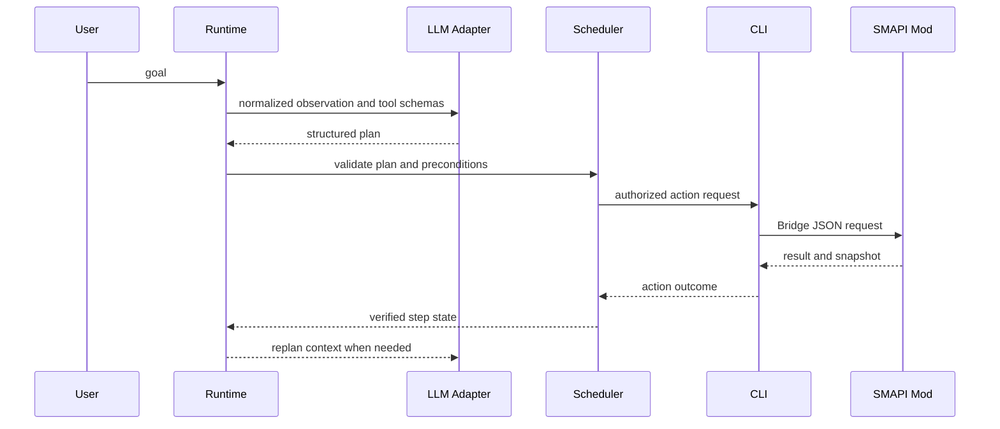

# LLM、Agent Runtime 与 RL 集成技术设计

## 文档信息

| 项目 | 内容 |
| --- | --- |
| **文档标题** | LLM、Agent Runtime 与 RL 集成技术设计 |
| **文档版本** | v0.1 |
| **创建日期** | 2026-08-26 |
| **更新日期** | 2026-08-26 |
| **文档类型** | 技术设计方案 |
| **关联文档** | [CLI 工具系统通信 Demo 技术实现方案](../demo/cli-file-bridge.md)、[任务循环与评测实现调研](../research/agent-loop-and-evaluation.md)、[LLM、规则与强化学习使用形态调研](../research/llm-and-rl-boundary.md) |

## 目录

- [文档定位](#文档定位)
- [背景与问题](#背景与问题)
- [范围与非目标](#范围与非目标)
- [当前系统边界](#当前系统边界)
- [总体架构](#总体架构)
- [Agent Runtime 核心模型](#agent-runtime-核心模型)
- [计划队列与动作调度](#计划队列与动作调度)
- [观察、验证与重规划](#观察验证与重规划)
- [LLM 接入层](#llm-接入层)
- [RL 接入边界](#rl-接入边界)
- [数据模型与持久化](#数据模型与持久化)
- [取消、安全与恢复](#取消安全与恢复)
- [分阶段实现](#分阶段实现)
- [验证与评测](#验证与评测)
- [未决问题](#未决问题)
- [相关文档](#相关文档)

## 文档定位

接入 LLM 和 Agent Runtime 会改变当前项目的调用边界、状态管理、动作执行和验证方式；如果后续再加入 RL，训练数据、策略推理和评测也会成为新的系统组成部分。本文单独描述这组变化，不把它们混入当前 CLI/Bridge/SMAPI Demo 的通信实现文档。

本文是 Stardew Agent 的设计文档，因此会明确记录当前设计、约束和实现阶段。现有参考项目的事实仍以 `doc/research/` 下的调研为准，不能把参考项目的做法直接视为本项目已经实现的能力。

当前设计的核心原则是：

- LLM 和 RL 都属于游戏进程外的策略层，不能直接修改游戏对象；
- Agent Runtime 是唯一的任务编排者，负责目标、计划、队列、重规划和恢复；
- CLI 是受控的动作工具接口，Bridge 是传输层，不承担任务规划；
- SMAPI Mod 负责游戏线程中的状态读取、动作执行和取消；
- 任意时刻，一个 Companion 只能有一个动作所有者，避免 LLM、RL 和用户同时写入动作；
- 计划可以批量生成，但动作必须根据最新观察逐步提交和验证。

## 背景与问题

当前 Demo 已经能够通过 CLI、JSON Bridge 和 SMAPI Mod 完成状态读取、Companion 动作、异步结果和取消。这个链路适合人、脚本或简单 Agent 调用，但还没有回答以下问题：

1. 用户目标如何转换成多个有前后关系的动作？
2. 为什么不能把每次观察都直接交给 LLM，再等待一个动作？
3. 已经生成的动作队列遇到地图变化、路径阻塞或动作失败时如何调整？
4. 长时间动作，例如 `move_to` 和 `follow`，如何与取消、超时、恢复关联？
5. LLM 生成的计划如何经过参数校验和权限控制后才能调用 CLI？
6. 如果以后使用 RL，训练、推理和 LLM 之间怎样分工，怎样避免影响当前游戏控制链路？

单次“观察 → LLM → 一个 CLI 命令”的循环存在三个实际问题：

- 每一步都调用模型，延迟和成本随游戏 tick 或观察频率增长；
- 模型只看到局部信息，无法稳定维护目标、前置条件和已完成步骤；
- 多个动作之间没有统一的取消、过期、重试和结果验证语义。

因此需要增加一个独立的 Agent Runtime。它不是另一个 Mod，也不是把 CLI 改造成 MCP Server，而是位于用户/模型与 CLI 之间的任务执行层。

## 范围与非目标

### 本文范围

- Agent Runtime 的职责、生命周期和状态机；
- 计划队列、单动作调度、结果验证和重规划；
- LLM 的结构化规划接口、工具授权和失败处理；
- RL 的训练、推理、轨迹和评测边界；
- Runtime 与现有 CLI/Bridge/SMAPI Mod 的接口关系；
- 分阶段实现和不依赖真实游戏的验证方式。

### 本文非目标

- 不在本文内选择具体 LLM 提供商、模型或提示词模板；
- 不在本文内确定 PPO、DQN、SAC 等具体 RL 算法；
- 不把 RL 训练代码放进 SMAPI Mod；
- 不把 Agent Runtime 的计划队列放进 Bridge 文件目录；
- 不要求当前 Demo 立刻支持完整自然语言对话；
- 不承诺静态设计可以替代 Windows + SMAPI + Stardew Valley 的运行验证。

## 当前系统边界

当前链路和未来 Runtime 的职责如下：

| 组件 | 当前或设计职责 | 不负责的事情 |
| --- | --- | --- |
| 用户/上层应用 | 提供目标、查看状态、发起取消 | 直接写 Bridge 或绕过 Runtime 抢占动作 |
| Agent Runtime | 管理目标、计划、队列、调度、验证和重规划 | 直接访问 Stardew Valley 对象 |
| LLM Adapter | 将结构化上下文交给模型并解析结构化输出 | 直接执行 CLI、直接写 Bridge |
| RL Policy/Trainer | 提供策略推理、训练和轨迹处理 | 在游戏线程训练或绕过调度器发动作 |
| CLI | 将已授权动作编码为 CLI 请求并读取结果 | 维护高层任务计划 |
| Bridge | 在 CLI 与 Mod 间传输请求、结果和快照 | 判断任务是否完成、生成计划 |
| SMAPI Mod | 读取游戏状态、执行动作、取消动作、写入结果 | 调用 LLM 或承担长期任务规划 |
| Stardew Valley | 提供真实游戏状态和运行时副作用 | 保证外部计划一定成功 |

Bridge 中的 `pending` 请求是传输层队列，不是 Agent Runtime 的战略队列。Runtime 不应把几十个未经验证的动作一次性写入 Bridge；它应保留自己的计划，再按动作所有权和前置条件逐个提交。

## 总体架构



一次完整的外部控制链路如下：

1. Runtime 接收用户目标，或者收到上一次动作验证失败产生的重规划请求。
2. Planner 读取 Runtime 的规范化状态、目标、可用工具和当前计划版本。
3. Planner 可以调用 LLM Adapter 生成一个有限长度的结构化计划，也可以使用规则或 RL Policy 产生计划步骤。
4. Scheduler 检查步骤的前置条件、动作所有权和参数约束，再通过 CLI 提交一个动作。
5. CLI 将请求写入现有 Bridge；SMAPI Mod 在游戏事件中领取并执行请求。
6. Mod 写入 action result 和最新 snapshot；CLI 读取后返回 Runtime。
7. Runtime 根据结果和新观察验证当前步骤。成功则继续下一步，不一致、失败或环境变化则使旧计划失效并重新规划。

LLM 和 RL 可以参与“产生或排序候选计划”，但不能直接拥有 Bridge 写权限。所有动作都必须经过 Scheduler 的授权。

## Agent Runtime 核心模型

Runtime 维护以下核心对象：

| 对象 | 作用 |
| --- | --- |
| `Goal` | 用户希望达到的高层目标、约束、优先级和截止条件 |
| `Plan` | 针对一个 Goal 的有序步骤集合和计划版本 |
| `PlanStep` | 一个可验证的有限动作，或一个需要持续维护的后台模式 |
| `ExecutionContext` | 当前游戏状态、动作所有权、活动请求和运行时配置 |
| `Observation` | 从 snapshot、action result 和即时 observe 归一化出的环境状态 |
| `ActionAttempt` | 一次实际 CLI 请求及其生命周期、重试和结果 |
| `ReplanRequest` | 触发重新规划的原因、关联步骤和观察证据 |
| `Policy` | 规则、LLM 或 RL 产生候选动作的统一策略接口 |

Runtime 自身使用有限状态机：



`plan_generation` 是计划的单调版本号。每个步骤和每次 CLI 请求都携带它；当 Runtime 重规划时，旧版本中尚未提交的步骤变为 `superseded`，旧动作如果已经运行则必须先执行取消或等待安全终止，不能继续无条件推进旧计划。

## 计划队列与动作调度

### 计划不是命令文件列表

Plan Queue 保存的是“还需要完成什么”以及“怎样判断完成”，不是已经写入 Bridge 的文件集合。一个步骤至少包含：

```json
{
  "plan_id": "plan-20260826-001",
  "plan_generation": 3,
  "step_id": "step-004",
  "kind": "action",
  "action": "move_to",
  "arguments": {
    "location": "Farm",
    "x": 18,
    "y": 12
  },
  "preconditions": ["actor_available", "target_tile_reachable"],
  "success_condition": "actor_at_target_tile",
  "observation_policy": "after_action",
  "replan_on": ["action_failed", "map_changed", "target_unreachable"],
  "status": "queued"
}
```

步骤状态至少包括 `queued`、`dispatched`、`running`、`verifying`、`succeeded`、`failed`、`cancelled`、`superseded` 和 `expired`。状态变更必须记录关联的 `request_id`，这样 Runtime 能将计划步骤和 CLI/Mod 的动作结果对应起来。

### 单动作调度

当前 Companion 控制模型是单 actor 单活动动作。Scheduler 因此遵循以下约束：

- 一个 actor 同时最多有一个 foreground action；
- `follow`、自动战斗等持续模式持有 actor lease，普通动作不能静默覆盖它；
- `cancel` 是控制路径，优先级高于普通动作；
- 动作收到“已受理”不等于动作完成，必须等终态结果或观察验证；
- 只有当前计划版本的步骤可以新建请求；
- 计划队列可以有多个步骤，但 Bridge 中同一 actor 的活动请求保持最小化。

这样既可以让 LLM 一次生成一小段计划，也保留根据游戏新状态调整后续步骤的空间。Runtime 不需要在每个游戏 tick 调用 LLM，也不能把所有未来动作当成不可改变的批处理任务。

### 持续模式

`follow` 不适合作为普通的“一次执行后结束”的队列步骤。Runtime 将它建模为一个带租约的 background mode：

- 启动步骤后，Mod 在游戏线程中持续维护跟随逻辑；
- Runtime 通过 snapshot 和 result 观察模式是否仍然有效；
- 需要执行 foreground action 时，先取消或暂停该租约；
- foreground action 完成后，可由后续计划显式恢复 follow；
- 地图切换、目标不可用或用户取消会触发模式终止和重新规划。

当前 `follow` 的具体寻路、跨地图 warp 和取消行为仍以 [Demo 技术实现方案](../demo/cli-file-bridge.md) 为准；本节只定义它进入 Runtime 后的生命周期。

## 观察、验证与重规划

### 观察分层

Runtime 不应把每一份高频快照原样发送给 LLM。观察分为三层：

1. **传输层观察**：CLI/Bridge 读取的完整 JSON 快照、结果和错误，用于恢复和审计。
2. **Runtime 状态缓存**：把位置、地图、时间、背包、动作状态、Companion 状态和最近变化归一化，供调度器即时判断。
3. **决策观察**：只向 Planner/LLM/RL 提供与当前目标相关的字段、状态增量、最近动作和失败原因。

高频状态可以持续写入本地缓存，但模型调用应由事件触发，而不是由每个游戏 tick 触发。以下事件通常需要重新验证或重规划：

- 当前动作终止、失败、超时或被取消；
- 目标位置、地图、游戏时间或可用资源发生相关变化；
- 路径不可达、目标消失、交互前置条件不满足；
- snapshot 与当前步骤的成功条件不一致；
- 用户发出新目标或明确取消；
- Runtime 重启后发现存在未对账的活动请求。

### 成功条件与验证

动作 result 只说明 Mod 对该请求的处理结果，不能替代任务层验证。例如 `move_to` 返回成功后，Runtime 仍应检查 actor 的地图和 tile；`use_tool` 返回成功后，可能还需要检查对象、库存、体力或目标状态是否变化。

每个步骤都要声明成功条件和必要的观察策略。验证结果分为：

- `confirmed`：结果和观察均满足成功条件；
- `rejected`：动作明确失败或参数无效；
- `uncertain`：没有足够信息判断，触发一次受限观察或重试；
- `invalidated`：环境变化使原步骤前提不再成立，需要重规划。

重规划请求必须带上原因和证据，例如 `action_failed`、`precondition_changed`、`map_changed`、`actor_busy`、`timeout` 或 `user_interrupt`。这样可以区分真正的环境变化与模型本身生成的无效计划。

### 队列调整示例

假设目标是“让 Companion 把指定作物放入箱子”：

1. Planner 生成“读取背包 → 移动到箱子 → 交互存放 → 验证库存”的短计划。
2. Scheduler 只提交读取背包，得到结果后更新 Runtime 状态。
3. 如果箱子所在地图变化或路径不可达，后续步骤不会继续写入 Bridge，而是标记为待重新验证。
4. 如果移动成功但箱子被占用，Runtime 保留目标，取消或结束当前动作，并携带“箱子不可用”的观察重新规划。
5. 如果用户在中途发出新目标，当前 generation 失效；活动动作先取消，未提交步骤标记为 `superseded`。

队列的价值在于保留目标上下文和候选后续步骤；重规划的价值在于不把这些步骤当成不可变命令。

## LLM 接入层

### 接口位置

LLM 通过 `LLM Adapter` 接入 Planner。Adapter 屏蔽模型提供商、请求认证、超时、重试、上下文长度和结构化输出差异；它不拥有 CLI 或 Bridge 的写权限。

输入上下文至少包括：

- 用户目标及明确约束；
- 当前 `plan_generation`、已完成步骤和活动动作；
- 与目标有关的规范化 Observation 和最近变化；
- 可用动作的名称、参数 Schema、前置条件和取消语义；
- 失败原因、重试次数、时间和资源限制；
- 当前持续模式及其 actor lease。

LLM 输出的是有限长度的结构化计划或重规划请求，不是任意 shell 命令，也不是 Bridge JSON 文件。输出经过 Schema 校验、动作白名单、参数范围和计划长度检查后，才能进入 Plan Queue。

### 工具契约

Runtime 可以把当前 CLI 动作暴露为工具 Schema，但工具调用需要经过以下步骤：



LLM 不应直接接触 `actions/pending`、`results` 或 snapshot 文件；否则模型可以绕过 Runtime 的计划版本、取消和安全检查。即使未来把 CLI 包装成函数调用接口，函数的最终执行者仍然是 Scheduler。

### 失败处理

LLM 请求需要独立于游戏动作设置超时和重试上限。以下错误不应直接重试游戏动作：

- 输出无法解析或不符合 Schema；
- 生成了不存在的 action 或越过参数范围；
- 计划引用了当前不可用的 actor、地图或资源；
- 模型上下文过期，无法对应当前 `plan_generation`；
- 同一原因连续触发重规划。

Runtime 应记录模型请求、输入摘要、输出 Schema 版本、拒绝原因和对应计划版本；生产环境中需要对凭据和敏感上下文做脱敏。

## RL 接入边界

### RL 可能承担的职责

RL 不必替代 LLM。它可以作为独立 Policy，在明确的状态和动作空间内承担以下一种职责：

| 位置 | 输入 | 输出 | 与 Runtime 的关系 |
| --- | --- | --- | --- |
| 高层候选选择 | 目标、资源、时间和任务进度 | 候选子目标或步骤排序 | 交给 Planner 生成或排序计划 |
| 局部动作策略 | 规范化局部地图、位置和目标 | 一个受限动作或方向 | 仍由 Scheduler 校验和提交 |
| 风险/价值估计 | 状态、候选步骤、历史结果 | 成功概率或价值 | 参与候选筛选，不直接发命令 |
| 离线策略实验 | 轨迹、Observation、Action、Result | checkpoint 或评测报告 | 不影响真实游戏运行时 |

算法、观测维度、奖励和训练数据尚未在本文固定。它们必须根据具体任务单独定义，不能因为使用了 RL 就把当前所有动作都改成低级按键控制。

### 训练与推理隔离

训练器、轨迹存储和实验评测运行在游戏进程外。SMAPI Mod 只提供运行时状态和动作结果，不负责采样梯度、保存 checkpoint 或修改策略参数。训练环境可以先使用 Fake Mod、确定性回放或独立模拟器，减少对 Windows 真机的依赖；真实游戏运行只承担推理和验证。

RL 的环境接口需要稳定的版本化契约：

- Observation 要区分全量字段、可选字段和事件增量；
- Action 要对应 CLI 的受限语义，而不是不可复现的文件操作；
- Result 要包含成功、失败、取消、超时和环境变化；
- 轨迹要记录计划版本、模型/策略版本、游戏版本和随机性来源；
- reset、存档和失败恢复要单独建模，不能假设真实游戏可以任意瞬间重置。

### LLM 与 RL 的仲裁

LLM 和 RL 不能同时直接给一个 actor 发动作。Runtime 需要为每次决策确定唯一的 policy owner：

- LLM 负责高层目标分解时，RL 可以提供局部候选或价值排序；
- RL 负责局部连续动作时，LLM 只更新高层目标和约束；
- 发生安全事件、取消或前置条件变化时，Scheduler 可以拒绝任意 policy 的输出；
- 一个活动 action 结束前，其他 policy 的候选只作为未执行建议保存，不得写入 Bridge。

这种边界允许后续逐步加入 RL，而不需要让训练代码侵入当前 CLI 或 Mod 的通信实现。

## 数据模型与持久化

Bridge 数据和 Runtime 数据分开保存。Bridge 继续保存请求、结果和 snapshot；Runtime 需要额外保存计划、目标和决策轨迹。建议的逻辑数据集合如下，具体物理目录可在实现阶段确定：

| 数据 | 最小内容 | 用途 |
| --- | --- | --- |
| Runtime state | 当前目标、计划版本、活动请求、actor lease | 进程重启后的恢复 |
| Plan record | 计划步骤、前置条件、成功条件、状态变化 | 队列管理和审计 |
| Observation cache | 规范化状态、时间戳、来源和增量 | 调度与模型上下文 |
| Action attempt | request ID、step ID、参数摘要、结果和耗时 | 结果对账、重试和指标 |
| Replan record | 触发原因、旧版本、新版本和证据 | 分析规划稳定性 |
| Trajectory | Observation、Action、Result、策略版本和任务结果 | RL/LLM 评测与训练 |

所有跨组件对象都需要版本字段和唯一 ID。Runtime 启动时应先读取自己的状态，再通过 CLI 查询活动 request 和最新 snapshot；如果发现活动请求已经终止，则补齐计划状态；如果状态无法对账，应取消过期动作并进入安全的 `replanning`，不能盲目重复提交。

## 取消、安全与恢复

取消是 Runtime 的控制路径，不是等待超时的副作用。完整取消流程为：

1. 用户、重规划或安全策略向 Runtime 发起 cancel。
2. Runtime 冻结当前计划 generation，阻止未提交步骤进入 Scheduler。
3. Scheduler 通过 CLI 提交对应 request 的 `cancel`。
4. Mod 在游戏事件中优先处理 cancel，停止路径控制器、持续模式或可取消动作。
5. Runtime 读取 cancelled result 和新 snapshot，确认 actor 已释放。
6. 原步骤记录为 `cancelled` 或 `superseded`，新目标才可以获得 actor lease。

安全约束至少包括：

- action 白名单和参数 Schema；
- 单计划最大步骤数、单步骤超时和重试上限；
- `move_to`、`follow` 等长动作必须可取消；
- LLM/RL 不得执行任意 shell、任意文件写入或未授权的 Bridge 操作；
- 计划版本过期后拒绝新动作；
- 游戏地图、actor、背包和工具前置条件在提交前再次检查；
- Runtime、CLI 和 Mod 的审计日志避免记录凭据，并保留 request/step/plan 的关联 ID。

Runtime 自身重启时不能假设上一次动作已经完成。恢复顺序应是“读取 Runtime state → 查询活动请求 → 查询最新 snapshot → 对账 → 取消或继续 → 必要时重规划”。

## 分阶段实现

这是 Agent Runtime 的实现边界，不代表当前 Demo 已经具备以下能力。每一阶段都应先在 Fake Mod 和 CLI 链路中验证，再进入 Windows 真机验证。

### Runtime 骨架

建立 Runtime 状态机、Goal/Plan/PlanStep 数据模型、plan generation、actor lease 和本地持久化。Planner 先使用固定规则或测试计划，不接入 LLM/RL。

### 队列与调度

接入当前 CLI 的 `status`、`observe`、action、`wait` 和 `cancel`；实现单动作提交、结果对账、成功条件、超时、取消、重规划和 Runtime 重启恢复。重点验证 Bridge 不是战略队列，以及旧计划不能继续污染新计划。

### LLM Adapter

定义结构化 Planner 输入输出、Schema 校验、工具白名单、模型请求超时和调用日志。先让 LLM 生成有限长度计划，再由 Runtime 决定是否、何时提交每个步骤。

### 轨迹与评测

统一记录 Observation、Action、Result、计划版本、策略版本和任务结果；增加 Fake Mod 的确定性回放、失败注入和指标统计。这样可以在没有 Windows 游戏的时期验证大部分 Runtime 逻辑。

### RL 实验接口

在 Runtime 契约稳定后，再确定 RL 的任务边界、Observation/Action 空间、奖励、数据集和训练环境。先做离线轨迹或确定性环境实验，策略推理必须通过 Scheduler，不直接改写 CLI/Bridge。

### 真实游戏验证

最后在 Windows + SMAPI + Stardew Valley 中验证地图切换、路径阻塞、长动作取消、存档恢复、持续模式和真实游戏副作用。真实游戏验证不能由 Fake Mod 或模型单元测试替代。

## 验证与评测

### Runtime 单元测试

- 计划生成、步骤状态转换和 generation 失效；
- 前置条件、成功条件和重规划原因；
- 单 actor lease、持续模式和 foreground action 冲突；
- action timeout、cancel、retry 和 superseded；
- Runtime 重启后的 request 对账和恢复；
- 非法 LLM/RL 输出的拒绝。

### CLI/Bridge 集成测试

- 计划步骤能正确映射为 CLI action；
- accepted、pending、succeeded、failed、cancelled 的生命周期正确；
- snapshot 与 action result 的 request/step/plan 关联正确；
- Fake Mod 注入路径阻塞、地图变化、busy 和超时后，Runtime 能停止旧队列并重规划；
- 不会因为高频 snapshot 产生无限计划或无限模型调用。

### 策略评测

至少分别记录：

| 指标 | 说明 |
| --- | --- |
| Goal success rate | 高层目标最终完成比例 |
| Action success rate | 动作通过 Mod 执行并满足验证条件的比例 |
| Replan rate | 每个目标和每个步骤触发重规划的次数 |
| Cancel latency | 发起取消到 actor 释放的时间 |
| Recovery rate | Runtime 重启或通信异常后的恢复比例 |
| Game-time cost | 游戏内时间消耗 |
| Wall-clock cost | 外部运行耗时 |
| LLM cost/latency | 模型调用次数、Token 或费用、延迟 |
| Policy quality | RL/规则策略在固定轨迹和任务上的结果 |

RL 训练指标与真实游戏任务成功率分开报告。独立模拟器或 Fake Mod 的结果只能证明策略接口和实验逻辑，不能证明真实游戏中的地图、碰撞、NPC、存档和副作用行为正确。

## 未决问题

以下问题会影响后续实现，但不应在没有实验或用户选择时假设答案：

- LLM 的提供商、模型、认证方式和部署位置；
- Runtime 与 CLI 是否共用一个发布目录，以及 Runtime 的分发方式；
- 用户对话入口是独立终端、游戏内输入框，还是另一个前端；
- 高层工具是否继续直接暴露低级 `move_to`，或增加“取物、浇水”等领域动作；
- 目标、成功条件和资源约束是否由用户显式提供，还是由 Planner 补全；
- RL 首个任务是局部导航、单一技能，还是高层任务排序；
- 是否需要独立的可重置模拟器，以及它和真实游戏状态的差异如何度量；
- Runtime 的本地状态、轨迹和模型调用日志的保留策略；
- 多 Companion 或多 actor 出现后，actor lease 是否扩展为资源调度器。

## 相关文档

- [Agent Runtime 架构选型与演进方案](architecture-options.md)：比较有限循环、计划队列、Behavior Tree/GOAP、图运行时、Durable Workflow、Skill Library 和 RL 接入方式。
