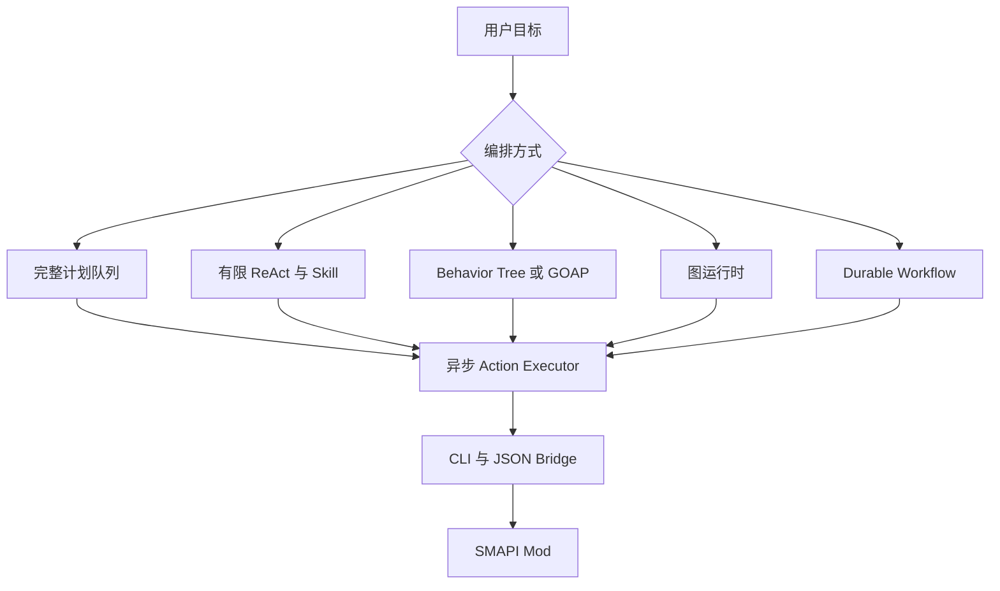
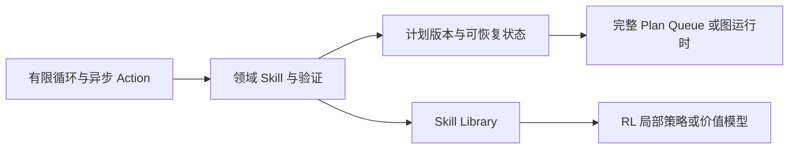

# Agent Runtime 架构选型与演进方案

## 文档信息

| 项目 | 内容 |
| --- | --- |
| **文档标题** | Agent Runtime 架构选型与演进方案 |
| **文档版本** | v0.1 |
| **创建日期** | 2026-08-26 |
| **更新日期** | 2026-08-26 |
| **文档类型** | 架构选型文档 |
| **关联文档** | [LLM、Agent Runtime 与 RL 集成技术设计](README.md)、[CLI 工具系统通信 Demo 技术实现方案](../demo/cli-file-bridge.md) |
| **参考资料** | Risk AF OnCall Agent、[ReAct](https://arxiv.org/abs/2210.03629)、[Voyager](https://voyager.minedojo.org/)、[LangGraph Persistence](https://docs.langchain.com/oss/python/langgraph/persistence)、[Temporal](https://docs.temporal.io/)、[Unreal Behavior Trees](https://dev.epicgames.com/documentation/en-us/unreal-engine/behavior-trees-in-unreal-engine) |

## 目录

- [文档定位](#文档定位)
- [选型问题](#选型问题)
- [当前约束](#当前约束)
- [可借鉴的实现](#可借鉴的实现)
- [候选方案总览](#候选方案总览)
- [方案 A：完整计划队列](#方案-a完整计划队列)
- [方案 B：有限 ReAct 与 Skill/Toolflow](#方案-b有限-react-与-skilltoolflow)
- [方案 C：Behavior Tree/GOAP 与 LLM 目标转换](#方案-cbehavior-treegoap-与-llm-目标转换)
- [方案 D：图运行时](#方案-d图运行时)
- [方案 E：Durable Workflow](#方案-edurable-workflow)
- [方案 F：Skill Library 与持续学习](#方案-fskill-library-与持续学习)
- [RL 的独立接入方式](#rl-的独立接入方式)
- [横向比较](#横向比较)
- [阶段性选型结论](#阶段性选型结论)
- [演进路径](#演进路径)
- [需要通过实验确认的问题](#需要通过实验确认的问题)

## 文档定位

接入 LLM、Agent Runtime 以及未来可能的 RL，会影响任务建模、动作执行、状态保存、模型调用和失败恢复。当前项目不应把“能让模型调用一个 CLI 命令”直接等同于“已经完成 Agent Runtime”。

本文提供多个可行架构的对比，并区分以下三个层次：

- **共同底座**：当前 CLI、JSON Bridge、SMAPI Mod、异步 action 和 cancel；
- **策略层**：规则、LLM、RL 或它们的组合；
- **编排层**：有限循环、计划队列、行为树、图运行时或 Durable Workflow。

本文的选型结论只针对当前阶段的落地方式。它不否定完整 Agent Runtime 作为长期目标；[LLM、Agent Runtime 与 RL 集成技术设计](README.md)中的完整计划、持久化和策略边界可以作为后续演进目标。

## 选型问题

需要回答的不是“LLM 能不能调用 CLI”，而是：

1. LLM 每次应该生成一个低级动作、一个高层技能，还是一组计划步骤？
2. `move_to`、`follow` 等长动作如何异步执行和取消？
3. 游戏状态变化后，已经产生的后续动作如何失效或调整？
4. 运行时重启后，怎样知道上一个动作是否已经产生游戏副作用？
5. 如何限制 LLM/RL 不能绕过校验直接写 Bridge？
6. 如何在没有 Windows 真机的时期，用 Fake Mod 验证大部分逻辑？
7. RL 是替代 LLM、补充 LLM，还是只负责局部策略？

## 当前约束

### 游戏与开发环境

- 当前控制对象是一个 `companion-1`，不是第二个联机客户端；
- Mod 是唯一可以直接访问 Stardew Valley 运行时的组件；
- CLI 通过 JSON Bridge 与 Mod 通信，Bridge 不是高层任务编排器；
- `move_to` 可能持续较长时间，`follow` 是持续模式；
- 所有 action 都需要异步受理、结果查询和 cancel；
- 开发机不能稳定运行游戏，Windows 真机验证间隔较长；
- 需要尽量通过 Fake Mod、协议测试和确定性回放减少真机验证次数。

### 不可妥协的运行时约束

- 同一个 actor 同时只能有一个动作所有者；
- LLM/RL 只能提交候选意图，不能直接写 Bridge 文件；
- 任何会产生游戏副作用的动作都必须可追踪到 request ID；
- 重规划不能自动重复一个可能已经执行过的非幂等动作；
- 取消、超时、失败和运行时重启必须有明确状态，而不能只靠进程是否退出判断；
- 模型调用不能绑定游戏 tick，必须由目标、动作结果或重要状态变化触发。

### 评价维度

候选方案从以下维度比较：

| 维度 | 关注点 |
| --- | --- |
| 落地成本 | 是否需要一次性实现大量 Runtime 基础设施 |
| 长动作支持 | 是否能自然处理 `move_to`、`follow` 和持续模式 |
| 动态调整 | 动作执行中或失败后是否容易重规划 |
| 可预测性 | 是否容易复现、调试和限制副作用 |
| 持久化 | 进程重启、暂停和恢复的能力 |
| 模型效率 | 是否避免每个 tick 或每个低级动作调用 LLM |
| 真机依赖 | 是否能在 Fake Mod 中验证主要逻辑 |
| RL 兼容性 | 是否能提供稳定的 Observation/Action/Result 边界 |
| 分发复杂度 | 是否要引入额外 Runtime、数据库或服务 |

## 可借鉴的实现

### Risk AF OnCall Agent：有限调查循环

Risk AF OnCall Agent 采用 Case 级有限循环，而不是长时间运行的游戏动作队列。每轮 LLM 根据压缩后的 Working Memory 和 Round Delta 决定下一步 Toolflow、Function 或 Direct Tool；执行结果写回 facts、evidence 和 execution log，再进入下一轮。它还设置了最大 LLM 轮次、模型超时/重试、工具注册表、`ExposeToLLM` 白名单、输入 Schema 和每个 Case 的持久化记录。

它的 Toolflow 是一个很有价值的抽象：LLM 选择高层流程，流程内部使用确定性的串行步骤和输入/输出契约。这个模式可以对应到 Stardew 的 Skill，但不能直接照搬同步执行方式，因为 Stardew action 可能在多个游戏 tick 中完成。

对 Stardew Agent 的可借鉴部分是：

- 用有限轮次控制 LLM 成本和失控范围；
- 用 Working Memory 和增量观察代替每次传递完整历史；
- 用 Tool/Skill Registry 控制哪些能力暴露给模型；
- 用结构化 Schema 约束模型输入和输出；
- 用 Case、request 和 execution 记录支持问题定位；
- 让流程内部的确定性逻辑处理重复性步骤。

不能直接复用的部分是：OnCall Toolflow 大多是请求后返回，而 Stardew 的动作需要独立的异步生命周期、取消和游戏状态验证。

### ReAct：按观察逐步决策

ReAct 将推理和行动交替进行，让模型根据外部环境返回的观察更新行动计划，而不是只生成一次静态答案。[ReAct 论文](https://arxiv.org/abs/2210.03629)报告了这种“推理—行动—观察”交替方式在交互任务中的使用方式。

它适合解释为什么 Stardew 不必一开始生成几十个低级动作：每个高层步骤完成后再基于新观察决定下一步即可。但 ReAct 本身不是持久化执行引擎，也没有自动解决长动作取消、动作幂等性或进程重启恢复。

### Voyager：技能库与环境反馈

Voyager 通过自动课程、可增长的 Skill Library 和迭代提示，让模型根据环境反馈和执行错误改进可复用技能。它选择代码作为动作空间，因为代码可以表达长时间且可组合的行为；成功技能可以被检索和复用。[Voyager 项目](https://voyager.minedojo.org/)、[Voyager 论文](https://arxiv.org/abs/2305.16291)

它对 Stardew 的启发不是直接让 LLM 生成可执行 C# 或 shell，而是把游戏能力提升为可复用的领域 Skill，例如 `water_all_crops`、`store_inventory` 和 `follow_player`。技能应由受控 Runtime 执行，模型只负责选择、组合或改进技能参数。

### LangGraph：图、checkpoint 与人工介入

LangGraph 将 Agent 执行表示为图，并在节点之间保存 checkpoint，支持线程状态、暂停、恢复、回放和分支；其 Human-in-the-loop 机制可以在工具执行前暂停，等待批准、修改或拒绝。[LangGraph Persistence](https://docs.langchain.com/oss/python/langgraph/persistence)、[LangGraph Human-in-the-loop](https://docs.langchain.com/oss/python/langchain/human-in-the-loop)

它适合需要对话线程、人工确认和复杂分支的 Agent。但 LangGraph 的回放会重新执行 checkpoint 之后的 LLM/API 节点，因此 Stardew 的非幂等游戏动作不能简单地当作普通节点重放，必须额外记录动作提交和结果对账状态。

### Temporal：持久化 Workflow

Temporal 将长流程建模为可恢复的 Workflow，目标是让应用在崩溃、网络故障或基础设施中断后继续执行。[Temporal 文档](https://docs.temporal.io/)

它适合多小时、多天、定时器、外部信号和多实例协调，但会增加独立服务、Worker 和部署配置。对于当前单机游戏控制，它更像未来需要高可靠常驻运行时后的选项，而不是第一版依赖。

### 游戏 AI：Behavior Tree 与 GOAP

Behavior Tree 通常由条件、控制流和任务节点组成，并把环境状态放在 Blackboard 中。Unreal 的官方文档展示了 Blackboard 保存状态、Behavior Tree 决定分支、Task 节点执行行为的组织方式。[Unreal Behavior Trees](https://dev.epicgames.com/documentation/en-us/unreal-engine/behavior-trees-in-unreal-engine)

GOAP 则通过目标、前置条件和动作效果搜索可行行动序列。两者都更偏确定性游戏行为系统，适合处理移动、战斗、浇水、收获等有明确状态和前置条件的技能。它们不能自动理解开放式自然语言，但可以让 LLM 只负责将用户目标转换成受控目标或参数。

## 候选方案总览



所有候选方案都应复用当前 CLI、Bridge 和 Mod。差异主要在 Runtime 如何表示目标、如何产生后续步骤、怎样持久化以及怎样处理重启。

## 方案 A：完整计划队列

### 结构

LLM 或其他 Planner 一次产生有限长度的 Plan。Plan 包含多个带前置条件、成功条件、重试策略和重规划条件的 PlanStep。Scheduler 逐个提交动作，并在每个动作完成后验证；计划版本变化时，旧步骤失效。

### 对当前项目的适配

- `move_to` 是一个异步 PlanStep；
- `follow` 是持有 actor lease 的长期模式；
- 每个步骤有 `plan_id`、`step_id`、`generation` 和 `request_id`；
- Bridge 只接收当前已授权的少量请求；
- Runtime 重启后通过 action result 和 snapshot 进行对账。

### 优点

- 长任务的结构最清楚；
- 计划、步骤、取消、重试和审计可以统一建模；
- 适合未来多 actor、多任务和跨会话恢复；
- 对 RL 轨迹记录和离线评测比较完整。

### 风险与成本

- 需要较多基础状态模型和持久化代码；
- Stardew 的状态变化会让预先生成的后续步骤快速过期；
- 需要解决“动作已提交但 Runtime 尚未记录结果”的崩溃窗口；
- 在领域 Skill 和成功条件尚未稳定前，Plan Schema 容易反复修改。

## 方案 B：有限 ReAct 与 Skill/Toolflow

### 结构

Runtime 每轮只维护一个目标、一个活动 Skill 或 Action，以及压缩后的 Working Memory。LLM 在目标开始、动作完成、动作失败或重要状态变化时决定下一步；Skill 内部可以串行执行多个确定性子步骤。

```text
goal
  ↓
compact observation
  ↓
LLM/Rule 选择一个 Skill
  ↓
Skill Runner 执行一个或多个确定性步骤
  ↓
Async Action Executor 执行当前游戏动作
  ↓
result + snapshot
  ↓
verify 或 replan
```

### 队列语义

该方案不维护很长的战略命令队列，只维护：

- `current_goal`；
- `current_skill`；
- `in_flight_action`；
- 可选的少量候选后续意图；
- 最近观察、结果和失败原因。

Skill 内部步骤也不能绕过 Scheduler。它们只是比 CLI 低级动作更高层的确定性编排，不是给 LLM 一个任意执行脚本的入口。

### 优点

- 改动量适中，和现有 CLI/Bridge 兼容；
- 天然支持根据观察逐步调整；
- LLM 调用次数少于每个 tick 一次，但比完整静态计划灵活；
- 适合先用 Fake Mod 验证；
- 可以逐渐积累领域 Skill，并在以后升级为完整 Plan。

### 风险与成本

- 超长任务可能需要更多决策轮次；
- 跨进程恢复能力需要额外补充；
- Skill 的成功条件、子步骤和取消语义需要单独设计；
- 如果没有轮次、时间和失败预算，可能陷入反复重规划。

## 方案 C：Behavior Tree/GOAP 与 LLM 目标转换

### 结构

LLM 不负责持续控制，而是将用户自然语言转换为有限目标、约束或参数。Behavior Tree/GOAP、Skill Runner 和游戏状态负责后续执行。

例如：

```text
用户：帮我把成熟作物都收了

LLM 输出：
  goal = harvest_ready_crops

确定性执行器：
  扫描成熟作物
  选择下一个目标
  移动
  收获
  验证
  继续或结束
```

### 优点

- 游戏行为可预测、可调试、可重放；
- LLM 不参与低级动作，模型错误影响范围更小；
- 对循环、优先级、打断和持续模式表达自然；
- 运行成本低，真实游戏验证重点集中在确定性技能。

### 风险与成本

- 需要建设较完整的 Stardew 领域动作、条件和状态黑板；
- 新能力需要新增节点、规则或 Skill；
- 开放式任务和模糊目标仍需要 LLM 补充；
- GOAP 的状态效果和行为树节点都需要真实游戏验证。

## 方案 D：图运行时

### 结构

把“理解目标、规划、执行、观察、验证、请求用户确认、重规划”表示成图节点和边。每个节点可以是规则、LLM、Skill 或 Action Executor；运行时在节点边界保存状态。

### 优点

- 分支、循环、人工确认和错误转移表达清晰；
- 可以对运行过程做 checkpoint、可视化和调试；
- 对多角色或多专家协作有扩展空间；
- 适合把当前方案中的状态机正式化。

### 风险与成本

- 引入图框架会带来新的状态语义和依赖；
- 图节点中的游戏副作用仍然需要 request 对账和幂等保护；
- 回放并不等于安全重试，不能重复提交已经产生副作用的动作；
- 目前单 Companion 的任务规模还不足以证明图框架的必要性。

### 适用条件

当项目需要对话暂停、人工批准、跨会话恢复、多种异常分支，或手写状态机开始难以维护时，图运行时才更有价值。

## 方案 E：Durable Workflow

### 结构

使用专门的 Workflow Runtime 管理长流程、计时器、外部信号、重试和恢复。游戏动作作为外部 Activity 或受控任务，SMAPI Mod 仍然只执行游戏内逻辑。

### 优点

- 进程崩溃、网络中断和长时间等待有成熟的恢复模型；
- 适合无人值守、多游戏实例和跨天任务；
- 取消、信号、定时任务和历史记录有明确抽象。

### 风险与成本

- 需要额外服务、Worker、部署和版本管理；
- 本地单机游戏的安装和分发复杂度明显增加；
- Workflow 重试语义不能直接等同于游戏动作重试；
- 需要解决游戏进程、Bridge 和 Workflow 状态之间的最终一致性。

### 适用条件

当 Agent 变成独立常驻服务，需要跨多个游戏实例或跨较长时间可靠运行时，再考虑它更合适。

## 方案 F：Skill Library 与持续学习

### 结构

将验证成功的高层 Skill、输入条件、适用环境、执行轨迹和失败经验保存下来。新任务先检索相似 Skill，再由 LLM 组合、参数化或改进；执行结果经过验证后才进入库。

### 优点

- 相同任务不必反复从零规划；
- 长期运行后可以减少 LLM 调用；
- Skill 可以组合成更复杂行为；
- 适合记录“这个存档、地图或资源条件下怎样做成功”。

### 风险与成本

- Skill 版本、适用条件和失效条件需要管理；
- 错误 Skill 不能因为执行过一次就永久复用；
- 如果 Skill 是模型生成代码，需要沙箱和权限控制；
- 需要较多成功/失败轨迹后才有实际收益。

### 与当前项目的关系

Skill Library 可以叠加在方案 B 或 C 之上，不必单独成为第一层 Runtime。第一版可以只保存结构化 Skill 元数据和执行结果，不保存任意可执行代码。

## RL 的独立接入方式

RL 不应作为上述编排方案的替代项，而应作为可插拔 Policy。至少有三种接入位置：

| 接入位置 | RL 输出 | 适合的问题 |
| --- | --- | --- |
| 高层选择 | 选择 Skill、子目标或步骤排序 | 任务优先级和资源安排 |
| 局部控制 | 方向、目标 tile 或有限动作 | 导航、避障和局部移动 |
| 价值估计 | 候选动作的成功概率或价值 | 对 LLM/规则候选排序 |

RL 训练应在游戏进程外进行，先使用 Fake Mod、确定性回放或独立模拟器。真实游戏阶段只加载策略做推理，策略输出仍然经过 Scheduler、参数检查、actor lease 和 cancel。

当前不建议直接采用端到端 RL 控制整个 Stardew Agent，原因是：

- 真实游戏奖励难以定义，很多目标是长期、稀疏且多目标的；
- 存档、地图、NPC、随机事件和游戏时间使 reset 成本高；
- 单纯低级动作策略难以解释任务失败原因；
- 在没有稳定 Observation/Action/Result 契约前，训练数据无法稳定复用。

## 横向比较

| 方案 | LLM 决策粒度 | 长动作与取消 | 动态重规划 | 可预测性 | 持久化 | 初始成本 | 当前匹配度 |
| --- | --- | --- | --- | --- | --- | --- | --- |
| A 完整计划队列 | 多个 PlanStep | 强 | 强 | 中 | 强 | 高 | 中 |
| B 有限 ReAct/Skill | 一个 Skill 或一步 | 强 | 强 | 中高 | 中 | 中 | 高 |
| C Behavior Tree/GOAP | 目标或参数 | 强 | 中高 | 高 | 中 | 中高 | 高 |
| D 图运行时 | 图节点/工具调用 | 强 | 强 | 中 | 强 | 高 | 中 |
| E Durable Workflow | Workflow/Activity | 强 | 强 | 高 | 很强 | 很高 | 低到中 |
| F Skill Library | Skill 选择/组合 | 依赖底层执行器 | 强 | 中 | 中 | 中高 | 中长期 |
| RL Policy | 候选、局部动作或价值 | 依赖底层执行器 | 依赖 Runtime | 低到中 | 依赖训练系统 | 高 | 后续 |

这张表是当前项目约束下的工程判断，不是对所有 Agent 或游戏项目的普遍排名。方案之间也可以组合：B 可以使用 C 的确定性 Skill，A 可以在后续吸收 F 的技能库，D/E 可以替换 A/B 的持久化与执行外壳。

## 阶段性选型结论

### 当前落地选择

当前阶段采用“方案 B 为主、方案 C 为技能实现方式”的组合：

> 有限 ReAct/Toolflow 循环 + 确定性 Skill + 异步单动作执行器。

具体含义：

- Runtime 先维护目标、Working Memory、当前 Skill 和活动 Action；
- LLM 只在目标开始、动作完成、失败、重要状态变化或用户干预时调用；
- LLM 输出有限长度的结构化 Skill/Action 意图，不直接输出 Bridge 文件；
- Skill 内部步骤串行执行，所有低级动作仍经 Scheduler；
- `move_to` 由异步 Action Executor 执行，期间不调用 LLM；
- `follow` 作为 background mode 管理，不当成普通短动作；
- 每个动作结果都要和 snapshot 一起验证；
- 失败或状态不一致时，只丢弃当前 Skill 的未执行后续步骤，再重新规划；
- 先不引入 LangGraph、Temporal 或 RL 训练依赖。

### 为什么不是完整计划队列

完整 Plan Queue 的边界仍然保留，但暂不作为第一版核心，原因是：

- 当前只有一个 actor，调度资源很少；
- 游戏状态和 Skill 成功条件尚未稳定；
- 长动作的异步结果和取消才是当前更基础的问题；
- 用 Fake Mod 可以先验证有限循环，而不需要先完成完整持久化系统；
- 过早生成长计划会放大状态过期和重复副作用问题。

这不是否定队列，而是把队列推迟到“Skill 和动作契约稳定后”。届时可以将当前 Skill 的已知步骤提升为 PlanStep，并沿用 plan generation、request 对账和重规划机制。

### 为什么 RL 不进入当前核心

RL 目前缺少稳定的训练环境、奖励、reset 和轨迹规模。先把 Runtime 的 Observation/Action/Result 以及成功条件记录稳定，才能判断 RL 应该优化导航、技能选择还是资源安排。RL 接入点先保留为 Policy 接口，不影响 CLI、Bridge 和 Mod。

## 演进路径



### 阶段一：验证最小闭环

- 增加一个独立 Agent Session；
- 使用固定规则或测试 Planner，不接入真实 LLM；
- 只允许一个活动 action；
- 支持 action accepted、pending、succeeded、failed、cancelled；
- 使用 Fake Mod 验证 `move_to`、`observe`、`cancel` 和状态变化。

### 阶段二：增加 Skill/Toolflow

- 把多个低级 CLI 动作组合成有限的确定性 Skill；
- 为 Skill 定义输入、前置条件、输出和成功条件；
- Skill 每个子步骤都记录 request ID 和结果；
- 验证路径阻塞、地图变化、busy 和用户中断。

### 阶段三：接入 LLM

- 只暴露白名单 Skill 和只读观察工具；
- 使用结构化输出和 Schema 校验；
- 设置每个目标的模型调用轮次、时间和失败预算；
- 让 LLM 选择 Skill，而不是直接生成任意动作文件；
- 增加模型调用、拒绝、重规划和成功率指标。

### 阶段四：补充可恢复状态

- 持久化 Goal、当前 Skill、活动 Action 和最近观察；
- Runtime 重启时查询 CLI result 和 snapshot 对账；
- 为未确认的动作设计安全恢复策略；
- 当 Skill 数量和任务长度增加后，再引入 plan generation 和小型 Plan Queue。

### 阶段五：按需要引入图或 Durable Workflow

- 如果只需要本地单机运行，继续使用轻量本地状态；
- 如果需要复杂分支、人工审批和跨会话恢复，评估图运行时；
- 如果需要多实例、跨天、无人值守和高可靠恢复，评估 Durable Workflow；
- 外部框架只能替换编排和持久化层，不能替换游戏动作对账。

### 阶段六：RL 实验

- 从离线轨迹和确定性回放开始；
- 选择单一问题，例如局部导航或 Skill 排序；
- 定义独立的 Observation、Action、Reward 和 reset；
- 只让 RL 通过 Policy 接口产生候选；
- 通过统一 Scheduler 执行，不能直接绕过 Runtime。

## 需要通过实验确认的问题

- 一个 Skill 包含多少个动作后，LLM 调用次数和失败恢复达到平衡；
- `move_to` 的结果和 snapshot 是否足以判断“真正到达”；
- 游戏暂停、菜单、地图切换时，Action Executor 的状态如何变化；
- Runtime 重启发生在 request 写入前、写入后但 Mod 未领取、或 Mod 已执行但 result 未写入时，分别怎样恢复；
- `follow` 与前台 Skill 的暂停、取消和恢复语义；
- Skill 的成功条件是否需要 Mod 提供领域级验证字段；
- Fake Mod 的状态模型与真实游戏之间哪些差异会影响 LLM 或 RL；
- 首个 RL 任务是否具备可定义、可重复且成本可接受的奖励；
- 是否真的需要跨天或多实例常驻运行，从而值得引入 Durable Workflow；
- Skill Library 的检索依据、版本失效条件和错误技能回滚方式。
