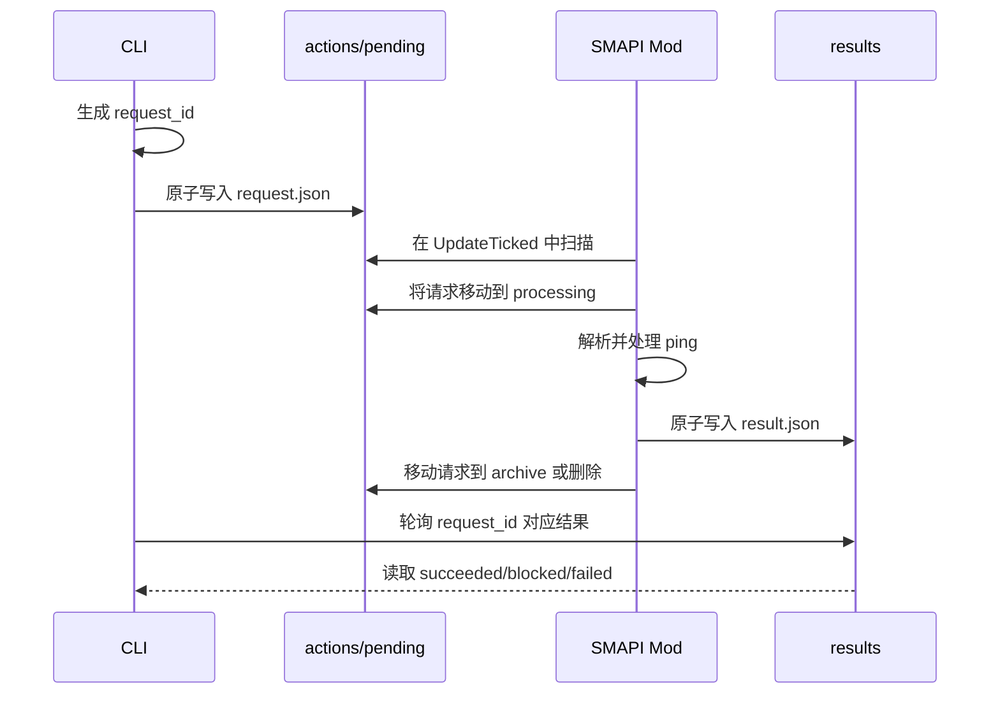
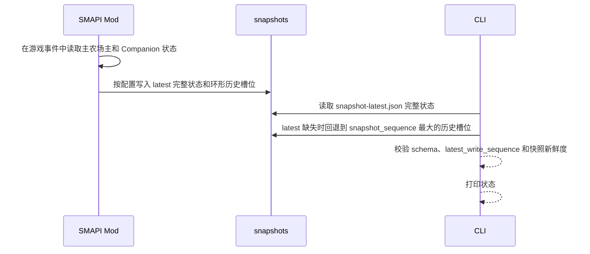
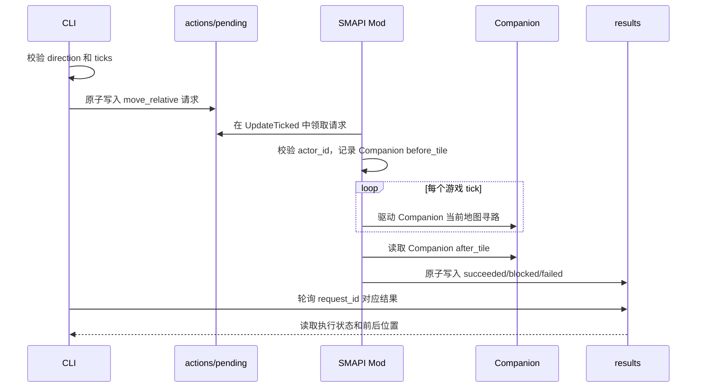

# CLI 工具系统通信 Demo 技术实现方案

## 文档信息

| 项目         | 内容 |
| ------------ | ---- |
| **文档标题** | CLI 工具系统通信 Demo 技术实现方案 |
| **文档版本** | v0.6 |
| **创建日期** | 2026-08-23 |
| **更新日期** | 2026-08-24 |
| **文档作者** | 项目维护者 |
| **文档类型** | 技术实现方案 |
| **参考资料** | [SMAPI Mod 结构](https://wiki.stardewvalley.net/Modding:Modder_Guide/APIs/Mod_structure)、[SMAPI Mod package](https://github.com/Pathoschild/SMAPI/blob/develop/docs/technical/mod-package.md)、[StardewMCP](https://github.com/Hunter-Thompson/stardew-mcp/tree/3ca54bbfc1d446eeb06d822a74c92cd14df82b93)、[StardewValley-MCP](https://github.com/amarisaster/StardewValley-MCP) |

## 目录

- [目标](#目标)
- [当前设计](#当前设计)
- [数据交互链路](#数据交互链路)
- [范围与非目标](#范围与非目标)
- [目录结构](#目录结构)
- [GitHub Actions 产物与配置](#github-actions-产物与配置)
- [通信目录与文件语义](#通信目录与文件语义)
- [协议定义](#协议定义)
- [读写流程](#读写流程)
- [CLI 设计](#cli-设计)
- [SMAPI Mod 设计](#smapi-mod-设计)
- [错误、超时与崩溃恢复](#错误超时与崩溃恢复)
- [Mac 与 Windows 的验证方式](#mac-与-windows-的验证方式)
- [实现顺序](#实现顺序)
- [验收标准](#验收标准)
- [后续扩展](#后续扩展)

## 目标

本 Demo 用一个外部 CLI、文件桥接和 SMAPI Mod 打通一条最小双向链路：

```text
CLI 写入请求
        ↓
SMAPI Mod 读取请求
        ↓
SMAPI Mod 写入结果和状态
        ↓
CLI 读取结果和状态
```

Demo 成功后，可以证明外部 CLI 与游戏 Mod 之间具备以下能力：

- CLI 能写入一条命令；
- Mod 能在游戏 tick 中读取并处理命令；
- Mod 能写回命令结果；
- Mod 能持续写出游戏状态快照；
- CLI 能读取最新状态；
- CLI 能发起一个受限的 Companion 移动操作，并读取执行结果；
- Mod 能在游戏内创建一个由可见 NPC 和 shadow farmer 组成的 Companion；
- Companion 与主农场主保持在同一地图，避免把未验证的后台地图运行当作 Demo 能力；
- 请求 ID 能将请求和结果关联起来。

## 当前设计

### 组件

| 组件 | 语言/运行位置 | 职责 |
| --- | --- | --- |
| `stardew-cli` | 游戏外 CLI（本 Demo 用 Rust 实现） | 提供命令行入口，写请求，读结果和状态 |
| `StardewAgentMod` | C#，SMAPI 游戏进程内 | 读取请求，访问游戏 API，写结果和状态 |
| Bridge 目录 | 游戏外可访问的共享目录 | 作为两个进程之间的文件通信边界 |

CLI 不直接操作游戏进程，也不使用 MCP、WebSocket 或 Python Client。CLI 的用户可以是人、脚本、LLM Agent 或 RL 环境；这些调用方不属于本 Demo 的实现范围。

## 数据交互链路

游戏数据不直接从游戏进程流入 CLI。游戏内的真实状态只存在于 Stardew Valley 运行时，SMAPI Mod 是唯一可以在游戏上下文中读取和改变这些状态的适配层；CLI 只读写 Bridge 中的协议文件。

完整链路如下：

```mermaid
flowchart LR
    subgraph CLI[CLI 进程]
        C1[命令参数或上层调用]
        C2[协议编码/解码]
        C3[终端输出或上层结果]
    end

    subgraph BRIDGE[Bridge 文件]
        A["actions/pending/*.json<br/>action.request"]
        R["results/*.json<br/>action.result"]
        S["snapshots/*.json<br/>snapshot"]
    end

    subgraph GAME[SMAPI Mod 与游戏进程]
        E[SMAPI GameLoop 事件]
        G["游戏运行时状态<br/>主农场主、Companion、地点、时间等"]
        P["状态投影<br/>生成最小 snapshot"]
        D[请求领取与校验]
        X["Companion 动作执行器<br/>调用游戏 API"]
    end

    C1 -->|move/ping| C2
    C2 -->|写入请求| A
    A -->|Mod 领取| D
    D -->|move_relative(actor_id)| X
    D -->|ping 或失败| R
    X -->|执行 Companion 动作| G
    E --> P
    P -->|读取| G
    G -->|动作生效后的新状态| P
    P -->|写入状态快照| S
    X -->|写入执行结果| R
    R -->|CLI 轮询 request_id| C2
    S -->|status/watch 读取最新快照| C2
    C2 --> C3
```

这条链路中有三类不同的数据，不能混为一谈：

| 数据 | 谁产生 | 表示什么 | CLI 如何使用 |
| --- | --- | --- | --- |
| 游戏运行时状态 | Stardew Valley | 当前真实的玩家、世界和游戏进度 | CLI 不直接读取，只能通过 Mod 投影获取 |
| `snapshot` | Mod 从游戏状态读取后生成 | 某一时刻的只读状态快照，可能因写出和轮询存在延迟 | `status` 读取最新一份，`watch` 持续读取变化 |
| `action.request` | CLI 根据命令参数生成 | 希望 Mod 执行的 Companion 动作，不代表动作已经成功 | `ping`、`move` 写入 `actions/pending/` |
| `action.result` | Mod 执行动作后生成 | 对某个 `request_id` 的执行结果和观测值 | CLI 等待并读取结果；`move` 读取前后 tile |

因此，CLI 与游戏数据的交互不是“CLI 修改 JSON 就修改了游戏状态”。以 `move` 为例，只有下面的闭环完成后，才算一次有效写操作：

1. CLI 将方向和 tick 数编码为 `action.request`；
2. Mod 在 `UpdateTicked` 中领取并校验请求；
3. Mod 根据 `actor_id` 找到 Companion，并调用其游戏内动作执行器；
4. 游戏运行时处理碰撞和移动，产生新的 Companion 位置；
5. Mod 读取执行前后的 Companion tile，写入 `action.result`；
6. Mod 后续生成的 `snapshot` 反映新的 Companion 状态，CLI 读取结果或快照进行确认。

`action.result` 是动作结果的即时观测，`snapshot` 是之后某个时刻的状态投影：前者用于判断这次请求发生了什么，后者用于获取 CLI 当前可见的游戏状态。`ping` 只验证 Mod 是否能够收发消息，不读取或改变实际游戏数据。

### 文件桥接的定位

文件队列不是 SMAPI 规定或推荐的外部通信方式。SMAPI 的官方资料主要定义 Mod 的生命周期、GameLoop 事件、游戏 API 和 Mod 打包方式，并没有规定外部 CLI 必须使用某一种 IPC。当前 Demo 采用文件队列，是项目层面的临时通信实现，原因是：

- CLI 和 Mod 之间不需要共享内存或进程内调用；
- 每条请求和结果都能保留为可检查的 JSON 文件；
- Mac 上可以用 Fake Mod 进程测试 CLI，不需要启动游戏；
- Windows 上只需要验证 Mod 是否能正确读写同一目录；
- 后续可以在不改变 CLI 命令和 JSON 模型的情况下替换底层传输。

文件队列的代价是轮询延迟、文件清理、重复处理和并发读写需要自行管理。Demo 通过唯一请求文件、原子写入、请求状态目录和超时来控制这些问题。

它适合验证低频控制命令和协议形状，不代表最终运行时一定继续使用文件通信。如果后续需要更低延迟、更高频率或跨机器通信，应在保持命令和消息模型稳定的前提下，单独比较本机 socket、命名管道或持久服务等传输方式；这些不属于本 Demo 的验证范围。

## 范围与非目标

### Demo 范围

Demo 实现以下四个 CLI 命令：

| 命令 | CLI 行为 | Mod 行为 |
| --- | --- | --- |
| `status` | 读取最新状态快照并打印 | 持续写入主农场主和 Companion 状态 |
| `ping` | 写入请求并等待结果 | 读取请求并写回 `pong` |
| `move` | 写入 Companion 移动请求并等待结果 | 在游戏 tick 中控制 `companion-1` 在当前地图内移动，并写回前后位置 |
| `watch` | 持续读取并打印状态变化 | 持续写入状态快照 |

`status` 验证 Mod → CLI 的读取链路，`ping` 验证 CLI → Mod → CLI 的双向链路，`move` 验证一条有实际游戏副作用的写命令，`watch` 验证状态持续写出和外部读取。

`move` 的协议固定使用 `actor_id=companion-1`。主农场主的状态只作为环境状态被读取，不是本 Demo 的动作目标。

### 非目标

- 不实现跨地图自主旅行、工具使用、菜单交互或其他复杂真实游戏动作；
- 不接入 LLM、MCP、RL 或自然语言解析；
- 不实现全量游戏状态序列化；
- 不支持多个 CLI 同时写入同一个 Bridge 目录；
- 不把文件队列包装成网络服务；
- 不处理原版多人 Farmhand、多人游戏和跨机器通信；
- 不在 Demo 阶段引入全局守护进程或复杂文件监听库。

## 目录结构

建议把 CLI 和 SMAPI Mod 分成两个独立工程，二者只通过协议 JSON 协作；本 Demo 的 CLI 工程使用 Rust 实现：

```text
stardew-agent/
├── .github/
│   └── workflows/
│       └── build-demo.yml
├── Directory.Build.props
├── cli/
│   ├── Cargo.toml
│   ├── src/
│   │   ├── main.rs
│   │   ├── fake.rs
│   │   ├── bridge.rs
│   │   └── protocol.rs
│   └── tests/
│       └── bridge_tests.rs
├── smapi-mod/
│   ├── StardewAgentMod.csproj
│   ├── manifest.json
│   └── ...
├── doc/
│   └── demo/
│       └── cli-file-bridge.md
```

CLI 的 `protocol.rs` 和 C# Mod 中的 DTO 必须依据同一份协议字段维护。Demo 阶段不生成跨语言代码，先通过 Rust 集成测试和实际 JSON 文件读写保证字段一致。

## GitHub Actions 产物与配置

GitHub Actions 负责生成 Windows CLI 和 SMAPI Mod 产物，但不替代 Windows 真游戏验证。Mod 的 C# 程序集通常可以跨平台编译；CLI 运行在游戏所在的 Windows 环境，因此只发布 Windows 二进制。Mac 仍可从源码运行 Rust 测试和 Fake Mod，不作为发布产物。

仓库根目录的 `Directory.Build.props` 只配置构建产物位置和 CI 行为：

```xml
<Project>
  <PropertyGroup>
    <ModZipPath>$(MSBuildThisFileDirectory)_releases</ModZipPath>
    <EnableModDeploy>false</EnableModDeploy>
  </PropertyGroup>
</Project>
```

`EnableModDeploy=false` 防止 CI 尝试把 Mod 复制到构建机的真实游戏目录；Mod zip 仍然会生成到 `_releases/`。本地有游戏环境时可以移除该配置，使用 SMAPI ModBuildConfig 的自动部署能力。

`.github/workflows/build-demo.yml` 负责两类任务：

1. 在 Ubuntu 构建 SMAPI Mod，并上传 `_releases/*.zip`；
2. 在 Windows 构建 Windows CLI，供真实游戏验证使用。

推荐的 Artifact 结构如下：

```text
stardew-agent-mod-<run-number>/
└── StardewAgentMod <version>.zip

stardew-agent-cli-windows-<run-number>/
└── release/
    ├── stardew-cli.exe
    └── fake-mod.exe
```

Windows 验证时下载 Mod zip 并解压到游戏的 `Mods/` 目录，再下载 Windows CLI Artifact。Mac 本地使用源码构建的 CLI 或 Fake Mod 只用于协议和文件链路测试，不能替代真实游戏验证。

## 通信目录与文件语义

### Bridge 目录

Bridge 根目录通过 CLI 参数或环境变量传入：

```text
bridge/
├── actions/
│   ├── pending/
│   ├── processing/
│   └── archive/
├── results/
├── snapshots/
└── errors/
```

| 目录 | 写入者 | 读取者 | 语义 |
| --- | --- | --- | --- |
| `actions/pending/` | CLI | Mod | 等待处理的请求 |
| `actions/processing/` | Mod | Mod | 已领取、正在处理的请求 |
| `actions/archive/` | Mod | 调试工具 | 已处理请求的可选留档 |
| `results/` | Mod | CLI | 请求的终态结果 |
| `snapshots/snapshot-latest.json` | Mod | CLI | Mod 最近一次写入的完整状态，反复替换 |
| `snapshots/snapshot-{index}.json` | Mod | CLI/调试工具 | 固定槽位的历史快照，索引范围为 `0..SnapshotHistoryLimit-1` |
| `errors/` | CLI 或 Mod | 调试工具 | 无法解析或无法归属的文件 |

### 文件命名

请求文件名为 `{request_id}.json`，结果文件名与请求 ID 相同，历史状态快照文件名为 `snapshot-{index}.json`，最新状态固定为 `snapshot-latest.json`。请求 ID 使用 CLI 生成的 UUID 或带时间和序号的唯一字符串。

`snapshot-latest.json` 保存 Mod 最近一次写入的完整状态，不是历史文件指针。它按 `LatestWriteIntervalSeconds` 更新，并包含 `latest_write_sequence`、当前最新历史快照的 `snapshot_sequence` 和 `snapshot_index`。历史快照按 `SnapshotHistoryIntervalSeconds` 写入固定槽位；写入历史槽位后会立即用同一份最新状态重新发布 latest，以同步最新索引，因此两个间隔不一致时，latest 也可能由历史快照事件触发一次写入。写到 `SnapshotHistoryLimit - 1` 后从 `0` 重新覆盖。历史快照只会有配置数量的槽位，不通过“写新文件再删除旧文件”实现轮转。

例如 `SnapshotHistoryLimit=3` 时，历史文件顺序为 `snapshot-0.json`、`snapshot-1.json`、`snapshot-2.json`、`snapshot-0.json`……。历史快照自身保存 `snapshot_sequence`，CLI 可以结合序号判断环回后的新旧关系。

### 文件写入规则

所有写入者都遵循以下规则：

1. 在目标目录中创建随机后缀的临时文件；
2. 将完整 JSON 写入临时文件并关闭文件；
3. 将临时文件 rename 为最终文件名；
4. 读取者只读取最终后缀为 `.json` 的文件；
5. 解析失败的文件移动到 `errors/`，不在原位置无限重试。

请求文件必须使用唯一文件名，不能覆盖已有请求。结果文件也不能覆盖已有结果。

## 协议定义

### 通用消息封装

请求和结果使用 JSON 对象，字段如下：

| 字段 | 类型 | 请求 | 结果/快照 | 说明 |
| --- | --- | --- | --- | --- |
| `schema_version` | string | 必填 | 必填 | 当前写作 `0.1` |
| `message_type` | string | 必填 | 必填 | `action.request`、`action.result` 或 `snapshot` |
| `request_id` | string | 必填 | 请求结果必填 | 关联请求和结果，快照为空 |
| `created_at_ms` | integer | 必填 | 必填 | 创建时间，Unix 毫秒 |
| `payload` | object | 必填 | 按消息类型决定 | 具体数据 |

### `ping` 请求

CLI 写入 `actions/pending/{request_id}.json`：

```json
{
  "schema_version": "0.1",
  "message_type": "action.request",
  "request_id": "req-000001",
  "created_at_ms": 1787449727000,
  "payload": {
    "action": "ping",
    "actor_id": "companion-1"
  }
}
```

Mod 写入 `results/{request_id}.json`：

```json
{
  "schema_version": "0.1",
  "message_type": "action.result",
  "request_id": "req-000001",
  "created_at_ms": 1787449727015,
  "payload": {
    "status": "succeeded",
    "action": "ping",
    "actor_id": "companion-1",
    "mod_tick": 123456,
    "world_ready": true
  }
}
```

### `move` 请求

`move` 是 Demo 中唯一带有真实游戏副作用的命令。它控制 `actor_id=companion-1` 这个 AI Companion 在当前地图内进行受限移动。CLI 限制 `ticks` 的范围，例如 `1..=30`，避免一次请求长时间占用游戏动作执行器。

CLI 写入请求：

```json
{
  "schema_version": "0.1",
  "message_type": "action.request",
  "request_id": "req-000002",
  "created_at_ms": 1787449727100,
  "payload": {
    "action": "move_relative",
    "actor_id": "companion-1",
    "direction": "right",
    "ticks": 15
  }
}
```

Mod 在 `UpdateTicked` 中驱动 Companion 的当前地图寻路，并在结束后写回执行前后的 Companion tile：

```json
{
  "schema_version": "0.1",
  "message_type": "action.result",
  "request_id": "req-000002",
  "created_at_ms": 1787449727150,
  "payload": {
    "status": "succeeded",
    "action": "move_relative",
    "actor_id": "companion-1",
    "direction": "right",
    "ticks": 15,
    "before_tile": {"x": 64, "y": 15},
    "after_tile": {"x": 66, "y": 15},
    "moved": true,
    "world_ready": true
  }
}
```

如果 Companion 不存在、世界尚未加载、方向或 tick 数非法，返回 `failed`；如果路径不可达或被地图碰撞阻挡，结果返回 `blocked`，同时保留 `before_tile`、`after_tile` 和 `moved=false`。结果中的 tile 变化是本 Demo 验证“写入实际 Companion”的依据，不能只用“请求已收到”代替。

### 状态快照

Mod 按配置间隔生成固定槽位的 `snapshots/snapshot-{index}.json`，并按另一配置间隔更新完整的 `snapshots/snapshot-latest.json`：

```json
{
  "schema_version": "0.1",
  "message_type": "snapshot",
  "request_id": null,
  "created_at_ms": 1787449727015,
  "payload": {
    "latest_write_sequence": 42,
    "snapshot_sequence": 7,
    "snapshot_index": 7,
    "mod_version": "0.1.0",
    "game_tick": 123456,
    "world_ready": true,
    "game": {
      "year": 1,
      "season": "spring",
      "day": 1,
      "time": 900
    },
    "player": {
      "location": "Farm",
      "tile": {"x": 64, "y": 15}
    },
    "companion": {
      "id": "companion-1",
      "type": "ai_companion",
      "display_name": "Companion",
      "location": "Farm",
      "tile": {"x": 66, "y": 15},
      "world_ready": true,
      "busy": false
    }
  }
}
```

### 失败结果

```json
{
  "schema_version": "0.1",
  "message_type": "action.result",
  "request_id": "req-000002",
  "created_at_ms": 1787449727020,
  "payload": {
    "status": "failed",
    "error": {
      "code": "invalid_request",
      "message": "unsupported action"
    }
  }
}
```

Demo 使用 `succeeded`、`blocked` 和 `failed` 三个结果状态。`accepted`、`running`、`canceled` 和 `expired` 留到长动作 Demo 再加入。

## 读写流程

### `ping` 双向流程



### `status` 读取流程



### `move` 写入流程



Mod 的移动执行器应把游戏对象访问限制在 SMAPI 允许的 GameLoop 上下文中。实际输入 API 的调用方式以目标 SMAPI/游戏版本为准；已有公开 Mod 实现也采用在 tick 中通过 SMAPI 输入接口施加方向输入的方式，可作为 API 核对样例，而不是本 Demo 的通信标准。

### `watch` 读取流程

`watch` 不读取游戏进程，只按固定间隔查询 `snapshot-latest.json`。当 `latest_write_sequence` 发生变化时，CLI 解析并打印主农场主和 Companion 的最新状态。读取失败时保留上一次成功快照，同时打印错误，不把半截文件当作状态。历史槽位只用于 latest 丢失时回退和调试。

## CLI 设计

### CLI 命令

```text
stardew-cli --bridge-dir <PATH> status
stardew-cli --bridge-dir <PATH> ping [--timeout-ms <MILLISECONDS>]
stardew-cli --bridge-dir <PATH> move --direction <up|down|left|right> --ticks <1..30>
stardew-cli --bridge-dir <PATH> watch [--interval-ms <MILLISECONDS>]
```

`--bridge-dir` 未传入时读取 `STARDEW_BRIDGE_DIR`。Demo 不把游戏安装路径写进 CLI；CLI 只需要 Bridge 目录。

### 模块职责

| 模块 | 职责 |
| --- | --- |
| `main.rs` | 解析子命令、参数和退出码 |
| `protocol.rs` | 定义 Rust 结构体、序列化和反序列化 |
| `bridge.rs` | 创建目录、提交请求、等待结果、读取最新状态和维护历史槽位 |
| `fake.rs` | 在没有游戏的环境中模拟 Mod 的请求处理和状态写出 |

### 数据类型

```rust
use serde::{Deserialize, Serialize};
use serde_json::Value;

#[derive(Debug, Serialize, Deserialize)]
struct Envelope<T> {
    schema_version: String,
    message_type: String,
    request_id: Option<String>,
    created_at_ms: u64,
    payload: T,
}

#[derive(Debug, Serialize, Deserialize)]
struct ActionRequest {
    action: String,
}

#[derive(Debug, Serialize, Deserialize)]
struct ActionResult {
    status: String,
    #[serde(flatten)]
    fields: std::collections::BTreeMap<String, Value>,
}
```

实际实现中，CLI 的 `message_type`、`action` 和 `status` 使用枚举，并为未知值保留可诊断的反序列化错误。示例使用字符串是为了展示 JSON 形状。

### Cargo 依赖

| 依赖 | 用途 |
| --- | --- |
| `clap` | 子命令和参数解析 |
| `serde` | Rust 数据结构序列化 |
| `serde_json` | JSON 编解码 |
| `uuid` | 生成请求 ID |
| `anyhow` 或等价错误库 | CLI 错误上下文和退出处理 |

Demo 的文件轮询使用标准库文件 API 和定时等待，不引入文件系统事件监听依赖。

### CLI 退出码

| 退出码 | 含义 |
| --- | --- |
| `0` | 命令成功 |
| `2` | CLI 参数或 Bridge 配置错误 |
| `3` | 文件读取/写入错误 |
| `4` | JSON 或协议错误 |
| `5` | 等待结果超时 |
| `6` | Mod 返回失败结果 |

## SMAPI Mod 设计

### 组件职责

| 组件 | 职责 |
| --- | --- |
| `ModEntry` | 注册事件、扫描并领取请求、驱动动作和写入结果 |
| `BridgePaths` | 解析 Bridge 根目录和子目录 |
| `Protocol DTO` | 解析 `ping`、`move_relative` 以及 snapshot 的 JSON 结构 |
| `CompanionController` | 创建单个 Companion，维护可见 NPC 与 shadow farmer，并限制其与主农场主同地图 |
| `MoveExecutor` | 在游戏 tick 中驱动 Companion 当前地图寻路，记录前后 Companion tile |
| `BridgeFileStore` | 原子写入结果、快照和错误文件，并维护快照槽位 |
| `CompanionNpc` / `BotFarmer` | 分别提供可见 NPC 和不加入原版多人集合的 shadow farmer |

### GameLoop 时机

| 事件 | Demo 行为 |
| --- | --- |
| `Entry` | 读取配置、创建目录、初始化日志 |
| `UpdateTicked` | 确保 Companion 存在、驱动移动、扫描并处理请求 |
| `OneSecondUpdateTicked` | 按 `LatestWriteIntervalSeconds` 更新 latest，按 `SnapshotHistoryIntervalSeconds` 覆盖历史槽位 |
| `DayStarted` | 恢复 Companion shadow farmer 的日间状态 |
| `DayEnding` | 让 Companion shadow farmer 进入可结束当天的状态 |
| `ReturnedToTitle` | 取消进行中的移动并清理 Companion |

文件读取和 JSON 解析可以在游戏线程之外准备，但访问 `Game1`、玩家、地点和菜单等游戏对象必须放在 SMAPI 允许的游戏事件上下文中。Demo 的 `ping` 不改变游戏对象，只返回 Mod tick；`move` 在 `UpdateTicked` 中访问 Companion 并驱动当前地图寻路；状态快照在游戏事件中读取主农场主和 Companion 的最小字段。

### 请求领取

Mod 每次 `UpdateTicked` 扫描 `actions/pending/`：

1. 只选择 `.json` 文件；
2. 按文件名排序，限制单 tick 最大处理数；
3. 将文件 rename 到 `processing/`，成功后才开始解析；
4. 解析失败时写入失败结果并移动到 `errors/`；
5. 处理完成后写结果，再移动到 `archive/` 或删除。

领取失败表示请求已经被其他消费者领取，Mod 不读取该文件。Demo 不支持多 Mod 消费同一个 Bridge 目录。

### Companion 动作执行

`move_relative` 领取后不直接把“已领取”当成成功。`MoveExecutor` 保存 `request_id`、方向、目标 tile 和 `before_tile`，在后续 `UpdateTicked` 中驱动 Companion 当前地图寻路；到达目标或判定不可达后读取 Companion 当前位置并生成终态结果。执行期间不领取第二个 `move_relative`，避免两个请求同时控制 Companion。若 Demo 只允许单个动作占用执行器，新的移动请求返回 `failed`，并设置 `error.code=busy`；CLI 在收到结果后再发送下一条请求。

Companion 移动使用当前地图的寻路控制器，不能直接修改主农场主坐标来伪造移动。Companion 的可见 NPC 和 shadow farmer 只用于本地 Mod 内部，不加入原版多人 Farmhand 集合；本 Demo 不承诺跨地图后台自主运行。

## 错误、超时与崩溃恢复

### CLI 超时

CLI 超时只表示在等待窗口内没有看到结果，不表示 Mod 一定没有执行请求。CLI 必须打印 `request_id`，用户可以再次调用后续的结果查询命令，或检查 `results/` 目录。

Demo 的 `ping` 是幂等的，超时后可以重新发送；未来有副作用的动作必须单独定义幂等键和重复执行规则。

### Mod 崩溃或重启

Mod 重启后重新创建目录但不自动重放 `processing/` 中的请求。启动时可以把遗留请求移动到 `errors/`，并写入 `mod_restarted` 错误。这样不会因为 Mod 重启而重复执行未知请求。

### 过期文件

CLI 和 Mod 都检查 `created_at_ms`。状态快照的历史文件使用固定槽位轮转，数量由 `SnapshotHistoryLimit` 配置；pending、processing、results、archive 和 errors 的长期清理仍由显式的 `cleanup` 命令或后续维护任务处理。

### JSON 损坏

读取者遇到 JSON 解析错误时不覆盖原文件，先将其移动到 `errors/`，文件名保留原 request ID 和错误原因。日志记录路径、错误类型和解析位置，不记录完整敏感配置。

## Mac 与 Windows 的验证方式

### Mac 可完成的验证

CLI 不依赖游戏安装，可以在 Mac 上完成：

- 协议结构体序列化和反序列化；
- 原子写入和完整文件读取；
- 请求 ID、文件路径和目录创建；
- 最新快照选择和快照过期判断；
- CLI 参数、退出码和错误输出；
- Fake Mod 对 `ping` 的读写闭环；
- 多个请求文件的排序、重复和损坏处理。

GitHub Actions 还会在 Windows runner 上生成 CLI Artifact，在 Ubuntu runner 上生成 Mod zip；这两类构建产物都不需要启动游戏。

Fake Mod 是一个测试进程，不访问 Stardew Valley，只读取 `actions/pending/` 并写入 `results/`，同时按固定间隔生成测试快照。

### Windows 游戏验证

Windows 上只验证依赖真实游戏的部分：

- SMAPI 能加载 Mod；
- Mod 能创建和访问 Bridge 目录；
- `UpdateTicked` 能读取 pending 请求；
- `OneSecondUpdateTicked` 能写出状态快照；
- `ping` 能返回真实游戏 tick 和 `world_ready`；
- `move --direction right --ticks 15` 能让 Companion 产生可观察的 tile 变化，或在碰撞阻挡时返回 `blocked`；
- 读档和返回标题时状态字段变化符合预期。

每次 Windows 验证保存以下 artifact：SMAPI 日志、CLI 输出、一个请求文件、一个结果文件、一个状态快照和版本信息。之后只改 CLI 或协议测试时，可以复用这些 artifact 做回放。

## 实现顺序

1. 创建 CLI 工程和 `clap` 子命令骨架。
2. 实现 Bridge 目录创建、路径解析和原子 JSON 文件写入。
3. 实现协议结构体、`ping` 请求和结果读取。
4. 实现 `status` 读取最新快照和 `watch` 轮询。
5. 编写 Fake Mod，完成 Mac 上的 CLI 双向文件测试。
6. 创建最小 SMAPI Mod，注册生命周期事件和 Bridge 目录配置。
7. 在 Mod 中实现 `ping` 的请求领取和结果写入。
8. 在 Mod 中实现 `move_relative`：Companion 目标校验、当前地图寻路、前后 tile 读取和阻挡结果。
9. 在 Mod 中实现最小状态快照写入。
10. 在 Windows 游戏环境中执行一次真实连通性和 Companion 移动验证。
11. 根据真实运行结果修正路径、权限、生命周期、输入 API 和状态字段问题。
12. 在 GitHub Actions 中固定 Windows CLI 产物和 SMAPI Mod zip 的上传流程。

## 验收标准

### Mac/Fake Mod

- `stardew-cli ping` 能生成唯一请求文件；
- Fake Mod 能读取请求并写入对应结果；
- CLI 能识别成功结果、失败结果、超时和损坏 JSON；
- `stardew-cli status` 能读取最新快照；
- `stardew-cli watch` 能观察快照序号变化；
- `snapshot-latest.json` 始终反映最近一次完整状态写出，并维护当前历史槽位索引；
- 历史快照按固定槽位轮转，槽位数量由 `SnapshotHistoryLimit` 控制；
- Fake Mod 能模拟 `move_relative` 的结果，验证移动请求字段、结果字段和阻挡状态；
- 重复请求不会覆盖其他请求或结果；
- 测试结束后能清理临时 Bridge 目录。

### Windows/真实游戏

- Mod 能正常加载且不影响游戏启动；
- CLI 与 Mod 使用同一个 Bridge 目录；
- `ping` 能完成 CLI 写、Mod 读、Mod 写、CLI 读的闭环；
- 状态快照至少包含 Mod 版本、游戏 tick、`world_ready`、主农场主地点和 tile，以及 Companion 的 ID、地点和 tile；
- 返回标题后不会继续报告旧的 `world_ready=true`；
- 一次完整验证产生可供 Mac 回放的请求、结果、快照和日志文件。

## 后续扩展

连通性 Demo 完成后，扩展保持在同一套文件协议上：

1. 增加 `get_state`、`get_inventory` 等只读查询；
2. 增加带参数的 `move_to`，引入 `accepted`、`running` 和终态结果；
3. 增加动作结果中的状态序号和效果摘要；
4. 增加 CLI 的 `result <request-id>` 和 `cleanup` 命令；
5. 将 CLI 作为 LLM 或 RL Runtime 的底层工具调用入口；
6. 在文件队列成为性能瓶颈后，再评估持久进程或其他传输实现。

这些扩展不属于本 Demo 的首轮实现。
