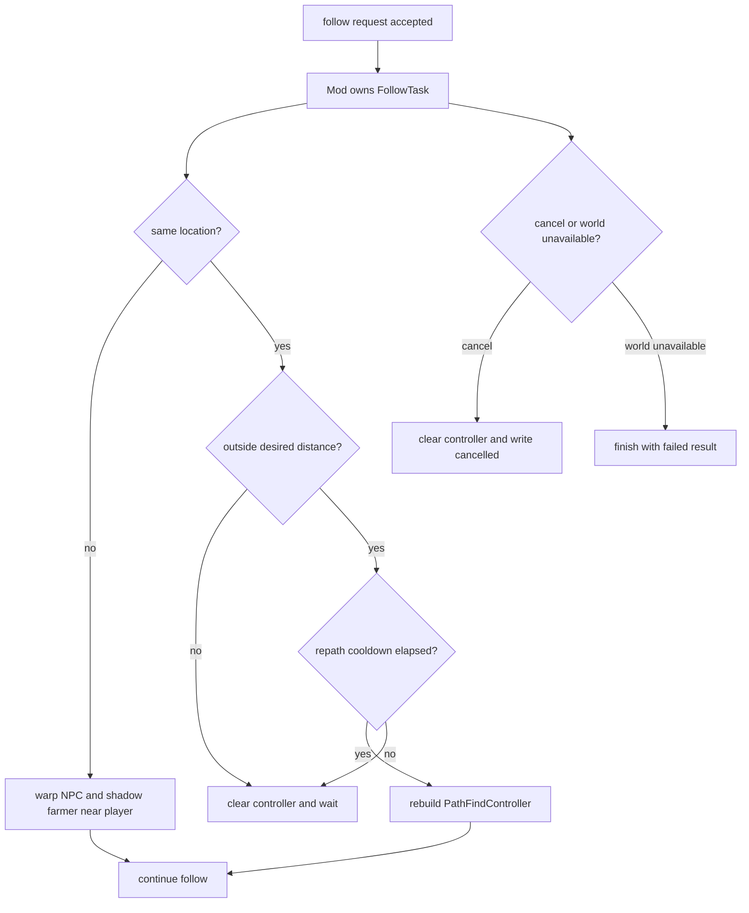
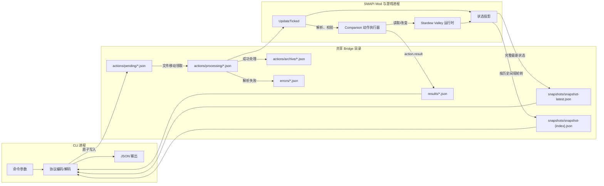
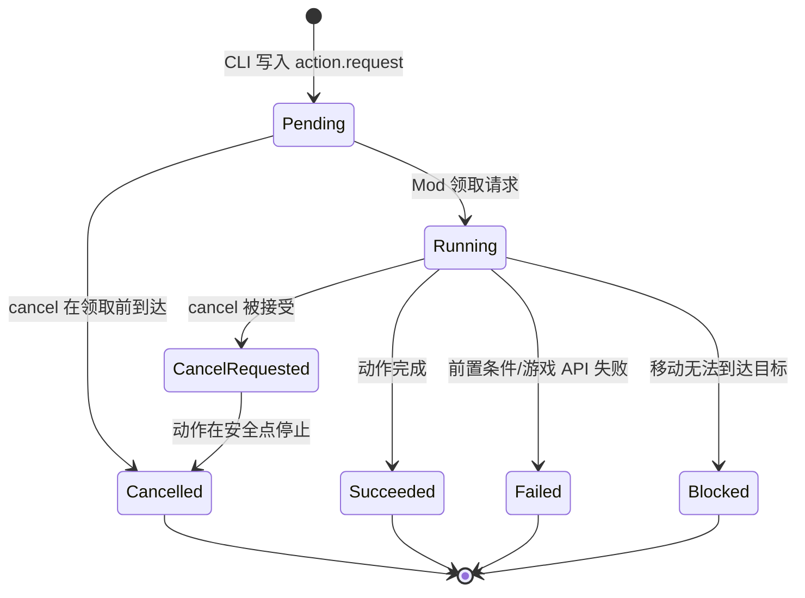

# CLI 工具系统通信 Demo 技术实现方案

## 文档信息

| 项目 | 内容 |
| --- | --- |
| **文档标题** | CLI 工具系统通信 Demo 技术实现方案 |
| **文档版本** | v0.24 |
| **创建日期** | 2026-08-23 |
| **更新日期** | 2026-08-28 |
| **文档类型** | 技术实现方案 |
| **参考资料** | [SMAPI Mod 结构](https://wiki.stardewvalley.net/Modding:Modder_Guide/APIs/Mod_structure)、[SMAPI Mod package](https://github.com/Pathoschild/SMAPI/blob/develop/docs/technical/mod-package.md)、[StardewMCP](https://github.com/Hunter-Thompson/stardew-mcp/tree/3ca54bbfc1d446eeb06d822a74c92cd14df82b93)、[StardewValley-MCP](https://github.com/amarisaster/StardewValley-MCP) |

## 目录

- [文档定位](#文档定位)
- [当前实现范围](#当前实现范围)
- [命令同步异步语义](#命令同步异步语义)
- [Follow 设计与实现](#follow-设计与实现)
- [持续模式扩展](#持续模式扩展)
- [数据交互链路](#数据交互链路)
- [动作生命周期与取消](#动作生命周期与取消)
- [组件与目录](#组件与目录)
- [Bridge 目录与文件语义](#bridge-目录与文件语义)
- [协议定义](#协议定义)
- [CLI 命令](#cli-命令)
- [SMAPI Mod 行为](#smapi-mod-行为)
- [Fake Mod 与 Mac 验证](#fake-mod-与-mac-验证)
- [错误、超时与恢复](#错误超时与恢复)
- [GitHub Actions 产物](#github-actions-产物)
- [Windows 真机验证](#windows-真机验证)
- [与参考项目的对应关系](#与参考项目的对应关系)
- [当前限制](#当前限制)
- [实现检查项](#实现检查项)

## 文档定位

本文描述当前仓库中 CLI、Bridge 文件和 SMAPI Mod 的实际实现。它是 Demo 的实现说明，不是对外部项目的客观调研报告；调研事实分别记录在 `doc/research/` 中。

本 Demo 不使用 MCP Server，也不把 CLI 解释成游戏内快捷键。CLI 是一个独立的外部工具进程，调用方可以是人、脚本或其他 Agent。游戏内只有 SMAPI Mod 能直接访问 Stardew Valley 运行时，CLI 只能通过 Bridge 文件与 Mod 间接交互。

当前实现固定创建一个 AI Companion：

```text
actor_id = companion-1
mode     = direct
```

Companion 由两个对象组成：

- 可见 `CompanionNpc`：负责在游戏画面中显示和移动；
- 隐藏 `BotFarmer`：持有运行时物品，并作为游戏 API 的调用主体。

主农场主不是 CLI 的动作目标。主农场主信息会进入状态快照，作为环境信息提供给外部调用方。

### Companion 资源占位

Companion 的逻辑名称固定为 `companion-1`，这个名称同时用于 CLI 的 `actor_id`、状态扫描和动作路由，不能为了修复游戏资源加载而改成原版 NPC 名称。

当前 Demo 尚未提供自定义头像资源。由于 Stardew Valley 会根据 NPC 名称尝试加载 `Portraits/companion-1`，Mod 在 SMAPI 的 `AssetRequested` 事件中临时将该资源映射到游戏已有的 `Portraits/Abigail`，并向 `Data/Characters` 注入最小的 Companion 角色数据，确保游戏将其作为有效 NPC 处理。生成时会优先选择玩家相邻且可通行的 tile；绘制使用原版 `NPC` 默认绘制逻辑，头顶气泡也由游戏官方接口和绘制流程负责。这些都是为了先验证 Companion 的生成和通信链路，不表示 Companion 的最终人物形象，也不改变其逻辑身份。

后续设计自己的头像时，只需将该映射的返回资源替换为 Mod 自带的 portrait 文件，并保留 `Portraits/companion-1` 这个资源键；如果替换行走动画，也应以同样方式注册 `Characters/companion-1`，不改动 CLI 和 Bridge 协议。

## 当前实现范围

当前 Demo 已实现四类能力：

1. **状态读取**：读取最新完整快照、世界、主农场主、Companion、环形历史快照，并请求即时观察和背包；
2. **Companion 直控**：移动、转向、使用工具、交互、显式传送、攻击、钓鱼、自动战斗开关、吃物品、发送聊天消息、显示头顶气泡和取消动作；游戏操作命令异步提交，信息命令同步返回，pending 请求和长生命周期任务都支持取消；
3. **链路诊断**：查看请求/结果、检查 Bridge 目录、清理历史请求文件和持续观察状态变化。
4. **持续工作模式**：通过一次 `start_mode` 请求在 Mod 内运行 `chop_trees`、`water_crops`、`harvest_crops`、`plant_crops`、`mine` 和 `fish`；模式状态进入快照，使用同一个 request ID 取消。

动作集合如下：

| 类别 | 动作 | 是否改变游戏状态 | CLI 调用语义 |
| --- | --- | --- | --- |
| 连通性 | `ping` | 否；验证 CLI → Mod → CLI | 同步等待结果 |
| 移动 | `move_relative`、`move_to` | 是；改变 Companion 的游戏内位置或移动任务；移动过程必须可取消 | 异步返回 request ID |
| 跟随 | `follow` | 是；在 Mod 内持续跟随主农场主，同地图寻路并在跨地图时自动 warp；任务必须可取消 | 异步返回 request ID |
| 持续工作 | `start_mode` | 是；在 Mod 内逐 Tick 扫描目标、移动、执行工具或鱼竿动作并验证状态；任务必须可取消 | 异步返回 request ID |
| 姿态 | `face_direction` | 是；改变 Companion 朝向 | 异步返回 request ID |
| 工具与交互 | `use_tool`、`interact` | 是；由游戏 API 决定是否成功 | 异步返回 request ID |
| 地图 | `warp_to` | 是；显式把 Companion 移到指定地点和 tile | 异步返回 request ID |
| 战斗 | `attack`、`set_auto_combat` | 是；攻击一次或开启/关闭实时自动攻击 | 异步返回 request ID |
| 钓鱼 | `cast_fishing_rod` | 是；启动鱼竿状态机 | 异步返回 request ID |
| 物品 | `get_inventory`、`eat_item` | 读取背包；吃物品会改变体力、生命和堆叠数量 | `get_inventory` 同步等待结果；`eat_item` 异步返回 request ID |
| 说话 | `say` | 是；在游戏聊天框中显示 Companion 消息 | 异步返回 request ID |
| 气泡 | `bubble` | 是；在 Companion 头顶显示限定时长的文字气泡，显示期间可取消 | 异步返回 request ID |
| 观察 | `observe` | 否；读取 Companion 周围 tile、对象、NPC 和怪物 | 同步等待结果 |
| 控制 | `cancel` | 取消任意尚未完成的 action；不回滚已经完成的游戏副作用 | 异步提交取消请求，并单独查询目标结果 |

`use_tool`、`attack` 和 `cast_fishing_rod` 的命令入口已经实现，但实际是否成功取决于 Companion 当前的游戏运行时前置条件。失败会通过结构化 `error` 返回，不会伪造成功。工具动作的背包映射、目标站位、状态机、取消边界、结果验证和可见表现统一记录在[use-tool 动作设计与持续模式执行基座](use-tool-design.md)，本页只保留通信协议和命令索引。

## 命令同步异步语义

同步或异步描述的是 CLI 的调用体验，不改变 Bridge 协议。所有需要进入游戏运行时的请求仍使用统一的 `action.request` 和 `action.result` Envelope；区别在于 CLI 是否在提交请求后自动等待结果。

信息类命令只读取快照、Bridge 文件或游戏当前状态，不持续改变 Companion，因此 CLI 应提交请求并等待终态后直接输出结果。包括 `ping`、`observe`、`inventory`，以及直接读取文件的 `status`、`world`、`player`、`companion`、`snapshot list`、`snapshot read`、`request show`、`result show` 和 `doctor`。`watch` 是持续输出状态变化的流式命令，不属于一次性同步命令；`wait` 是通用结果等待命令。

涉及游戏操作的命令保持异步：CLI 写入请求后立即返回受理回执和 `request_id`，由调用方使用 `wait` 查询终态，必要时使用 `cancel` 发出取消请求。包括移动、跟随、转向、工具、交互、warp、攻击、钓鱼、自动战斗、吃物品、聊天和气泡。即使某些操作通常在一个游戏 Tick 内完成，也保留相同的异步入口，以便协议语义统一，并为操作前置检查、游戏 Tick 调度和取消保留边界。

信息请求在协议层仍可能经历 `pending`、`processing` 和 `result` 文件阶段；“同步”不表示 CLI 绕过 Mod 直接读取内存，也不表示游戏主线程被 CLI 阻塞。CLI 只是在合理超时内轮询对应结果。超时只表示 CLI 停止等待，请求本身仍可能继续执行；调用方可以用 `result show` 查询，或对尚未完成的操作使用 `cancel`。

当前协议和 Bridge 已经支持统一的等待能力；CLI 将信息类实时请求改为自动等待属于调用层行为，不需要为同步查询增加另一套通信协议。

本节记录的是确定的 CLI 调用约定。信息类实时命令由 CLI 提交请求并自动等待结果，游戏操作命令仍只返回受理回执。该差异不会改变信息请求在协议层的只读性质，也不需要增加另一套通信协议。

## Follow 设计与实现

Follow 是一个持续运行的异步动作，用于让 `companion-1` 跟随当前主农场主。它不由 CLI 通过反复读取快照、计算位置和提交 `move_to` 实现，而由 SMAPI Mod 在游戏主线程中维护一个 `FollowTask`。CLI 只负责启动和取消任务，游戏运行时负责读取玩家位置、寻路、跨地图同步和动作清理。

### CLI 命令

当前提供以下命令，默认跟随主农场主：

```text
stardew-cli follow [--distance <tiles>]
```

`--distance` 表示 Companion 与主农场主之间的期望距离，默认值为 `2`，由 CLI 和 Mod 限制在 `1..=8`。重算路径周期和紧急 warp 距离属于 Mod 的行为策略，不通过 CLI 暴露。

该命令只返回受理回执，不等待跟随结束：

```text
stardew-cli follow --distance 2
stardew-cli cancel <follow-request-id>
stardew-cli wait <cancel-request-id>
stardew-cli wait <follow-request-id>
```

Follow 是长期任务，因此它的原始结果在跟随期间保持为 `pending`。只有收到 `cancel`、世界不可用或任务发生不可恢复错误时，Mod 才会为原 request 写入终态结果。CLI 不应使用短超时把 `wait` 的超时解释成 follow 失败；需要结束跟随时必须显式调用 `cancel`。

### 请求字段

Follow 使用现有 `action.request` Envelope，action payload 如下：

```json
{
  "action": "follow",
  "actor_id": "companion-1",
  "target_actor_id": "player",
  "distance": 2
}
```

`target_actor_id` 当前固定支持 `player`，不表示创建第二个 Farmhand；它只是把主农场主作为游戏内目标。`follow` 与 `warp_to` 是不同语义：`warp_to` 是一次性把 Companion 移到调用方指定的地点，`follow` 则在 Mod 内持续观察目标并在需要时自动调整位置。

### Mod 内部任务

Mod 为每个活动 follow 保存一个最小状态对象：

| 字段 | 作用 |
| --- | --- |
| `request_id` | 关联原始 action.result 和 cancel 请求 |
| `actor_id` | 当前固定为 `companion-1` |
| `target_actor_id` | 当前固定为 `player` |
| `desired_distance` | 目标周围的保持距离 |
| `last_target_location` | 上一次观察到的玩家地图 |
| `last_target_tile` | 上一次触发重算的玩家 tile |
| `repath_cooldown` | 限制 PathFindController 重建频率 |
| `state` | `following`、`waiting`、`warping` 或 `blocked` |

每个 `UpdateTicked` 的处理顺序保持为：先处理 cancel，再推进已有动作，最后领取普通 pending 请求。Follow 的 Tick 逻辑如下：



具体行为如下：

1. **同地图且距离足够近**：清除过期的路径控制器，进入 `waiting`，不重复创建移动任务。
2. **同地图但距离超过阈值**：在重算冷却结束后，以玩家附近的可通行 tile 为目标创建 `PathFindController`；玩家移动达到一定幅度或当前路径失效时才重算。
3. **玩家切换地图**：清除旧地图中的 NPC 和旧路径，将可见 NPC 放入玩家当前 `GameLocation`，同时更新 shadow farmer 的 `currentLocation` 和像素位置，然后继续 follow。
4. **距离异常过远或路径无法建立**：使用与参考项目相同的近距离应急 warp，把 Companion 放到玩家附近的可通行 tile，再继续跟随；如果找不到安全位置，则返回结构化失败结果。
5. **取消或世界结束**：清除路径控制器和 follow 状态，为原 request 写入 `cancelled` 或对应失败结果。取消优先级高于普通动作领取。

跨地图 follow 使用的是“玩家换地图后 Mod 自动 warp Companion”，不是让 Companion 自己寻找地图出口。由于 Companion 是 Mod 创建的 NPC + shadow farmer，这种 warp 不会启动第二个客户端，也不会把它注册成原版联机 Farmhand。它必须同时更新可见 NPC 和 shadow farmer，否则后续动作会在错误的地图对象上执行。

### 与其他动作的关系

单个 `companion-1` 同时只允许一个活动任务。Follow 运行期间：

- `cancel` 始终可以领取并优先执行；
- 普通移动、显式 `warp`、钓鱼和其他需要占用 Companion 的 action 返回 `busy`；
- 需要手动 `warp` 或执行其他长期动作时，先取消 follow，再提交新 action；
- `set_auto_combat --enabled false` 可以继续作为关闭自动战斗的控制动作，但不会隐式结束 follow。

Follow 的状态写入现有 Companion 快照字段：`busy=true`、`current_action=follow`，并增加可选的 follow 详情，包括目标 actor、目标地点、目标 tile、当前 follow 状态和最近一次自动 warp。这样外部 Agent 可以通过 `status` 观察 follow，而不需要依赖 `wait` 阻塞。

### 错误与验证范围

Follow 返回以下相关错误：

| 错误 | 含义 |
| --- | --- |
| `invalid_distance` | 跟随距离不在允许范围内 |
| `unsupported_follow_target` | 目标 actor 不是当前支持的 `player` |
| `follow_target_unavailable` | 主农场主或当前世界暂时不可用 |
| `follow_warp_failed` | 跨地图或应急 warp 找不到安全位置 |
| `follow_path_blocked` | 同地图路径无法建立且应急 warp 也失败 |

Fake Mod 已验证 follow 请求的字段、异步受理、pending 状态和 cancel 关联；真实的寻路、地图切换、NPC 所属地图同步和应急 warp 仍必须在 Windows + SMAPI 游戏中验证。

## 持续模式扩展

本节描述在 `follow` 之外的游戏侧持续模式及其当前实现。持续模式由 SMAPI Mod 在游戏线程中维护，CLI 或 Agent Runtime 只负责启动、查询和取消，不通过外部循环反复提交低级动作。工具型持续模式的目标解析、相邻站位、朝向、执行、验证和取消统一见[use-tool 动作设计与持续模式执行基座](use-tool-design.md)；本节只保留各模式的目标范围、状态和结束条件。

每个持续模式都持有一个 actor lease。单个 `companion-1` 同时只能运行一个持续模式或 foreground action；模式启动后异步返回 request ID，并在运行期间通过快照暴露当前状态，直到完成、失败、取消或被新的计划取代才写入终态结果。模式处于 `paused` 或 `waiting` 时保留活动状态，等待资源补充、环境变化或后续控制请求。

当前模式边界如下：

| 模式 ID | 目标 | 典型结束或暂停条件 |
| --- | --- | --- |
| `follow` | 跟随主农场主 | 用户取消、目标不可用、世界结束 |
| `chop_trees` | 搜索并砍伐满足条件的树木 | 没有目标、缺少斧头、路径持续阻塞、用户取消 |
| `water_crops` | 为需要浇水的耕地浇水 | 当日没有可浇水目标、缺少浇水壶、体力不足、用户取消 |
| `harvest_crops` | 收获成熟作物 | 没有成熟作物、背包无法接收、路径持续阻塞、用户取消 |
| `plant_crops` | 在已开垦且符合条件的耕地上播种 | 没有可用种子、没有符合条件的已开垦土地、路径问题、用户取消 |
| `mine` | 在当前矿井楼层持续处理可破坏石块 | 当前楼层没有可处理石块、地点或工具前置条件失败、用户取消 |
| `fish` | 在当前地点附近水域反复执行鱼竿状态机 | 没有水域或鱼竿、鱼竿状态失败、用户取消 |

这些模式共享目标选择、路径任务、前置检查、失败重试、气泡通知和取消清理机制；每个模式只实现自己的目标扫描和成功条件。模式内部的每个 Tick 只推进有限状态，不阻塞游戏主线程，也不等待 CLI 或模型返回。

### `chop_trees`

`chop_trees` 的目标是持续寻找可砍伐的树木。它不是对地图上所有可交互对象进行尝试，而是先通过目标扫描器识别允许处理的树木，再为单个目标交给[use-tool 执行基座](use-tool-design.md#持续模式复用)处理。目标扫描需要排除不可砍伐对象、建筑、作物和不应由该模式处理的特殊树木；允许的树木类型和地点应由模式参数或策略限定。没有符合条件的树木时正常完成；工具前置条件不满足时进入 `paused` 并提示；路径连续失败时有限重试，超过上限后暂停或失败。

### `water_crops`

`water_crops` 只处理已经存在的耕地数据中的作物，不负责锄地、播种或收获。目标扫描选择需要浇水的 `HoeDirt`，并排除没有作物、已经完成当日浇水或当前天气和游戏规则不需要浇水的 tile；单个目标交给[use-tool 执行基座](use-tool-design.md#持续模式复用)处理并由模式验证耕地状态。当日没有需要浇水的作物时正常完成；工具前置条件、体力、地点或路径不满足时暂停并提示。该模式不应为了寻找更多目标自动切换到未授权的地图，也不应把普通地面当成耕地目标。

### `harvest_crops`

`harvest_crops` 只收获已经成熟的作物。目标扫描选择已有 `HoeDirt` 中被游戏 API 判断为可收获的作物，排除未成熟作物、没有作物的耕地和不满足当前收获条件的目标。

单个目标的处理顺序为：确认收获目标仍存在且成熟 → 检查背包是否有接收空间 → 移动到作物附近 → 调用游戏收获逻辑 → 重新读取耕地和背包状态。成功条件至少包括目标作物被移除或进入下一游戏状态，以及产物在背包或游戏允许的掉落结果中可观察到。收获 API 成功但状态没有变化时先重新观察，避免重复收获同一个目标。

背包无法接收产物时模式进入 `paused`，通过气泡提示玩家清理空间；不能静默丢弃产物，也不能自动把物品写入未授权的箱子。没有成熟作物时正常完成；路径阻塞、地点切换或世界结束按通用取消和恢复规则处理。

### `mine`

当前 Demo 的 `mine` 只处理 Companion 已经所在的 `MineShaft` 楼层中的可破坏石块，不自动进入矿井、不自动跨楼层，也不把战斗和梯子逻辑伪装成已经完成的能力。后续若扩展到地点进入、矿井楼层、梯子或出口、近战战斗、体力和生命管理，仍需增加明确的停止条件和对应状态验证。

完整的矿井模式可以拆成进入矿井、扫描楼层、处理目标、推进楼层和安全结束几个阶段。每个目标的接近、朝向、工具调用和结果验证交给[use-tool 动作设计](use-tool-design.md#持续模式复用)或对应的战斗执行器；地图切换后重新同步可见 NPC 和 Shadow Farmer，并重新读取当前地点的目标，不能沿用上一楼层的 tile 坐标。

矿井模式需要检查工具、生命、体力和背包容量；具体工具动作交给[use-tool 执行基座](use-tool-design.md#持续模式复用)，战斗仍由独立的战斗执行器负责。没有必要前置条件时暂停；生命、体力或游戏时间达到安全阈值时主动结束，不应为了继续执行而强行战斗。目标不可达、楼层加载失败、战斗结果无法确认或跨地图同步失败时，进入 `paused`/`failed` 并通过 Bubble 说明原因。

矿井模式不能把任意坐标 warp 当作正常的挖矿步骤。只有已经验证的地点入口、梯子、出口或明确授权的地图切换才可以改变地点；每次切换后必须重新获取当前地点的目标和状态，不能沿用上一楼层的 tile 坐标。

### `fish`

`fish` 是对鱼竿状态机的持续封装。当前实现先在 Companion 所在地点附近寻找水域，移动到水边后反复调用已有的鱼竿状态机；它不是由 CLI 轮询提交多次 `cast_fishing_rod`。

一次钓鱼循环至少包含：选择水域和站位 → 检查鱼竿、体力和时间 → 抛竿 → 等待咬钩 → 推进收线或小游戏状态 → 确认捕获、失败或取消 → 读取背包并决定是否继续下一次。捕获结果应通过背包变化、鱼竿状态或游戏返回值确认；只看到“抛竿成功”不能算作完成一条鱼。

没有鱼竿、没有合法水域、鱼竿状态异常、背包无法接收鱼或达到时间/体力限制时暂停或结束。等待咬钩期间必须保留 request ID 并支持取消；取消需要清理鱼竿状态，但不能回滚已经完成的捕获。不同地点的鱼类、天气、季节、诱饵和鱼竿小游戏规则属于游戏运行时前置条件，Fake Mod 只能验证模式状态机，不能证明真实捕获逻辑。

### `plant_crops` 的土地约束

`plant_crops` 只允许在已经存在的已开垦土地上播种。目标选择必须从当前 `GameLocation` 的耕地数据中筛选已存在的 `HoeDirt`，并满足以下条件：

1. tile 已经是 `HoeDirt`，不是普通地面、草地或其他可通行 tile；
2. tile 没有现有作物，且游戏 API 判断当前种子可以种植；
3. Shadow Farmer 背包中存在可用种子，并满足季节、地点和种子本身的游戏前置条件；
4. Companion 能够到达该 tile，播种后重新读取背包和耕地状态确认结果。

该模式不得调用锄地逻辑，不得自动把普通地面转换成 `HoeDirt`，也不得为了扩张种植区域而改变土地状态。没有符合条件的已开垦土地时，模式返回正常完成或受约束的暂停结果，不能把未开垦土地当成播种失败后自动修复的目标。

播种一次只消耗一个种子。若游戏 API 调用成功但背包堆叠或耕地作物状态没有按预期变化，模式先进入 `uncertain` 并重新观察；连续验证失败后再交给 Runtime 重规划，不继续盲目消耗种子。

### 模式阻塞与 Bubble 通知

模式遇到可恢复问题时进入 `paused` 或 `waiting`，遇到不可恢复问题时进入 `failed`，并通过官方 `NPC.showTextAboveHead` 接口向玩家提示。模式内部的提示不是外部 `bubble` action，不创建新的 actor lease，也不应阻塞当前模式的 Tick；通知需要带原因和冷却时间，避免重复刷屏。

Mod 配置可以提供可替换的文本模板。以下配置项当前已经生效：

```json
{
  "BubbleTemplates": {
    "MissingTool": "我没有{tool}，无法继续{mode}。",
    "MissingSeed": "我没有可用的种子，无法继续播种。",
    "NoTilledSoil": "没有找到可以播种的已开垦土地。",
    "InventoryFull": "我的背包已满，无法继续工作。",
    "PathBlocked": "我在{location}遇到了障碍，正在重新寻找路径。",
    "LowStamina": "我太累了，需要休息。"
  }
}
```

模板变量由 Mod 在渲染时替换，例如 `{tool}`、`{mode}`、`{location}` 和 `{target}`。缺少模板或模板变量时使用稳定的内置默认文本；模板配置错误不能阻止模式执行和取消清理。

### 扩展模式验证范围

每个模式都需要分别验证目标扫描、路径阻塞、前置条件、游戏副作用、结果确认、气泡冷却、暂停恢复和取消。工具动作的具体验证项见 [use-tool 实施检查项](use-tool-design.md#实施检查项)。各模式的额外验证重点如下：

| 模式 | 额外验证重点 |
| --- | --- |
| `chop_trees` | 普通树木、不可处理对象、目标状态变化、掉落物和连续目标切换 |
| `water_crops` | 需要浇水和无需浇水的耕地、空耕地、天气影响和浇水状态变化 |
| `harvest_crops` | 成熟与未成熟作物、收获产物、背包满、目标被其他变化移除和重复收获保护 |
| `plant_crops` | 普通地面、已经开垦的空地、已有作物的耕地、不可种植季节、没有种子和种子堆叠扣减 |
| `mine` | 石头、矿脉、梯子、楼层切换、战斗、生命/体力阈值、背包满和安全结束 |
| `fish` | 合法水域、站位、抛竿、咬钩、捕获、鱼竿状态清理、背包满和等待期间取消 |

Fake Mod 只能验证模式状态机和协议；树木、土地类型、作物、矿井、战斗、鱼竿状态机及实际副作用仍需 Windows + SMAPI 实机验证。

## 数据交互链路

游戏数据不直接从游戏进程流入 CLI。真实状态只存在于 Stardew Valley 运行时；SMAPI Mod 负责读取和改变它，并将有限字段投影为 JSON。CLI 只读写 Bridge 目录。



以 `move_to` 为例，一次完整写操作的实际链路是：

1. CLI 将 `actor_id`、目标 tile 和 `action=move_to` 编码为请求文件；
2. Mod 在 `UpdateTicked` 中把请求从 `pending` 移到 `processing`；
3. Mod 校验 actor，并让可见 Companion NPC 使用游戏的 `PathFindController` 寻路；
4. Companion 到达目标、被阻挡、超时或被取消时，Mod 记录前后 tile 和状态；
5. Mod 写入与 `request_id` 同名的结果文件，再将请求移到 `archive`；
6. CLI 读取结果。之后的 `snapshot-latest.json` 会在下一次状态写出时反映 Companion 的当前位置。

因此，写入 JSON 请求本身不等于修改游戏。只有 Mod 领取请求、调用游戏 API 并生成成功结果后，才算动作执行完成。

## 动作生命周期与取消

所有 `action.request` 都必须携带 `request_id`，并通过同一个 `cancel` 动作支持取消。取消是一个独立的控制请求，不在原动作 payload 中增加布尔字段；这样 CLI、脚本和其他外部调用方都可以在拿到目标 request ID 后，从另一个进程发出取消请求。

“支持取消”表示 Mod 在动作尚未完成时能够阻止它继续执行，并为目标请求写出 `cancelled` 终态；它不表示能够撤销已经完成的游戏副作用。例如，已经显示到聊天框的 `say` 消息不能被删除，已经完成的 `eat_item` 不能通过取消恢复物品。对一次性动作，取消窗口位于调用游戏 API 之前；对长动作，取消窗口覆盖整个状态机生命周期。

动作处理必须遵守以下生命周期：



Mod 不使用阻塞等待、线程强杀或 `Thread.Sleep` 实现取消。`UpdateTicked` 每次先处理取消控制请求，再推进当前任务；长动作在每个游戏 Tick 的安全点检查取消标记。取消只能在主线程中调用游戏 API，从而避免跨线程访问 Stardew Valley 对象。

取消请求的处理结果与目标动作结果分开：

1. `cancel` 自身返回“取消请求已接受、目标已完成或目标不存在”等处理结果；
2. 目标请求仍然使用原来的 `request_id` 写出最终 `action.result`；
3. 目标进入 `cancelled` 前，CLI 不能仅凭 `cancel` 的返回就断言动作已经停止，应继续读取目标结果或使用 `result show` 查询；
4. 如果目标已经完成，取消不会回滚副作用，`cancel` 返回目标已完成；如果目标仍在 `pending`，Mod 直接写入目标的 `cancelled` 结果并归档请求；如果目标在执行中，Mod 设置取消标记并由对应动作的 Tick 逻辑完成清理。

取消请求在 Mod 的读取链路中具有优先级：每个 `UpdateTicked` 先扫描并领取 `cancel`，再推进活动任务，最后领取普通动作。普通动作不会自动取消当前任务；当单个 `companion-1` 已经执行一个长动作时，新的普通动作仍返回 `busy`，只有明确的 `cancel` 才能中断它。

### 各类动作的取消边界

| 动作类别 | 执行方式 | 取消检查点 | 已完成后的行为 |
| --- | --- | --- | --- |
| `move_relative`、`move_to` | 路径控制器逐 Tick 移动 | 每个 Tick；调用路径控制器停止并记录当前位置 | 不回退已经走过的路径，目标结果为 `cancelled` |
| `follow` | Mod 内 FollowTask 逐 Tick 检查地图、距离和路径 | 每个 Tick；清除路径控制器并结束 follow | 不回退已经发生的移动或 warp |
| `cast_fishing_rod` | 鱼竿状态机逐 Tick 更新 | 抛竿、等待咬钩、收线的每个安全点；清理鱼竿状态 | 已经完成的捕获不回滚 |
| `set_auto_combat` | 自动战斗循环逐 Tick 检查 | 每次自动攻击前；关闭自动战斗并结束任务 | 已造成的伤害不回滚；使用中的模式被关闭 |
| `bubble` | 带截止时间的显示状态 | 每个 Tick；清除当前气泡 | 已消失的气泡不产生额外效果 |
| `face_direction`、`interact`、`warp_to`、`attack`、`eat_item`、`say` | 单 Tick 内调用一次游戏 API | 调用 API 前 | 已提交的游戏副作用不回滚 |
| `use_tool` | 由 [`ToolActionTask`](use-tool-design.md#异步状态机) 分阶段推进 | 验证、选站位、移动、面向和游戏 API 执行前；详细边界见 [use-tool 设计](use-tool-design.md#取消与结果边界) | API 已执行后不回滚，表现状态单独清理 |
| `ping`、`observe`、`get_inventory` | 单 Tick 内读取状态 | 读取开始前 | 已返回的只读结果无需撤销 |

一次性动作也必须经过统一任务登记和取消检查，不能因为通常很快就省略 `request_id` 或取消分支。取消请求到达时，如果游戏 API 调用已经完成，系统返回目标已完成，而不是伪造一个取消结果。

### CLI 等待与取消

涉及游戏操作的 CLI 命令采用异步语义：命令只负责生成并写入请求，成功写入后立即输出请求受理结果和 `request_id`，不等待 Mod 执行动作。需要等待终态时使用独立的 `wait` 命令；需要取消时使用独立的 `cancel` 命令。典型调用链是：

```text
stardew-cli move-to --x 120 --y 80
stardew-cli cancel <move-request-id>
stardew-cli wait <cancel-request-id>
stardew-cli wait <move-request-id>
```

动作命令的立即返回值是受理回执，例如：

```json
{
  "status": "accepted",
  "action": "move_to",
  "request_id": "0c6c7d24-8a6d-4b99-9b40-3c1f10c7068f"
}
```

动作命令、包括 `cancel` 自身，都不等待最终结果。`wait` 只是读取指定 request 的结果文件并等待终态，不会向 Mod 创建新的游戏动作。CLI 进程是否退出、是否由另一个进程执行 `cancel`，都不影响 Mod 继续处理请求。

`action.result` 与 `snapshot` 的职责不同：

| 数据 | 含义 | 典型用途 |
| --- | --- | --- |
| `action.result` | 某个 request 的即时执行结果 | 判断这一次移动是否到达、工具是否成功、错误原因是什么 |
| `snapshot` | 某个时刻的状态投影 | 查看完整环境、轮询状态、恢复后读取最新状态 |
| `observe` 结果 | Companion 周围的即时局部观察 | 为移动和交互调用提供局部 tile 信息 |

## 组件与目录

### 组件

| 组件 | 运行位置 | 职责 |
| --- | --- | --- |
| `stardew-cli` | 游戏外；发布产物为 Windows CLI | 解析命令、写请求、等待结果、读取状态和诊断 Bridge |
| `fake-mod` | 游戏外；Mac 可运行 | 模拟 Mod 的文件领取、结果写回和状态快照，用于协议测试 |
| `StardewAgentMod` | Stardew Valley 进程内 | 访问 SMAPI/Game API，创建 Companion，执行动作，生成状态 |
| Bridge 目录 | CLI 与 Mod 都能访问的共享目录 | 传递 JSON 请求、结果和快照 |

### 仓库目录

```text
stardew-agent/
├── .github/workflows/build-demo.yml
├── Directory.Build.props
├── cli/
│   ├── Cargo.toml
│   ├── src/
│   │   ├── main.rs       # CLI 命令和 JSON 输出
│   │   ├── protocol.rs   # Rust 协议 DTO
│   │   ├── bridge.rs     # 文件桥接、快照、诊断
│   │   └── fake.rs       # Fake Mod
│   └── tests/bridge_tests.rs
├── smapi-mod/
│   ├── StardewAgentMod.csproj
│   ├── ModEntry.cs       # SMAPI 事件、请求分发、快照写出
│   ├── CompanionController.cs
│   ├── CompanionObservationScanner.cs
│   ├── Protocol.cs       # C# 协议 DTO
│   ├── BridgeFileStore.cs
│   └── ModConfig.cs
└── doc/demo/cli-file-bridge.md
```

Rust 和 C# 各自维护协议 DTO。字段名通过 JSON 属性保持一致；跨语言协议变化时，两侧必须同时更新。

## Bridge 目录与文件语义

Bridge 目录由 Mod 配置的 `BridgeDirectory` 指定。CLI 优先使用 `--bridge-dir`，其次使用 `STARDEW_BRIDGE_DIR`；两者都未提供时，默认使用 CLI 可执行文件所在目录下的 `bridge/`，与启动 CLI 时的工作目录无关。

合并发布包中 CLI 与 Mod 文件位于同一目录时，CLI 可执行文件旁边的 `bridge/` 与 Mod 默认的 `bridge/` 就是同一个目录。即使从其他工作目录启动 CLI，仍会使用这个位置；只有把 CLI 和 Mod 分开放置时，才需要显式指定 `--bridge-dir` 或设置 `STARDEW_BRIDGE_DIR`。

```text
bridge/
├── actions/
│   ├── pending/
│   ├── processing/
│   └── archive/
├── results/
├── snapshots/
└── errors/
```

| 路径 | 写入者 | 读取者 | 语义 |
| --- | --- | --- | --- |
| `actions/pending/{request_id}.json` | CLI | Mod | 等待处理的 `action.request` |
| `actions/processing/{request_id}.json` | Mod | Mod/诊断 | 已由 Mod 领取、尚未归档的请求 |
| `actions/archive/{request_id}.json` | Mod | CLI/诊断 | 已处理请求的留档 |
| `results/{request_id}.json` | Mod | CLI | 与请求 ID 对应的 `action.result` |
| `snapshots/snapshot-latest.json` | Mod | CLI | Mod 最近一次写出的完整状态，反复替换 |
| `snapshots/snapshot-{index}.json` | Mod | CLI/诊断 | 固定索引的历史快照槽位 |
| `errors/{request_id}[-{unique}].json` | Mod | CLI/诊断 | 请求解析或处理流程异常时的原始请求；协议版本错误可能保留原文件名 |

### 原子写入和领取

CLI 和 Mod 都先写入同目录临时文件，写完后再替换正式 `.json` 文件。Mod 通过把文件从 `pending` 移到 `processing` 来领取请求；同一文件不能被两个 Mod tick 重复领取。

请求 ID 由 CLI 生成 UUID。结果文件使用相同 ID，便于等待、诊断和关联；请求完成后，原始请求进入 `archive`，结果不会因为请求归档而丢失。

### `latest` 和历史快照轮转

`snapshot-latest.json` 保存完整最新状态，不是只记录索引的指针。它的 `payload` 至少包含：

- `latest_write_sequence`：Mod 状态写出的单调序号；
- `snapshot_sequence`：历史快照写出的单调序号；
- `snapshot_index`：最近历史快照占用的固定槽位；
- `game`、`player`、`companion`：当前状态投影。

两个写出周期独立配置：

- `LatestWriteIntervalSeconds`：多久重新写一次 `snapshot-latest.json`；
- `SnapshotHistoryIntervalSeconds`：多久写一次历史槽位；
- `SnapshotHistoryLimit`：历史槽位总数。

历史槽位是环形的，不是“不断创建新文件后删除旧文件”：

```text
SnapshotHistoryLimit = 3

snapshot-0.json → snapshot-1.json → snapshot-2.json
       ↑                                  ↓
       └──────────── 下一轮覆盖 ───────────┘
```

实际顺序是 `0, 1, 2, 0, 1, 2 ...`。每个历史文件保留自己的 `snapshot_sequence`，`snapshot-latest.json` 同时保留当前槽位索引。CLI 读取历史时按 `snapshot_sequence` 排序，而不是按文件名推断新旧。

历史写出后，Mod 会立即用同一份状态重新发布 `snapshot-latest.json`，所以 latest 能够同步反映最新的 `snapshot_index`。latest 写出本身不创建新的历史槽位。

## 协议定义

当前协议版本为 `0.2`。所有消息使用统一 Envelope：

```json
{
  "schema_version": "0.2",
  "message_type": "action.request",
  "request_id": "uuid",
  "created_at_ms": 1776900000000,
  "payload": {}
}
```

### Action Request

`payload.action` 区分动作，`actor_id` 当前必须是 `companion-1`。请求字段如下：

| `action` | 额外字段 |
| --- | --- |
| `ping` | 无 |
| `move_relative` | `direction`、`ticks` |
| `move_to` | `x`、`y` |
| `face_direction` | `direction` |
| `use_tool` | `tool`、`x`、`y` |
| `interact` | `x`、`y` |
| `warp_to` | `location`、`x`、`y` |
| `observe` | `radius` |
| `get_inventory` | 无 |
| `attack` | 无 |
| `cast_fishing_rod` | 无 |
| `set_auto_combat` | `enabled` |
| `eat_item` | 可选 `slot` |
| `say` | `text` |
| `bubble` | `text`、`duration_ms` |
| `follow` | `target_actor_id`、`distance` |
| `start_mode` | `mode`；当前值为 `chop_trees`、`water_crops`、`harvest_crops`、`plant_crops`、`mine` 或 `fish` |
| `cancel` | `target_request_id` |

示例：

```json
{
  "schema_version": "0.2",
  "message_type": "action.request",
  "request_id": "0c6c7d24-8a6d-4b99-9b40-3c1f10c7068f",
  "created_at_ms": 1776900000000,
  "payload": {
    "action": "move_to",
    "actor_id": "companion-1",
    "x": 72,
    "y": 18
  }
}
```

### Action Result

普通动作的结果使用 `message_type=action.result`。常见状态为：

| 状态 | 含义 |
| --- | --- |
| `succeeded` | Mod 执行动作并满足成功条件 |
| `blocked` | 移动任务结束但未到达目标 |
| `cancelled` | 目标动作在完成前被取消 |
| `failed` | 参数、世界状态或游戏 API 前置条件不满足 |
| `expired` | 预留给上层调用方标记等待超时；当前 CLI 超时不会写入这个状态，也不会自动撤销已发出的请求 |

结果包含 `action`、`actor_id`，失败时包含结构化错误：

```json
{
  "schema_version": "0.2",
  "message_type": "action.result",
  "request_id": "0c6c7d24-8a6d-4b99-9b40-3c1f10c7068f",
  "created_at_ms": 1776900000123,
  "payload": {
    "status": "blocked",
    "action": "move_to",
    "actor_id": "companion-1",
    "ticks": 0,
    "target_tile": {"x": 72, "y": 18},
    "before_tile": {"x": 65, "y": 15},
    "after_tile": {"x": 65, "y": 15},
    "moved": false,
    "world_ready": true,
    "error": {
      "code": "movement_timeout",
      "message": "the companion did not reach the target tile"
    }
  }
}
```

移动结果还包括 `before_tile`、`after_tile`、`target_tile`、`moved` 和 `world_ready`。观察结果的 `data.observation` 包含地点、中心 tile、半径、特殊 tile、怪物和 NPC；背包结果的 `data.inventory` 为结构化物品数组。

取消结果至少包含 `target_request_id`、`target_action`、`target_status` 和 `cancelled`。`cancelled=true` 表示目标已经进入取消流程或已经写出取消终态；调用方仍应读取目标 request 的结果，以确认动作是否已经完成清理。目标动作的取消结果保留原动作字段，例如移动仍需返回取消发生时的 `before_tile`、`after_tile` 和 `target_tile`。

### Snapshot

快照的 `payload` 是只读状态投影，主要字段如下：

```json
{
  "latest_write_sequence": 42,
  "snapshot_sequence": 7,
  "snapshot_index": 2,
  "mod_version": "0.1.0",
  "game_tick": 12345,
  "world_ready": true,
  "game": {
    "year": 1,
    "season": "spring",
    "day": 1,
    "time": 900,
    "location": "Farm",
    "weather": "sunny"
  },
  "player": {
    "name": "Player",
    "location": "Farm",
    "tile": {"x": 64, "y": 15},
    "facing_direction": "down",
    "health": 100,
    "max_health": 100,
    "stamina": 270,
    "max_stamina": 270,
    "money": 500
  },
  "companion": {
    "id": "companion-1",
    "type": "ai_companion",
    "display_name": "Companion",
    "location": "Farm",
    "tile": {"x": 65, "y": 15},
    "facing_direction": "down",
    "mode": "direct",
    "status": "idle",
    "world_ready": true,
    "busy": false,
    "auto_combat": false,
    "inventory": [],
    "capabilities": ["move_to", "observe", "interact"]
  }
}
```

快照不是游戏存档的完整序列化，也不是对主农场主输入的模拟；它只承诺当前协议 DTO 中的字段。

## CLI 命令

所有命令都支持：

```text
stardew-cli [--bridge-dir <bridge-directory>] <command>
```

也可以设置 `STARDEW_BRIDGE_DIR`，省略全局参数。没有参数或环境变量时，CLI 使用自身可执行文件所在目录下的 `bridge/`。输出统一为 JSON。信息类命令会自动等待实时请求结果或直接读取本地状态；游戏操作命令只输出受理回执，最终动作结果由 `wait` 或 `result show` 获取。

### 状态、观察和诊断

| 命令 | 作用 | CLI 语义 |
| --- | --- | --- |
| `status` | 打印完整 `snapshot-latest.json` | 同步读取本地快照 |
| `world` | 只打印快照中的 `game` | 同步读取本地快照 |
| `player` | 只打印快照中的 `player` | 同步读取本地快照 |
| `companion --actor-id companion-1` | 只打印指定 Companion 状态 | 同步读取本地快照 |
| `inventory [--actor-id ...]` | 发请求读取实时背包 | 同步提交并等待结果 |
| `observe [--actor-id ...] [--radius 8]` | 发请求读取局部环境 | 同步提交并等待结果 |
| `snapshot list` | 按序号列出历史槽位 | 同步读取本地文件 |
| `snapshot read <index>` | 读取一个固定历史槽位 | 同步读取本地文件 |
| `request show <request-id>` | 查找请求及其所在目录 | 同步读取本地文件 |
| `result show <request-id>` | 读取已写入的结果 | 同步读取本地文件 |
| `wait <request-id>` | 等待并打印指定 request 的终态结果 | 阻塞等待，不创建游戏动作 |
| `doctor` | 检查目录、latest、历史数量和临时文件 | 同步读取本地文件 |
| `cleanup --dry-run` | 预览结果、归档和错误文件清理范围 | 同步执行本地清理检查 |
| `cleanup` | 删除超过保留时长的结果、归档和错误 JSON | 同步执行本地文件操作 |
| `watch` | 按 `latest_write_sequence` 变化持续打印快照 | 持续读取的流式命令 |

`cleanup` 不会触碰 `snapshots/`，也不会删除 `pending` 或 `processing` 中的请求。执行前可以先使用 `--dry-run`。

### Companion 动作

| CLI 命令 | 请求动作 | 示例 | CLI 语义 |
| --- | --- | --- | --- |
| `ping` | `ping` | `ping` | 同步提交并等待结果 |
| `move <direction> --ticks <n>` | `move_relative` | `move right --ticks 15` | 异步返回 request ID |
| `move-to --x <x> --y <y>` | `move_to` | `move-to --x 72 --y 18` | 异步返回 request ID |
| `follow [--distance <tiles>]` | `follow` | `follow --distance 2` | 异步返回 request ID |
| `chop-trees` | `start_mode` (`chop_trees`) | `chop-trees` | 异步返回 request ID |
| `water-crops` | `start_mode` (`water_crops`) | `water-crops` | 异步返回 request ID |
| `harvest-crops` | `start_mode` (`harvest_crops`) | `harvest-crops` | 异步返回 request ID |
| `plant-crops` | `start_mode` (`plant_crops`) | `plant-crops` | 异步返回 request ID |
| `mine` | `start_mode` (`mine`) | `mine` | 异步返回 request ID |
| `fish` | `start_mode` (`fish`) | `fish` | 异步返回 request ID |
| `face <direction>` | `face_direction` | `face left` | 异步返回 request ID |
| `use-tool <tool> --x <x> --y <y>` | `use_tool` | `use-tool hoe --x 72 --y 18` | 异步返回 request ID |
| `interact --x <x> --y <y>` | `interact` | `interact --x 72 --y 18` | 异步返回 request ID |
| `warp --location <name> --x <x> --y <y>` | `warp_to` | `warp --location Mine --x 6 --y 6` | 异步返回 request ID |
| `attack` | `attack` | `attack` | 异步返回 request ID |
| `cast-fishing-rod` | `cast_fishing_rod` | `cast-fishing-rod` | 异步返回 request ID |
| `set-auto-combat --enabled <bool>` | `set_auto_combat` | `set-auto-combat --enabled true` | 异步返回 request ID |
| `eat-item [--slot <n>]` | `eat_item` | `eat-item --slot 4` | 异步返回 request ID |
| `say <text>`（别名 `chat`） | `say` | `say "我已经开始工作了"` | 异步返回 request ID |
| `bubble <text> [--duration-ms <ms>]` | `bubble` | `bubble "我在这里" --duration-ms 3000` | 异步返回 request ID |
| `cancel <request-id>` | `cancel`；可指向任意尚未完成的 action | `cancel 0c6c7d24-...` | 异步提交控制请求 |

写命令当前固定控制 `companion-1`；读命令可以通过 `--actor-id` 指定协议中的 actor 字段，但 Mod Demo 目前只接受这个唯一 ID。

Follow 默认把当前主农场主作为目标，命令成功后立即返回长期任务的 request ID。它不会在 CLI 中循环提交 `move_to`，跨地图自动 warp、同地图寻路和取消清理均由 Mod 完成。

持续工作命令同样只提交一次 `start_mode`。农场模式在当前地点扫描并验证树木或 `HoeDirt` 状态，`mine` 只处理 Companion 当前所在矿井楼层的可破坏石块，`fish` 在当前地点附近水域反复推进鱼竿状态机。模式运行中的 `state`、当前目标和已完成数量通过 `snapshot-latest.json` 的 `companion.mode_info` 暴露；模式没有目标时结束，缺少工具、体力、种子、浇水壶水量或背包空间时暂停并显示配置气泡，使用 `cancel <request-id>` 结束暂停或运行中的模式。

`say` 当前使用 Stardew Valley 的聊天框 API，显示一条带有 Companion 颜色的聊天消息。`bubble` 调用 Stardew Valley `NPC.showTextAboveHead` 官方接口，以气泡样式和指定时长显示文本；Mod 不再自行绘制背景、边框、文字或尾部，也不会打开 NPC DialogueBox 或产生语音输出。气泡的具体样式、布局和计时由游戏负责。

`move_relative` 的 `ticks` 由 CLI 限制为 `1..=30`。`observe` 的 `radius` 由 CLI 和 Mod 共同限制为 `1..=16`。限制是为了避免单个请求无限占用游戏 tick 或产生过大的观察结果。

涉及游戏操作的命令都异步提交并立即返回 request ID：

```text
stardew-cli move-to --x 120 --y 80
stardew-cli wait <request-id>
stardew-cli cancel <request-id>
```

信息类命令的实时读取也使用相同的 `request_id` 和结果文件，但 CLI 会自动执行一次 `wait`，直接向调用方返回读取结果。所有请求仍使用相同的 `request_id`、`wait` 和 `cancel` 机制，而不是为 `move_to` 单独设计一套取消协议。CLI 的等待超时只表示等待停止，不会隐式取消目标 action。

## SMAPI Mod 行为

### 生命周期事件

Mod 订阅以下事件：

| 事件 | 行为 |
| --- | --- |
| `UpdateTicked` | 确保 Companion 存在、进入存档后首次写出 latest、优先领取取消请求、推进活动动作（包括 follow 和持续工作模式）、领取普通 pending 请求 |
| `OneSecondUpdateTicked` | 按配置写 latest 和历史快照 |
| `DayStarted` | 重置 shadow farmer 的睡眠状态和基础资源 |
| `DayEnding` | 向 shadow farmer 发出睡眠就绪信号 |
| `ReturnedToTitle` | 取消所有正在执行的动作并清理可见 Companion |
| `AssetRequested` | 注入 Companion 角色数据，并将当前 Demo 的 `Portraits/companion-1` 临时映射到 `Portraits/Abigail` |

### 请求处理

请求处理顺序是：优先扫描并领取 `cancel` → 推进已有活动动作 → 扫描普通 `pending` → 原子移动到 `processing` → 读取 Envelope → 读取 `payload.action` → 校验 actor 和参数 → 调用 CompanionController 或创建动作状态机 → 写结果 → 归档请求。

`cancel` 是所有 action 共用的取消入口。Mod 为每个已领取的请求保留最小运行状态，并在每个 `UpdateTicked` 执行取消检查：

- `move_relative` 和 `move_to` 由路径控制器逐 Tick 推进，收到取消后停止控制器，保留当前位置并为原请求写入 `cancelled`；
- `cast_fishing_rod` 保存鱼竿状态机对应的 request ID，收到取消后退出钓鱼状态并清理相关状态；
- `set_auto_combat` 的启用状态绑定到活动任务，收到取消后关闭自动战斗循环；
- `bubble` 在显示期间保留 request ID，收到取消后调用 Stardew Valley `NPC.clearTextAboveHead` 清除官方气泡；
- `follow` 在每个 Tick 检查玩家位置，按地图和距离选择 warp、寻路或等待，收到取消后清除路径控制器并结束任务；
- `start_mode` 在每个 Tick 扫描当前地点的目标，分阶段执行模式动作和结果验证；工具型模式复用 [use-tool 动作设计](use-tool-design.md)，暂停状态保留 request ID，收到取消后清除路径和鱼竿状态并结束任务；
- 一次性动作在调用游戏 API 前检查取消；如果 API 已返回，则动作视为已完成，取消只能返回目标已完成，不能回滚游戏副作用；
- 只读动作同样登记 request ID，读取开始前可以取消，读取完成后取消不再产生效果。

`UpdateTicked` 不等待长动作结束。它每次只执行有限的状态推进和取消检查，保证 Mod 可以继续读取新的 cancel 请求。动作处理器不得在游戏主线程中运行阻塞循环、等待文件结果或休眠。

### 状态读取

快照状态包括：

- 世界：年份、季节、日期、时间、当前地点和天气；
- 主农场主：名字、地点、tile、朝向、生命、体力和金钱；
- Companion：地点、tile、朝向、生命、体力、背包数量、模式、忙碌状态、当前动作、自动战斗开关、持续模式详情和能力列表。

`observe` 的局部扫描从 Companion 所在 `GameLocation` 读取：

- 不可通行或有内容的 tile；
- 水、耕地、作物、作物成熟状态和浇水状态；
- 石头、杂草、树枝、梯子、箱子和机器等对象类型；
- 半径内怪物和普通 NPC。

## Fake Mod 与 Mac 验证

`fake-mod` 不加载 SMAPI 和游戏程序集，只实现同一 Bridge 协议的文件侧行为：领取请求、生成 `action.result`、按独立周期写出 latest 与环形历史快照，并维护一个简化的 Companion 状态。`--latest-interval-ms` 和 `--snapshot-history-interval-ms` 分别控制两个周期；旧参数 `--snapshot-interval-ms` 是 latest 周期的兼容别名。

Mac 上可以运行：

```text
cargo test --manifest-path cli/Cargo.toml
cargo run --manifest-path cli/Cargo.toml --bin fake-mod -- --help
cargo run --manifest-path cli/Cargo.toml --bin fake-mod -- \
  --bridge-dir <bridge-directory> \
  --snapshot-history-limit 10
```

Fake Mod 可以验证：

- CLI 是否能写入请求文件；
- 游戏操作命令是否立即返回受理回执和 request ID；
- 信息类实时命令是否提交请求并等待结果后直接输出；
- 请求是否能被领取、归档并产生同 ID 结果；
- cancel 是否优先于普通 pending 请求，并能取消尚未执行的 action；
- 每类动作的 JSON 字段和结果形状；
- `latest` 是否为完整状态；
- 历史槽位是否按 `SnapshotHistoryLimit` 轮转；
- `doctor`、请求查询和结果查询是否能读取 Bridge；
- 没有游戏时，CLI 是否能对失败状态返回非零退出码。

Fake Mod 不能验证 SMAPI API、游戏碰撞、实际寻路、工具动画、作物收获、怪物战斗或鱼竿状态机。上述内容必须在 Windows 游戏环境中验证。

## 错误、超时与恢复

### 错误分类

| 错误 | 发生位置 | 结果 |
| --- | --- | --- |
| `invalid_request` | Mod 无法解析 Envelope 或请求文件 | 请求移到 `errors/`，结果写为失败 |
| `unsupported_schema` | 请求协议版本与 Mod 当前版本不一致 | 结果写为失败，请求移到 `errors/` |
| `unsupported_action` | Mod 没有对应分发分支 | 结果写为失败，请求归档 |
| `unsupported_actor` | actor 不是 `companion-1` | 结果写为失败，请求归档 |
| `world_not_ready` | 未进入存档或 Companion 未创建 | 结果写为失败 |
| `busy` | Companion 仍有活动任务 | 新的普通动作失败；取消请求仍然优先处理 |
| `blocked` | 路径结束但没有抵达目标 | 移动结果带前后 tile |
| `movement_timeout` | 移动超出 tick 限制 | 结果失败/阻塞并释放任务 |
| `invalid_distance` | Follow 距离不在允许范围内 | Follow 请求失败 |
| `unsupported_follow_target` | Follow 目标不是当前支持的 `player` | Follow 请求失败 |
| `follow_target_unavailable` | Follow 运行时主农场主或世界不可用 | Follow 任务失败并清理状态 |
| `follow_warp_failed` | Follow 找不到跨地图或应急 warp 的安全位置 | Follow 任务失败并清理状态 |
| `follow_path_blocked` | Follow 无法建立路径且应急 warp 也失败 | Follow 任务失败并清理状态 |
| `unsupported_mode` | 持续模式名称不受支持 | `start_mode` 请求失败 |
| `tool_use_failed`、`plant_failed`、`harvest_failed` | 持续模式当前目标动作不可用或结果未确认 | 模式暂停并通过官方气泡提示 |
| `no_seed`、`no_water`、`no_fishing_rod`、`inventory_full` | 持续模式缺少必要资源 | 模式暂停并通过官方气泡提示 |
| `cancelled_before_start` | 目标仍在 `pending`，尚未调用游戏 API | 目标结果为 `cancelled` 并归档 |
| `cancelled_by_request` | 活动动作在安全点响应取消 | 目标结果为 `cancelled` 并完成动作清理 |
| `request_not_found` | Bridge 中不存在目标 request | `cancel` 自身失败 |
| `request_completed` | 目标已经写出终态结果 | `cancel` 自身返回未取消，不回滚副作用 |
| `unknown_tool`、`no_attack_target` 等 | 游戏动作前置条件不满足 | 结构化动作失败 |

### CLI 超时

CLI 等待 `results/{request_id}.json`，超时只表示 CLI 停止等待，不会撤销已经写入 `pending` 的请求。此时可以使用：

```text
stardew-cli request show <request-id>
stardew-cli result show <request-id>
```

判断请求是仍在 `pending`、正在 `processing`、已归档还是进入 `errors`。对任何尚未进入终态的 action，都可以使用 `cancel <request-id>`；取消请求本身成功不代表目标结果已经写完，应继续查询目标 request 的结果。

### 崩溃恢复

- CLI 写请求和 Mod 写结果/快照使用临时文件后再替换正式文件，减少半截 JSON 被读取的机会；
- Mod 启动时清理超出当前 `SnapshotHistoryLimit` 的历史槽位；
- CLI 读取 latest 失败或缺失时，回退到 `snapshot_sequence` 最大的合法历史槽位；
- `doctor` 会报告目录是否存在、latest 是否可用、历史快照数量和临时文件数量；
- 结果、归档和错误文件由 `cleanup` 按文件修改时间清理，快照不受影响。

## GitHub Actions 产物

工作流文件是 `.github/workflows/build-demo.yml`，负责构建 CLI、构建 SMAPI Mod，并更新一个固定的 `latest` 开发版 GitHub Release。Actions artifact 仍然作为 job 间传递和失败排查用的中间产物。

Release 中提供一个稳定命名的 Windows 下载资产，CLI 和 SMAPI Mod 位于同一个压缩包中：

```text
latest/
└── stardew-agent-windows.zip
    ├── manifest.json
    ├── StardewAgentMod.dll
    ├── stardew-cli.exe
    └── fake-mod.exe
```

将压缩包内容放入同一个目录后，可以把该目录作为 SMAPI Mod 目录。CLI 默认使用自身旁边的 `bridge/`，与 Mod 默认的 `bridge/` 保持一致，不要求从该目录启动命令行。

构建 job 的中间 artifact 结构为：

```text
stardew-agent-mod-<run-number>/
└── StardewAgentMod <version>.zip

stardew-agent-cli-windows-<run-number>/
└── release/
    ├── stardew-cli.exe
    └── fake-mod.exe
```

CI 构建 Mod 时使用仓库根目录的 `Directory.Build.props`：

```xml
<Project>
  <PropertyGroup>
    <ModZipPath>$(MSBuildThisFileDirectory)_releases</ModZipPath>
    <EnableModDeploy>false</EnableModDeploy>
  </PropertyGroup>
</Project>
```

这只影响构建机上的 Mod 自动部署，不会影响 zip 产物生成。推送到 `main` 或手动运行工作流会更新同一个 `latest` Release，不需要用户手工创建或推送版本 tag；workflow 内部使用固定 tag 作为 Release 的标识。Pull Request 只运行构建和测试，不会修改 Release。

Mod 项目目标框架为 `net6.0`。Mac 可以安装 .NET SDK 编译 C# 工程，但真实 SMAPI/Game API 验证仍然需要 Windows 游戏环境；Windows CLI 只发布 Windows 运行产物，Mac 主要运行 Rust 测试和 Fake Mod。

## Windows 真机验证

每次完整验证需要：

1. 用 SMAPI 启动 Stardew Valley 并进入存档；
2. 将合并发布包中的全部文件放入游戏的 `Mods/StardewAgentMod` 目录；
3. 直接运行其中的 `stardew-cli.exe`，CLI 会使用自身旁边的 `bridge/`；
4. 如果 CLI 与 Mod 分开放置，在 Mod 配置中设置相同的 `BridgeDirectory`，或给 CLI 指定 `--bridge-dir`；
5. 依次验证 `status`、`ping`、`observe`、`inventory`、`move-to`、`use-tool` 和 `interact`；
6. 对传送、战斗、钓鱼和自动战斗分别在满足游戏前置条件的场景验证；
7. 在 Windows 真机中验证 `follow`、跨地图自动 warp、路径阻塞和 `cancel`；
8. 在有树木、耕地、矿井石块和水域的场景分别验证六种持续模式、暂停气泡、状态确认和 `cancel`；
9. 用 `snapshot list`、`doctor` 和 `request/result show` 检查文件轮转与请求生命周期。

可以在 Windows 真机验证后，把 Bridge 目录中的 JSON 复制到 Mac，用 CLI 做离线解析、查询和快照轮转测试；这些离线检查不能替代下一次真实游戏验证。

当前实现没有注册游戏内快捷键。用户或外部 Agent 发出动作的入口是 CLI 命令及其生成的 `action.request`；这与参考项目通过 MCP 工具调用直控动作的方式对应，但本 Demo 的外部接口是 CLI。

## 与参考项目的对应关系

参考项目 [StardewValley-MCP](https://github.com/amarisaster/StardewValley-MCP) 的 Player mode 直控动作与本 Demo 的对应关系如下：

| 参考项目能力 | 本 Demo |
| --- | --- |
| `get_surroundings` | `observe` |
| `get_inventory` | `inventory` |
| `get_companion_state` | `companion` + `status` |
| `move_to` | `move-to` |
| `follow` | `follow` |
| `warp_companion` | `warp` |
| `face_direction` | `face` |
| `use_tool` | `use-tool` |
| `interact` | `interact` |
| `attack` | `attack` |
| `cast_fishing_rod` | `cast-fishing-rod` |
| `set_auto_combat` | `set-auto-combat` |
| `eat_item` | `eat-item` |

对应关系只表示动作语义，不表示两边协议字段、伴侣数量、资源配置或自主模式完全相同。当前 Demo 有意只创建一个 `companion-1`，已实现 direct 控制、Follow 和本节所述的本地持续模式；没有把 Companion 注册为原版联机 Farmhand。

参考项目和本 Demo 都采用“可见 NPC + shadow farmer”的职责分离：NPC 负责可见位置和寻路，shadow farmer 负责调用 Farmer/Tool/Item 等游戏机制。参考项目的 Follow 会在同地图内寻路，在玩家切换地图时将 NPC 放到玩家所在地图；本 Demo 的 Follow 实现采用相同的 Mod 内自动 warp 思路。由于 shadow farmer 不是原版网络玩家，`warp` 是 Mod 内部的显式对象移动，不会创建第二个本地游戏客户端，也不会把它描述成真实联机角色。

## 当前限制

- 只支持一个 actor：`companion-1`；
- 直控入口是 CLI，不是 MCP，不是游戏内按键；
- Follow 当前只支持跟随主农场主，目标 actor、路径策略和距离范围仍是固定约束；持续模式只处理当前地点可扫描的目标，不负责通用任务规划；
- `warp` 可以把 Companion 显式移动到另一个已加载地点；Follow 会复用同一类对象同步逻辑实现玩家换地图后的自动 warp；
- 工具动作的背包、执行和表现限制见 [use-tool 动作设计](use-tool-design.md#当前限制)；
- `say` 只写入游戏聊天框；`bubble` 只显示临时头顶气泡，不会打开 NPC DialogueBox；
- 状态是有限投影，不是完整存档或完整游戏对象图；
- 当前 Bridge 适用于同一台机器上的低频 CLI/Mod 通信，不承诺跨机器、多 CLI 并发写入或高频实时控制；
- Fake Mod 只覆盖协议和文件链路，不能替代 Windows 游戏验证；
- CI 负责构建和上传产物，不负责启动游戏、安装 SMAPI 或完成真机验收。

## 实现检查项

以下检查项对应当前代码和文档范围：

- [x] CLI 可写入 `action.request` 并等待按 ID 返回的结果；
- [x] Mod 可领取、校验、处理、归档请求；
- [x] 请求失败时返回结构化错误；
- [x] `latest` 始终保存完整最新状态；
- [x] 历史快照按固定槽位环形覆盖，数量由配置控制；
- [x] CLI 支持状态、观察、背包、快照、请求、结果和 Bridge 诊断；
- [x] CLI 支持向游戏聊天框发送 Companion 消息；
- [x] CLI 支持在 Companion 头顶显示限定时长的文字气泡；
- [x] CLI 支持参考项目 Player mode 的核心直控动作；
- [x] Fake Mod 在 Mac 上覆盖全部协议动作入口；
- [x] Rust 集成测试覆盖 ping、移动、快照轮转和动作协议；
- [x] `move_to` 使用逐 Tick 路径控制，不在游戏主线程同步等待；
- [x] 所有 action 请求支持 pending 阶段取消，长生命周期 action 支持运行中取消；
- [x] `move_relative`、`move_to`、钓鱼、自动战斗和气泡的活动状态可被取消并完成清理；
- [x] 一次性和只读 action 具备统一的取消前检查及已完成结果语义；
- [x] CLI 按命令语义区分同步信息读取和异步游戏操作；
- [x] CLI 支持按 request ID 等待结果和从另一个进程发送取消请求；
- [x] Fake Mod 覆盖 pending 取消优先级和目标结果关联；
- [x] CLI 提供 `follow [--distance <tiles>]` 并异步返回长期任务 request ID；
- [x] Mod 增加 FollowTask，在同地图内按 Tick 寻路并在跨地图时同步 warp NPC 与 shadow farmer；
- [x] Follow 复用统一 cancel 机制，并在快照中写出 follow 目标和运行状态；
- [x] Fake Mod 覆盖 follow 请求、pending 状态和 cancel 关联；
- [x] CLI 支持 `chop-trees`、`water-crops`、`harvest-crops`、`plant-crops`、`mine` 和 `fish` 持续模式入口；
- [x] Mod 在逐 Tick 状态机中执行持续模式，并在快照中暴露模式状态、目标和完成数量；
- [x] 持续模式支持工具、种子、水量、体力和背包前置检查、官方气泡通知、有限重试和统一 cancel 清理；
- [ ] Windows + SMAPI 真实游戏中验证 follow 的同地图寻路、跨地图 warp、路径阻塞和取消；
- [x] 按 [use-tool 动作设计](use-tool-design.md#实施检查项)实现工具动作任务、执行器、验证器和持续模式复用；
- [ ] 在 Windows + SMAPI 中完成 [use-tool 动作设计](use-tool-design.md#实施检查项)中的真实游戏验证；
- [ ] 在真实游戏中验证不同地点、工具、作物、箱子、怪物和鱼竿状态机的版本兼容性；
- [ ] 扩展 `mine` 的入口、梯子、战斗和安全停止策略，并增加有界 Runtime 参数。
