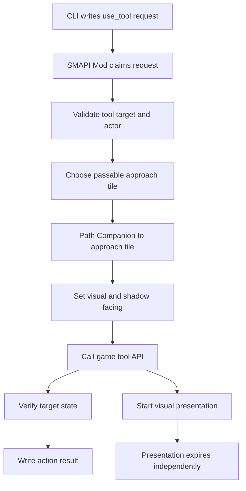
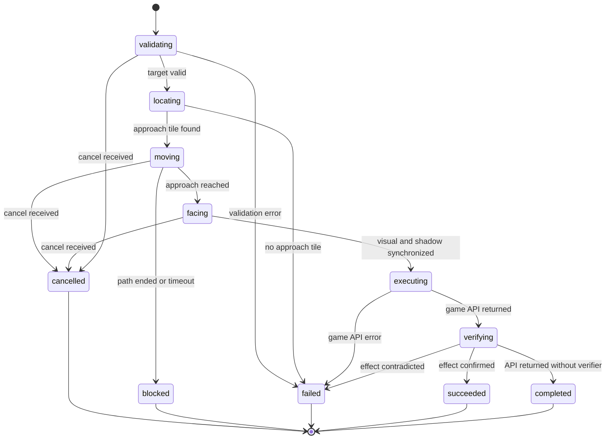
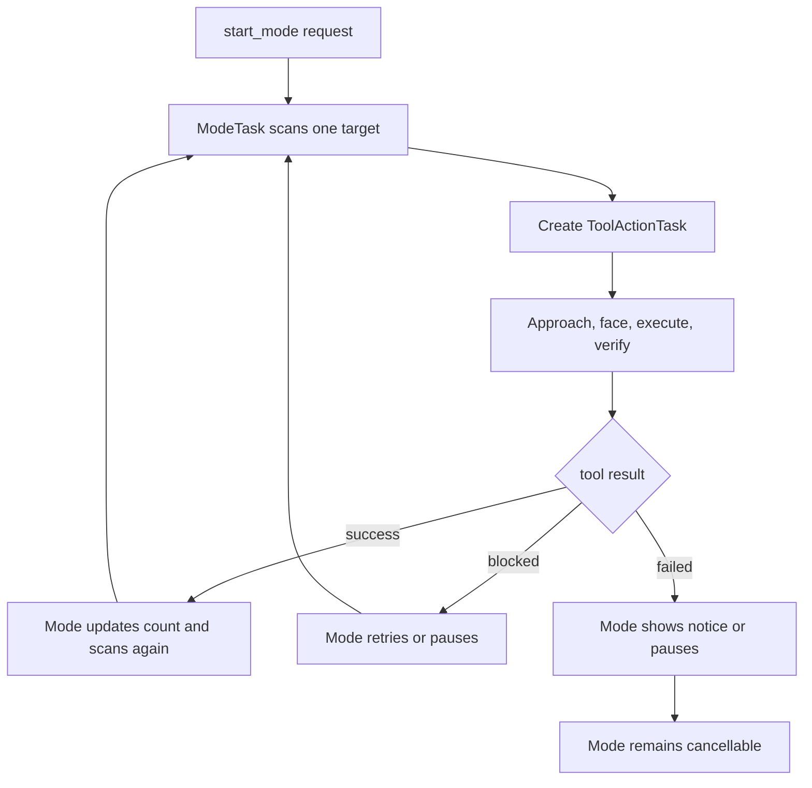

# use-tool 动作设计与持续模式执行基座

## 文档信息

| 项目 | 内容 |
| --- | --- |
| **文档标题** | use-tool 动作设计与持续模式执行基座 |
| **文档版本** | v0.3 |
| **创建日期** | 2026-08-28 |
| **更新日期** | 2026-08-28 |
| **文档类型** | 技术设计方案 |
| **关联文档** | [CLI 工具系统通信 Demo 技术实现方案](cli-file-bridge.md)、[Agent Runtime 技术设计](../agent-runtime/README.md) |
| **参考资料** | [SMAPI Mod structure](https://wiki.stardewvalley.net/Modding:Modder_Guide/APIs/Mod_structure)、[Stardew Valley tool source](https://github.com/veywrn/StardewValley/blob/master/StardewValley/Tool.cs)、[Farmer sprite reference](https://stardewvalleywiki.com/Modding:Farmer_sprite)、[StardewValley-MCP](https://github.com/amarisaster/StardewValley-MCP)、[stardew-mcp](https://github.com/Hunter-Thompson/stardew-mcp) |

## 目录

- [文档定位](#文档定位)
- [问题与目标](#问题与目标)
- [当前对象与职责](#当前对象与职责)
- [背包与工具映射](#背包与工具映射)
- [use-tool 命令语义](#use-tool-命令语义)
- [动作执行链路](#动作执行链路)
- [异步状态机](#异步状态机)
- [目标、站位与朝向](#目标站位与朝向)
- [游戏 API 执行](#游戏-api-执行)
- [可见表现](#可见表现)
- [取消与结果边界](#取消与结果边界)
- [状态与结果字段](#状态与结果字段)
- [持续模式复用](#持续模式复用)
- [并发与动作所有权](#并发与动作所有权)
- [实现边界与验证](#实现边界与验证)
- [实施检查项](#实施检查项)
- [参考实现对照](#参考实现对照)
- [当前限制](#当前限制)

## 文档定位

本文定义 `use_tool` 的当前设计语义，并规定后续持续模式如何复用它。本文是实现方案，不是外部项目调研；参考项目只用于说明设计依据和差异。

当前 Demo 使用一个固定的 `companion-1`，由两个运行时对象组成：

- `CompanionNpc`：可见对象，负责位置、寻路、朝向和画面表现；
- `BotFarmer`：不可见对象，持有工具和物品，作为 Stardew Valley 游戏 API 的调用主体。

一次工具动作必须同时维护这两个对象。游戏副作用由 `BotFarmer` 触发，可见位置和表现由 `CompanionNpc` 展示；二者不能长期处于不同的地点、tile 或朝向。

## 问题与目标

当前实现的 `use_tool` 会直接让 shadow farmer 面向目标并调用工具 API，可见 Companion 不一定先走到目标附近，也没有可靠地把 NPC 精灵切换到对应朝向和动作阶段。这会导致以下问题：

- Companion 与实际工具作用位置不一致；
- Companion 可能站在目标 tile 上，而不是站在目标旁边；
- shadow farmer 的朝向变化不一定反映到可见 NPC；
- 直接调用 `DoFunction` 只保证尝试产生游戏副作用，不能自动产生可见的原版 Farmer 工具动画；
- 持续模式如果绕过 `use_tool`，一次性动作和持续动作会拥有两套不同的站位、取消和验证逻辑。

本设计的目标是：

1. 将 `use_tool` 定义为“对目标 tile 执行一次工具动作”，而不是“在当前位置盲目挥动工具”；
2. 在游戏线程内异步完成接近目标、面向目标、执行工具和验证结果；
3. 让 CLI `use_tool` 与持续模式中的工具动作共享同一个执行基座；
4. 保持所有游戏操作命令的异步语义，并在安全边界支持 `cancel`；
5. 将游戏副作用、动作状态和可见表现分离，避免用绘制动画冒充动作成功。

## 当前对象与职责

| 对象 | 负责 | 不负责 |
| --- | --- | --- |
| CLI | 编码 `use_tool` 请求、返回 request ID、等待或取消 | 计算游戏内路径、直接调用游戏 API |
| JSON Bridge | 传输请求、结果和快照 | 决定目标站位、执行工具、验证世界状态 |
| `CompanionController` | 创建和推进 `ToolActionTask`，同步两个运行时对象 | 阻塞等待外部进程或模型 |
| `CompanionNpc` | 位置、寻路、朝向、基础精灵和临时可见表现 | 产生工具副作用 |
| `BotFarmer` | 工具、物品、体力、游戏 API 调用 | 直接绘制给玩家 |
| 持续模式 | 选择多个目标并逐个等待工具动作完成 | 复制工具执行、站位和取消逻辑 |

## 背包与工具映射

### 当前背包初始化

当前 Shadow Farmer 背包不是 `config.json` 配置，也不是玩家存档中的独立 Farmhand 背包。每次 Companion 创建时，Mod 创建一个运行时 `BotFarmer`：

1. 背包容量固定为 `36` 格；
2. 使用游戏的 `Farmer.initialTools()` 加入默认初始工具；
3. 剩余槽位填充为空值；
4. 当前没有从配置、存档或箱子转移物品到这个背包的通用流程。

因此，`Farmer.initialTools()` 是当前唯一的初始工具来源；项目代码没有在初始化阶段显式添加剑、鱼竿或其他额外物品。Shadow Farmer 是 Mod 运行时对象，当前没有独立的存档持久化逻辑；返回标题并重新创建 Companion 后，背包会按上述规则重新初始化。

### 背包读取和修改边界

`inventory` 是信息类 CLI 命令，对应协议动作 `get_inventory`。它读取 Shadow Farmer 当前 `Items`，结果中的每个物品包含槽位、名称、 qualified item ID、堆叠数量、类型和可食用性等字段。`companion` 和 `status` 的最新快照中也会包含当前背包投影，但快照只在 latest 写出周期到达时更新，不等价于即时读取。

当前 Demo 只有有限的背包修改路径：`eat_item` 会消耗可食用物品并改变 Shadow Farmer 的体力、生命和堆叠数量；`interact` 对箱子只读取并返回箱内物品，不会自动把物品转入背包。当前没有通用的添加、移除、转移、装备或整理背包命令，也没有背包配置项。

### 当前支持的工具

当前 `use_tool` 通过 Shadow Farmer 背包中的工具类型查找并调用游戏 API，支持以下入口：

| CLI 工具参数 | 对应游戏类型 | 背包要求 | 说明 |
| --- | --- | --- | --- |
| `hoe` | `Hoe` | 背包中有锄头 | 对目标 tile 执行锄头逻辑 |
| `pickaxe` | `Pickaxe` | 背包中有镐 | 对目标 tile 执行镐逻辑 |
| `axe` | `Axe` | 背包中有斧头 | 对目标 tile 执行斧头逻辑 |
| `watering_can` | `WateringCan` | 背包中有浇水壶 | 对目标 tile 执行浇水逻辑 |
| `sword`、`weapon` | `MeleeWeapon` | 背包中有近战武器 | 对目标 tile 执行近战伤害逻辑 |

鱼竿不通过 `use_tool` 选择，而由独立的 `cast_fishing_rod` 动作查找 `FishingRod`。`attack` 同样查找 Shadow Farmer 背包中的第一个 `MeleeWeapon`，没有武器时返回 `no_attack_target`；没有鱼竿时 `cast_fishing_rod` 返回 `no_fishing_rod`。

上述是当前 Demo 支持的工具入口，不是 Stardew Valley 全部原生工具的完整清单。当前没有为镰刀、奶桶、剪刀、淘金盘、弹弓、魔杖等其他原生工具提供 `use_tool` 参数映射；它们即使出现在背包中，也不能通过当前 CLI 工具命令自动调用。

工具命令的结果表示游戏 API 调用是否成功，不表示可见 Companion 已完成完整原版动画。工具表现由本设计的“可见表现”部分负责，实际游戏副作用仍由 Shadow Farmer 和游戏 API 决定。

## use-tool 命令语义

CLI 命令保持现有形式：

```text
stardew-cli use-tool <tool> --x <target-x> --y <target-y>
```

`x` 和 `y` 表示被操作的目标 tile，不表示 Companion 应该站立的 tile。Mod 默认自动选择目标四周的可通行站位，并把 Companion 放到该站位后面向目标。

当前工具参数映射如下：

| 参数 | 游戏类型 | 目标示例 | 说明 |
| --- | --- | --- | --- |
| `hoe` | `Hoe` | 可锄地面 | 目标是待锄的 tile |
| `pickaxe` | `Pickaxe` | 石头或矿脉 | 目标是待处理对象所在 tile |
| `axe` | `Axe` | 树木或树桩 | 目标是树木所在 tile |
| `watering_can` | `WateringCan` | 已开垦土地 | 目标是待浇水 tile |
| `sword`、`weapon` | `MeleeWeapon` | 目标方向或目标附近 | 实际伤害范围仍由游戏 API 决定 |

鱼竿继续使用独立的 `cast_fishing_rod`，因为鱼竿在抛竿后进入等待咬钩的长期状态，不是一次普通 `use_tool`。

`use_tool` 的调用方只获得异步受理回执和 `request_id`。Mod 可能在同一 Tick 完成参数失败，也可能需要多个 Tick 完成移动和工具调用；CLI 不对这两种情况暴露不同的协议。

## 动作执行链路



`CompanionNpc` 是唯一可见的位置来源。每个游戏 Tick 开始时，shadow farmer 从可见 NPC 同步位置和地点；工具执行前再同步一次朝向和位置，并确认工具的作用位置与目标 tile 一致。

## 异步状态机

每个 `use_tool` 建立一个 `ToolActionTask`。它只在 `UpdateTicked` 中推进有限工作，不使用线程等待、文件轮询或 `Thread.Sleep`。



### 状态说明

| 阶段 | 行为 | 是否已经产生游戏副作用 |
| --- | --- | --- |
| `validating` | 检查世界、地点、工具、体力和目标格式 | 否 |
| `locating` | 计算四周候选站位并检查可通行性 | 否 |
| `moving` | 使用 `PathFindController` 移动可见 NPC | 否 |
| `facing` | 设置 NPC 和 shadow farmer 的最终朝向，刷新可见精灵方向 | 否 |
| `executing` | 调用一次工具游戏 API | 可能产生 |
| `verifying` | 读取目标状态并判断动作是否达到预期 | 已经可能产生 |
| `succeeded` | 工具效果已确认 | 是 |
| `completed` | API 已返回，但该工具没有可靠的目标验证器 | 可能是 |
| `failed`、`blocked`、`cancelled` | 结束任务并清理路径和临时表现 | 取决于结束前是否进入执行阶段 |

`succeeded` 和 `completed` 都是终态成功；`completed` 的 `data.verification` 必须明确标记为 `api_returned`，不能伪装成目标状态已确认。

## 目标、站位与朝向

### 目标 tile 与站立 tile

工具目标和 Companion 站位是两个不同的坐标：

```text
target_tile   = 工具要作用的对象或地面
approach_tile = Companion 实际站立的可通行 tile
```

默认只考虑目标四个正交相邻 tile，不把目标 tile 本身作为候选站位。候选站位必须满足：

- 位于当前 `GameLocation`；
- 通过地图可通行检查；
- 能从 Companion 当前 tile 建立路径；
- 不要求路径穿过目标对象；
- 到达后，工具作用位置能映射回目标 tile。

候选方向与最终朝向的映射如下：

| 站位相对目标 | 面向方向 | 方向值 |
| --- | --- | --- |
| 目标下方 `(x, y + 1)` | `up` | `0` |
| 目标左侧 `(x - 1, y)` | `right` | `1` |
| 目标上方 `(x, y - 1)` | `down` | `2` |
| 目标右侧 `(x + 1, y)` | `left` | `3` |

候选顺序应优先选择距离当前 Companion 较近且路径可达的站位。若没有可达站位，动作进入 `blocked`，不调用工具 API。

### 到达后的同步

到达站位后必须按以下顺序处理：

1. 停止旧的 `PathFindController`；
2. 读取 Companion 实际 tile，不能只使用计划中的目标 tile；
3. 将可见 NPC 的 `FacingDirection` 设置为最终方向；
4. 显式刷新 NPC sprite 的方向帧；
5. 将 shadow farmer 的 `Position`、`currentLocation` 和 `FacingDirection` 同步到可见 NPC；
6. 用 shadow farmer 的 `GetToolLocation` 或等价游戏坐标确认工具作用点对应目标 tile；
7. 通过取消检查后才进入 `executing`。

普通 `move_to` 仍然是底层移动命令，但路径控制器不能再把所有动作的最终朝向固定为向下。工具动作需要把计算出的最终朝向传入路径任务；普通移动没有指定朝向时才使用其默认行为。

## 游戏 API 执行

工具执行必须发生在 SMAPI 游戏主线程中。`BotFarmer` 是游戏 API 的调用主体，工具对象仍然从它的背包中查找。

执行阶段的约束如下：

- 一次 `ToolActionTask` 只调用一次工具操作；
- 工具调用前检查工具存在、地点一致、体力大于零和目标仍然存在；
- `MeleeWeapon` 使用游戏的武器伤害入口；普通工具使用对应工具 API；
- 工具 API 返回后立即记录执行边界，并进入验证阶段；
- 体力消耗和游戏掉落物由游戏对象负责，不由可见表现模拟；
- 不通过操作 `Game1.player` 的输入状态来代替 Companion 的执行，这会把动作施加到主农场主身上；
- 如果未来接入原版 Farmer 动画，只能把它作为 Shadow Farmer 或独立可见渲染对象的实现细节，不能假设 NPC 贴图自动拥有 Farmer 的工具帧。

公开的游戏代码中，原版工具动画由 `Tool.beginUsing/endUsing`、`FarmerSprite.animateOnce` 和工具帧回调共同推进；因此直接调用 `DoFunction` 不能等价于完整的原版玩家动作。

## 可见表现

可见表现不是动作成功条件，也不拥有游戏副作用。表现至少需要与动作共享以下信息：

- `request_id`；
- 工具类型；
- 目标 tile；
- 实际站位；
- 最终朝向；
- 表现开始和结束 Tick。

### 无素材阶段

无新增素材时，表现优先使用以下方式：

- Companion 身体切换到正确的方向帧；
- 在目标 tile 使用游戏已有的水花、受击、碎片或音效效果；
- 对工具无法复用的部分显示短暂的目标脉冲或命中提示；
- 不再把旋转工具图标作为主要动作反馈，因为它无法表达不同方向和不同工具的真实动作。

### 当前 Demo 的表现覆盖

当前 Demo 使用无新增素材的近似表现，覆盖以下入口：

| 入口 | 工具或动作 | 当前表现 |
| --- | --- | --- |
| `use_tool` | `hoe`、`pickaxe`、`axe` | 按 Companion 朝向播放短暂挥动，并以目标 tile 作为命中位置 |
| `use_tool` | `watering_can` | 按朝向绘制短暂水流或水滴轨迹 |
| `use_tool` | `sword`、`weapon` | 播放短暂近战挥动和命中闪光；实际伤害仍由 Shadow Farmer 产生 |
| `attack` | Shadow Farmer 背包中的近战武器 | 使用实际武器类型和朝向播放近战挥动；失败时不播放成功特效 |
| `cast_fishing_rod` | 鱼竿 | 播放抛竿的短暂表现；等待咬钩、收线和捕获仍由鱼竿状态机负责 |
| `set_auto_combat` | 连续近战攻击 | 每次自动攻击成功时触发独立的近战表现 |

表现状态保存在可见 Companion 上，至少包含 `request_id`、表现类型、工具类型、朝向、目标 tile、开始 Tick 和剩余 Tick。表现状态与游戏副作用分别完成：Shadow Farmer 的游戏 API 成功或失败决定 action result，表现只负责短暂显示。鱼竿等待咬钩和自动战斗循环不能阻塞绘制逻辑。

实现层应保留 `CompanionNpc` 的 `base.draw()`，再叠加工具表现，不能重新实现 NPC 基础精灵或官方气泡。取消、读档、切换地点、返回标题和新的一天都必须清理临时表现状态。

### 高保真阶段

如果需要 Companion 看起来真正拿着斧头、锄头或剑挥动，有两个独立实现方向：

1. 为 Companion 提供包含工具动作帧的自定义角色资源；
2. 让可见角色使用可播放 Farmer 动画的渲染路径。

这两种方式都会影响资源或渲染架构，不能仅通过 `DoFunction` 或改变 NPC 的 `FacingDirection` 自动获得。无论采用哪种方式，表现都必须继续订阅 `ToolActionTask` 的状态，不能反向决定动作结果。

## 取消与结果边界

`cancel` 使用原始 `request_id` 关联 `ToolActionTask`。取消检查点如下：

- `validating`、`locating`、`moving`、`facing`：可以取消，停止路径并写入 `cancelled`；
- 进入 `executing` 前：最后一次检查取消；
- `executing` 已调用游戏 API 后：不再伪造取消，不回滚已经产生的副作用；
- `verifying`：继续完成最小状态读取，然后根据已发生的 API 调用写成功或失败；
- 可见表现播放期间：只清理表现，不改变已经完成的动作结果。

如果动作已进入 `executing`，取消请求可以返回“目标已进入不可回滚阶段”，目标 request 最终写入 `succeeded`、`completed` 或 `failed`，而不是 `cancelled`。持续模式的每一次工具命中都遵守同样的边界。

## 状态与结果字段

### 活动快照

Companion 快照在活动期间增加或更新以下字段：

| 字段 | 含义 |
| --- | --- |
| `current_action` | `use_tool` 或所属持续模式名称 |
| `action_phase` | `validating`、`moving`、`facing`、`executing`、`verifying` 等 |
| `target_tile` | 被操作的 tile |
| `approach_tile` | Companion 计划或实际站立的 tile |
| `facing_direction` | 工具执行时的最终朝向 |
| `tool` | 实际选中的工具名称 |
| `action_request_id` | 当前外部动作或持续模式 request ID |

### 结果示例

```json
{
  "status": "succeeded",
  "action": "use_tool",
  "actor_id": "companion-1",
  "data": {
    "tool": "axe",
    "target_tile": {"x": 18, "y": 12},
    "approach_tile": {"x": 18, "y": 13},
    "facing_direction": "up",
    "verification": "tree_health_changed"
  }
}
```

动作进入 `blocked` 或 `cancelled` 时，结果仍应包含已经获得的 `target_tile`、`approach_tile` 和当前位置，方便外部 Agent 根据新观察重新规划。

## 持续模式复用

持续模式不是通过 CLI 在外部循环提交很多个 `use_tool` 文件，而是在 Mod 内持有一个长期的模式任务，并逐个创建内部工具动作。



### 工具型持续模式

以下模式必须复用 `ToolActionTask`，不能直接调用旧的单 Tick 工具入口：

| 模式 | 目标扫描 | 工具动作 | 验证条件 |
| --- | --- | --- | --- |
| `chop_trees` | 当前地点可砍伐树木 | `Axe` | 树木生命下降、变成树桩或消失 |
| `water_crops` | 需要浇水的 `HoeDirt` | `WateringCan` | `needsWatering()` 变为 false |
| `mine` | 当前矿井楼层可破坏石块 | `Pickaxe` | 对象消失或目标状态发生变化 |

每次工具动作完成后，模式才可以扫描下一个目标。砍树的多次挥动不是一个无限期的工具调用，而是同一目标上多个有界的 `ToolActionTask`，每次执行后验证树木状态并检查取消。

### 非工具型持续模式

`harvest_crops` 和 `plant_crops` 不调用工具 API，但应复用相同的“选择相邻站位 → 寻路 → 面向 → 执行 → 验证”基础设施。它们的执行器分别调用收获和播种逻辑，不能为了复用 `use_tool` 而伪造工具调用。

`fish` 继续使用鱼竿状态机；`follow` 继续使用自己的跟随任务；自动战斗未来可以复用目标接近和朝向组件，但武器伤害和攻击频率仍由独立的战斗执行器负责。

### 模式取消

持续模式持有外部 `start_mode` 的 request ID，当前内部工具动作不产生新的外部 request。收到取消时，先停止内部路径或鱼竿状态，再结束模式 request；已经完成的工具副作用不回滚。

### 工具型模式的领域约束

以下约束属于模式的目标扫描和验证语义；单个目标的接近、朝向、工具调用、取消和结果边界统一由 `ToolActionTask` 执行：

#### `chop_trees`

模式只扫描允许处理的树木，排除不可砍伐对象、建筑、作物和特殊树木。没有符合条件的树木时正常完成；没有斧头时暂停并提示；路径连续失败时有限重试，超过上限后暂停或失败。每次斧头动作后重新读取树木、生命或掉落物状态，不能只依据 API 没有抛异常判断完成。

#### `water_crops`

模式只扫描需要浇水的 `HoeDirt`，排除没有作物、已完成当日浇水以及按当前天气和游戏规则无需浇水的 tile。只有重新读取并确认 `needsWatering()` 变为 false，才计入完成数量。没有浇水壶、壶为空、体力不足、地点不允许操作或路径持续阻塞时暂停并提示；不把普通地面当成耕地目标。

#### `mine`

当前 Demo 只处理 Companion 所在 `MineShaft` 楼层中的可破坏石块，不自动进入矿井、不自动跨楼层，也不把战斗和梯子逻辑伪装成已完成能力。模式需要检查镐、生命、体力和背包容量；每次破坏后重新读取目标状态。没有镐、目标不可达、楼层加载失败或状态无法确认时暂停或失败。

如果未来扩展地点进入、梯子、楼层推进或战斗，仍必须为这些阶段增加独立的状态验证和安全停止条件，不能把任意坐标 warp 当成正常挖矿步骤。

## 并发与动作所有权

单个 `companion-1` 同时只允许一个 foreground action 或持续模式：

- `use_tool` 执行期间不能被新的 `move_to`、`face_direction` 或其他工具动作抢占；
- 持续模式运行期间，模式内部可以创建工具子任务，但外部普通动作返回 `busy`；
- `cancel` 是唯一的通用中断入口；
- 路径、工具、鱼竿和表现状态必须由同一个 `CompanionController` 清理；
- `shadow farmer` 不能脱离可见 NPC 单独执行未登记的工具动作。

## 实现边界与验证

### 代码边界

当前实现已将工具动作拆分为以下职责：

1. `ToolTargetResolver`：校验目标并选择可达的相邻站位；
2. `ToolActionTask`：维护阶段、request ID、取消和超时；
3. `ToolExecutor`：在主线程调用具体工具 API；
4. `ToolVerifier`：读取目标变化并返回结构化验证结果；
5. `ActionPresentation`：只订阅执行阶段和表现信息，不参与成功判断。

`TryStartUseTool` 负责把外部请求转换成 `ToolActionTask`；持续模式负责提供目标并等待任务终态。两者不能分别实现一套近似逻辑。

### 本地可验证内容

- C# 项目能通过参考程序集构建；
- 协议 payload、request ID、pending/result 归档和 cancel 关联正确；
- Fake Mod 能覆盖阶段转换、无站位、取消和工具缺失；
- 单元测试能覆盖候选站位和方向映射。

### Windows + SMAPI 必须验证内容

- Companion 是否实际走到目标相邻 tile；
- 四个方向的身体朝向是否正确；
- 工具作用点是否与目标 tile 一致；
- 树木、石块、耕地和怪物的实际状态是否按预期变化；
- 工具动画、目标特效、音效和绘制层级是否可见；
- 移动中、面向中和执行前取消是否生效；
- 工具 API 执行后取消不会产生错误的 `cancelled` 结果；
- 持续砍树、浇水和挖矿是否逐个复用同一工具动作基座。

## 实施检查项

- [x] 为工具和攻击增加统一的 Companion `ActionPresentation` 状态，不新增美术素材；
- [x] 为 `hoe`、`pickaxe`、`axe`、`watering_can`、`sword`/`weapon` 和 `cast_fishing_rod` 增加近似动作表现；
- [x] 自动战斗每次成功攻击复用近战表现，并在取消和生命周期清理时结束表现状态；
- [ ] Windows + SMAPI 真实游戏中验证 Companion 是否走到目标相邻 tile，以及四个方向的朝向和工具作用点；
- [ ] Windows + SMAPI 真实游戏中完成全部工具动作表现的阶段验证；
- [ ] 在真实游戏中验证不同地点、工具、作物、矿井对象和怪物的版本兼容性；
- [x] 将直接 `use_tool` 和持续砍树、浇水、挖矿的工具调用统一收敛到 `ToolActionTask`、`ToolExecutor` 和 `ToolVerifier`。

## 参考实现对照

参考项目的做法不完全相同：

- [StardewValley-MCP](https://github.com/amarisaster/StardewValley-MCP) 使用可见 NPC 与 shadow farmer 分工，直接工具调用由 shadow farmer 执行；其 Player mode 的公开说明把 `move_to`、`face_direction` 和 `use_tool` 分成独立步骤。
- [stardew-mcp](https://github.com/Hunter-Thompson/stardew-mcp/blob/main/mod/StardewMCP/CommandExecutor.cs) 通过设置面向目标并模拟主玩家的使用工具输入来复用原版动作流程。这适用于主玩家控制，不等价于当前 Companion 的 shadow farmer 控制。
- 公开的游戏工具代码显示，原版工具动作会根据 Farmer 朝向选择 Farmer sprite 的不同动作帧，并通过工具回调推进副作用；NPC 的角色贴图不会自动获得这些 Farmer 动作帧。

这些资料支持“移动、朝向、工具执行和视觉表现需要区分”的判断，但不替代 Stardew Agent 的 Windows 真机验证。

## 当前限制

- 当前代码已将直接 `use_tool` 和工具型持续模式收敛到 `ToolActionTask`；仍需通过 Windows + SMAPI 验证真实游戏中的寻路、作用点和副作用。
- 当前 `use_tool` 只支持有限的工具类型，其他原生工具需要增加类型映射、作用范围和验证器。
- 无素材版本只能提供方向和目标反馈，不能保证复刻原版 Farmer 的完整工具动作。
- 目标状态验证依赖具体地点、对象和游戏版本；没有可靠验证器时只能返回 `api_returned`。
- 参考程序集只能验证编译和协议，不能证明寻路、朝向、工具副作用或动画在真实游戏中正确。
