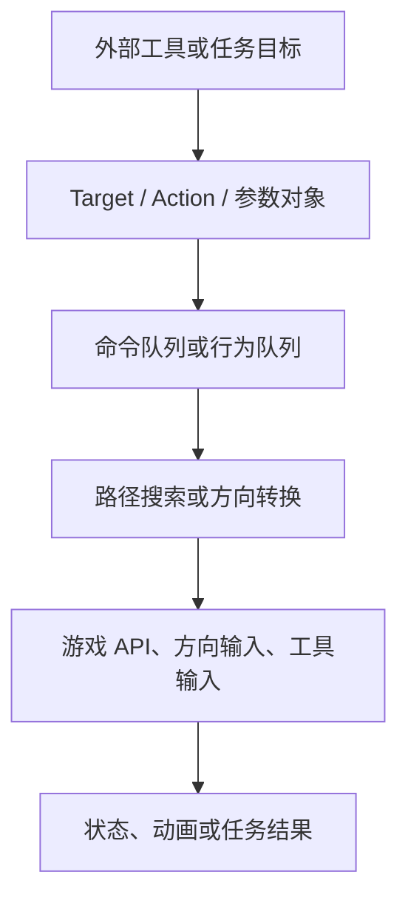
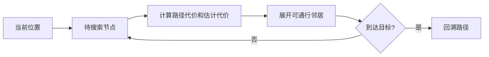

# Stardew Agent 动作执行与寻路实现调研

## 文档信息

| 项目         | 内容 |
| ------------ | ---- |
| **文档标题** | Stardew Agent 动作执行与寻路实现调研 |
| **文档版本** | v0.2 |
| **创建日期** | 2026-08-23 |
| **更新日期** | 2026-08-23 |
| **文档作者** | 项目维护者 |
| **文档类型** | 资料调研报告 |
| **参考资料** | [StardewMCP CommandExecutor](https://github.com/Hunter-Thompson/stardew-mcp/blob/3ca54bbfc1d446eeb06d822a74c92cd14df82b93/mod/StardewMCP/CommandExecutor.cs)、[StardewMCP Pathfinder](https://github.com/Hunter-Thompson/stardew-mcp/blob/3ca54bbfc1d446eeb06d822a74c92cd14df82b93/mod/StardewMCP/Pathfinder.cs)、[BotFramework Brain](https://github.com/andyruwruw/stardew-valley-bot-framework/blob/252d28496c545749497d46869d0f0bb7369e2c4d/BotFramework/Brain.cs)、[Farmtronics BotObject](https://github.com/JoeStrout/Farmtronics/blob/a59fc65bdb263d257d0ecd453202b65c6269f7a5/Farmtronics/Bot/BotObject.cs) |

## 目录

- [调研范围](#调研范围)
- [执行层次](#执行层次)
- [参考项目中的执行实现](#参考项目中的执行实现)
- [寻路实现](#寻路实现)
- [工具、交互与地点切换](#工具交互与地点切换)
- [等待、失败与重试](#等待失败与重试)
- [实现差异](#实现差异)
- [资料限制](#资料限制)

## 调研范围

本报告记录参考项目如何把高层目标、Target、工具调用、离散动作或脚本调用转换成游戏内移动和交互。内容包括命令队列、GameLoop、路径搜索、动画等待、目标验证、失败状态和跨地点行为。报告不规定 Stardew Agent 的执行器结构。

## 执行层次

参考项目中可以观察到若干不同执行层次：

并非所有项目都具备全部层次：StardewMCP 包含外部命令、命令队列、路径搜索和状态序列化；BotFramework 主要包含 Target、Brain、WorldParser 和角色控制；Farmtronics 则使用游戏内脚本 API 和 Bot 更新循环；Junimo-Kart-AI 直接使用屏幕和键盘输入。

## 参考项目中的执行实现

### StardewMCP 的 CommandExecutor

[CommandExecutor.cs](https://github.com/Hunter-Thompson/stardew-mcp/blob/3ca54bbfc1d446eeb06d822a74c92cd14df82b93/mod/StardewMCP/CommandExecutor.cs) 使用并发队列接收命令，并在 `UpdateTicked` 中消费。源码涉及移动、重复使用工具、蓄力工具等异步动作，并通过回调或状态把执行结果交给通信层。

执行器还保存移动目标、路径长度和进度等信息，状态序列化器可以将部分执行状态暴露给外部客户端。网络线程收到的命令和游戏事件中实际执行命令之间存在队列边界。

### StardewMCP 的 Pathfinder

[Pathfinder.cs](https://github.com/Hunter-Thompson/stardew-mcp/blob/3ca54bbfc1d446eeb06d822a74c92cd14df82b93/mod/StardewMCP/Pathfinder.cs) 在 tile 图上使用 A* 搜索，根据地点可通行判断和邻接规则生成路径。README 和源码中可以看到搜索半径、最大迭代次数、路径重算和不可达处理等约束。

路径搜索属于当前地点内的移动处理。地点切换、门和传送点在工具和命令层另有处理，没有被同一个 tile A* 图完整表示。

### BotFramework 的 Target 和 Brain

[BotFramework](https://github.com/andyruwruw/stardew-valley-bot-framework/tree/252d28496c545749497d46869d0f0bb7369e2c4d) 将目标分为 Tile、Object 和 Character，并为目标记录查询行为、调用顺序、可操作距离和动作。 [Brain.cs](https://github.com/andyruwruw/stardew-valley-bot-framework/blob/252d28496c545749497d46869d0f0bb7369e2c4d/BotFramework/Brain.cs) 按 `BeforeEach`、`AtLocationStart`、目标位置和 `AfterEach` 等阶段管理动作队列。

该项目的目标对象和执行器与 C# 游戏对象、地点查询和角色控制器关联，资料中没有发现与 StardewMCP WebSocket JSON 相同的跨进程动作协议。

### Farmtronics 的 Bot 更新循环

[BotObject.cs](https://github.com/JoeStrout/Farmtronics/blob/a59fc65bdb263d257d0ecd453202b65c6269f7a5/Farmtronics/Bot/BotObject.cs) 和 [BotFarmer.cs](https://github.com/JoeStrout/Farmtronics/blob/a59fc65bdb263d257d0ecd453202b65c6269f7a5/Farmtronics/Bot/BotFarmer.cs) 展示了游戏内 Bot 的位置、库存、工具选择和更新逻辑。MiniScript 的 `me` API 将脚本调用转换为 Bot 的移动和工具行为。

BotManager 负责更新 Bot，并处理保存、加载和多玩家状态。动作执行没有经过独立的外部网络队列。

## 寻路实现

### A* 的数据形态

StardewMCP 的 Pathfinder 使用地点内 tile 作为节点，使用可通行检查和相邻 tile 生成边。一个抽象的搜索过程可以表示为：

图示是对 A* 一般过程的说明，不是 StardewMCP 的完整代码复制。固定提交中还存在扫描范围、迭代上限和路径重新计算等工程限制。

### 动态障碍

游戏中的 NPC、动物、对象、门、动画和地点状态可能改变 tile 的可通行性。参考资料可以看到路径重算或执行状态检查，但无法仅凭静态代码确定所有动态障碍的更新时机和处理覆盖范围。

### 到达判定

路径执行和到达判定不是同一件事。源码和相关动作逻辑中可以观察到的位置、路径进度、动画和当前地点等状态。仅凭发送最后一个方向输入，不能确认角色已经完成目标动作；实际判定还依赖游戏状态读取和执行器的具体实现。

## 工具、交互与地点切换

### 工具动作

StardewMCP 的工具动作包含工具选择、目标或方向、重复使用和蓄力等参数。工具动画完成表示输入阶段结束，不必然表示目标对象已经发生预期变化。目标是否可作用、工具是否正确和状态是否变化由游戏状态和执行器逻辑共同决定。

### 交互与菜单

BotFramework 和 StardewMCP 都包含对象或目标交互的概念，但对象定位、距离和菜单处理方式不同。StarDojo 的动作接口还包含功能键和菜单状态。参考资料没有给出一个跨项目统一的菜单项标识方式；菜单索引、文本、对象 ID 和当前菜单类型在不同实现中承担不同作用。

### 跨地点移动

参考项目将地点、出口、门或传送相关状态分别处理。当前地点内的 tile 路径不能覆盖地点切换后的坐标系和加载生命周期。StarDojo 的 `get_surroundings`、地点状态和任务环境字段也把地点作为 Observation 的一部分。

## 等待、失败与重试

### 游戏状态等待

StarDojo 的 `waitForReady` 检查暂停、工具动画、武器动画、传送、菜单等状态后再执行部分命令。StardewMCP 的动作执行器通过游戏 tick 队列和动作状态处理异步操作。两个实现都表明外部命令到达时间和游戏可操作时间可能不同。

### 失败信息

参考项目中可以观察到以下失败来源：

| 来源 | 示例 |
| --- | --- |
| 路径搜索 | 目标超出搜索范围、达到迭代上限、没有可通行路径 |
| 游戏状态 | 游戏未加载、暂停、菜单打开、地点切换或动画未结束 |
| 动作前置条件 | 缺少工具、目标不在作用范围、物品或资源状态不满足 |
| 输入执行 | 方向输入、工具动画或键盘输入与预期状态不一致 |
| 通信 | 连接断开、文本结束标记错误、消息解析失败或超时 |
| 任务评估 | 动作返回但任务状态未达到成功谓词 |

不同项目对这些失败的分类粒度不同。静态资料不足以比较它们在重试次数、幂等性和中断后的命令处理上的实际行为。

### 重试行为

StardewMCP 的路径可以在执行过程中重新计算；StarDojo 的环境可以在任务或 Episode 层重置；BotFramework 的 Brain 可以重新生成行为队列。这些分别属于路径级、环境级和行为队列级的恢复方式，不是同一种重试协议。

## 实现差异

| 维度 | StardewMCP | BotFramework | Farmtronics | StarDojo | Junimo-Kart-AI |
| --- | --- | --- | --- | --- | --- |
| 命令来源 | WebSocket 外部命令 | 游戏内 Brain/Target | 游戏内脚本 | Python TCP/离散动作 | 键盘输入 |
| 队列 | CommandExecutor 队列 | Brain 行为队列 | Bot/脚本更新循环 | 环境命令与 Mod 处理 | 输入帧/控制循环 |
| 寻路 | tile A* | WorldParser/角色控制 | Bot 移动 API | Mod 内动作转换 | 视觉策略控制 |
| 等待 | 游戏 tick、动作状态 | 目标和动作阶段 | 更新循环 | `waitForReady` 等状态检查 | 帧和按键时序 |
| 结果依据 | 回调、状态和序列化 | 目标/动作执行状态 | Bot 状态 | 文本结果、Observation、evaluator | 游戏分数或训练奖励 |

## 资料限制

- 静态源码无法完全描述碰撞、动画、输入延迟和动态对象对寻路的影响。
- 参考项目的固定提交可能使用了特定游戏版本、SMAPI 版本或平台行为。
- 路径算法的平均延迟、失败率、重算频率和资源消耗没有在本报告中进行运行时测量。
- 动作 Result 的语义在不同项目中由 JSON 字段、文本结果、对象状态或 evaluator 分别定义。
- 地点切换、存档加载、多人模式和连接断开时的动作处理，需要实际运行或更完整的测试资料确认。
