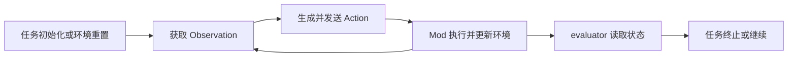

# Stardew Agent 任务循环与评测实现调研

## 文档信息

| 项目         | 内容 |
| ------------ | ---- |
| **文档标题** | Stardew Agent 任务循环与评测实现调研 |
| **文档版本** | v0.2 |
| **创建日期** | 2026-08-23 |
| **更新日期** | 2026-08-23 |
| **文档作者** | 项目维护者 |
| **文档类型** | 资料调研报告 |
| **参考资料** | [StarDojo 任务文档](https://github.com/StarDojo2025/stardojo/tree/e251401cf1e84ba07cbfa08283a7aba52290e578/docs/docs_src)、[StardewMCP Agent 入口](https://github.com/Hunter-Thompson/stardew-mcp/blob/3ca54bbfc1d446eeb06d822a74c92cd14df82b93/mcp-server/main.go)、[StardewMCP 状态序列化](https://github.com/Hunter-Thompson/stardew-mcp/blob/3ca54bbfc1d446eeb06d822a74c92cd14df82b93/mod/StardewMCP/GameStateSerializer.cs) |

## 目录

- [调研范围](#调研范围)
- [可观察的任务循环](#可观察的任务循环)
- [任务模型](#任务模型)
- [轨迹与状态记录](#轨迹与状态记录)
- [评测指标](#评测指标)
- [复现条件](#复现条件)
- [资料限制](#资料限制)

## 调研范围

本报告记录 StarDojo、StardewMCP 以及相关环境代码中的任务执行、状态观察、动作调用、结果验证和轨迹记录。报告将“项目代码中已有的任务/评测实现”和“从实现结构中可以抽象出的共同步骤”分开描述，不把抽象步骤转换为 Stardew Agent 的实施方案。

## 可观察的任务循环

### StarDojo 的环境循环

StarDojo 将 Python 环境、Mod 通信、Observation Space、Action Space、任务初始化和 evaluator 组织在一起。任务运行时，环境接收动作、从 Mod 获取状态、更新环境 Observation，并由任务 evaluator 计算任务结果。

从这些组件的交互关系可以抽象出以下观察序列：

该图表示 StarDojo 资料中环境、动作和 evaluator 的关系，不代表 Stardew Agent 必须采用相同的循环。

### StardewMCP 的外部调用循环

StardewMCP 的 Go [GameClient](https://github.com/Hunter-Thompson/stardew-mcp/blob/3ca54bbfc1d446eeb06d822a74c92cd14df82b93/mcp-server/main.go) 维护当前状态和响应通道。外部工具提交命令后，Mod 的 CommandExecutor 在游戏事件中处理，结果通过 WebSocket 返回，状态还会按连接建立或定时事件发送。

从代码可以观察到以下事件关系：

1. 外部客户端读取或缓存状态；
2. 工具生成包含动作名称和参数的命令；
3. Mod 将命令排队并在游戏 tick 中执行；
4. 命令结果和后续状态通过 WebSocket 返回；
5. 外部调用者根据状态或工具结果继续调用。

StardewMCP 的固定提交没有显示 StarDojo 那种统一的任务配置和 evaluator 目录结构。

## 任务模型

### StarDojo 任务字段

StarDojo 的任务文档和任务代码中可以看到以下字段或概念：

| 字段/概念 | 资料中的作用 |
| --- | --- |
| 任务标识 | 区分任务实例或任务类型 |
| instruction | 任务的自然语言或文本描述 |
| save/init_commands | 提供初始存档和初始化状态 |
| difficulty | 任务难度或任务配置字段 |
| evaluator | 根据 Observation 和环境状态计算任务结果 |
| task pipeline | 任务推断、规划、执行和日志等外部组件 |

不同任务的具体字段和初始化方式由 StarDojo 代码解释。表格不表示 Stardew Agent 的任务 Schema。

### 任务状态与游戏状态

参考实现中，任务状态和游戏状态不是同一个对象：

| 状态 | 示例来源 |
| --- | --- |
| 游戏状态 | 玩家位置、游戏时间、地点、菜单、库存、NPC 和地图 |
| 动作状态 | 当前动作、队列、工具动画、路径进度或通信响应 |
| 任务状态 | 目标进度、成功/失败谓词、Episode 是否结束 |
| 运行状态 | 连接、环境实例、日志、模型调用或异常 |

StarDojo 的 evaluator 将任务状态从环境 Observation 中计算出来；StardewMCP 则主要把游戏状态和动作结果交给外部工具调用者。

## 轨迹与状态记录

### StarDojo 的记录内容

StarDojo 的环境和 Agent Pipeline 涉及日志、任务输出和视频记录。其 Observation、Action、任务信息和环境结果可以作为运行轨迹的一部分。共享内存图像和文本命令还会产生不同的数据记录来源。

### StardewMCP 的记录内容

StardewMCP 的 Go Runtime 维护当前状态和响应通道；Mod 侧序列化游戏状态并通过 WebSocket 发送。固定提交的公开代码中可以看到状态缓存、请求 ID 和命令响应，但没有看到与 StarDojo evaluator 统一格式的 Episode 轨迹对象。

### 轨迹事件的共同字段

从两个项目的接口可以整理出用于分析的字段类别：

| 字段类别 | 可能的来源 |
| --- | --- |
| 时间 | 游戏时间、游戏 tick、环境步数、墙钟时间 |
| 状态 | Observation、状态缓存、共享内存图像 |
| 动作 | JSON 命令、离散数组、TCP 文本或工具调用 |
| 结果 | WebSocket 响应、TCP 文本、环境 step 结果、evaluator 输出 |
| 上下文 | 任务 ID、存档、环境实例、模型或策略配置 |
| 终止 | 任务成功、任务失败、超时、异常或环境重置 |

这些字段是对资料中不同日志来源的分类，不是统一日志格式。

## 评测指标

### StarDojo evaluator

StarDojo 的任务 evaluator 读取环境 Observation 和任务配置，评估任务状态。任务难度、初始状态、成功条件和输出记录由任务代码决定。当前固定版本的资料没有把所有任务的成功谓词归纳为跨任务标准。

### 可从资料中观察的指标维度

| 指标维度 | 可能的计算来源 | 资料状态 |
| --- | --- | --- |
| 任务成功/失败 | evaluator 或任务结果 | StarDojo 有明确组件，StardewMCP 外部处理 |
| 动作数量 | Action 调用、命令队列或环境步数 | 可从运行轨迹统计 |
| 游戏内耗时 | 游戏时间字段 | 状态序列化或 Observation 中可能出现 |
| 墙钟耗时 | 外部日志或环境运行日志 | 需要运行时记录 |
| 重试/恢复 | 重复 Action、路径重算、环境重置 | 不同项目定义不同 |
| 资源变化 | 游戏状态、库存、金币、体力 | 依赖 Observation 字段 |
| 模型调用成本 | Agent Pipeline 或外部服务日志 | StarDojo Pipeline 可能包含，需结合运行配置 |
| 复现性 | 多次运行的结果和轨迹比较 | 当前资料未给出统一实验结果 |

表格列出可由接口或日志得到的指标维度，不对指标进行权重排序或提出评测标准。

## 复现条件

参考项目的任务和环境行为受到以下条件影响：

- Stardew Valley、SMAPI、Mod 和外部 Runtime 的版本；
- 初始存档、初始化命令和任务配置；
- 游戏地点、游戏内时间、NPC 行为和随机事件；
- 端口、共享内存名称、环境实例和并行数量；
- 模型提供者、提示、随机种子、策略 checkpoint 和采样参数；
- 屏幕捕获、键盘输入、图像编码和系统延迟。

StarDojo 的任务环境提供了部分初始化和评估入口；StardewMCP 的公开代码主要提供游戏状态、命令和外部客户端。固定提交的资料没有提供一套跨项目通用的复现清单。

## 资料限制

- 静态源码无法说明 evaluator 在所有任务状态下的边界判定是否正确。
- 任务成功不一定等同于单个 Action 返回成功；不同项目的任务层和动作层分离程度不同。
- 日志、视频、共享内存图像和 JSON 状态的时间戳对齐方式需要运行时确认。
- 参考项目没有共同的 Episode、Trajectory 或 Metric Schema。
- 随机事件、多人状态、连接断开和环境重置对评测的影响需要实际运行确认。
- 本报告不从这些事实推导 Stardew Agent 的任务集、评测门槛或工程计划。
