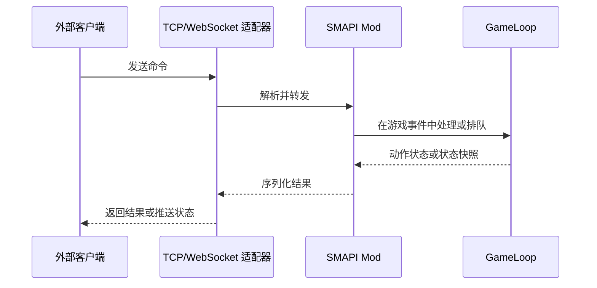

# Stardew Agent 通信实现调研

## 文档信息

| 项目         | 内容 |
| ------------ | ---- |
| **文档标题** | Stardew Agent 通信实现调研 |
| **文档版本** | v0.2 |
| **创建日期** | 2026-08-23 |
| **更新日期** | 2026-08-23 |
| **文档作者** | 项目维护者 |
| **文档类型** | 资料调研报告 |
| **参考资料** | [StardewMCP](https://github.com/Hunter-Thompson/stardew-mcp/tree/3ca54bbfc1d446eeb06d822a74c92cd14df82b93)、[StarDojo](https://github.com/StarDojo2025/stardojo/tree/e251401cf1e84ba07cbfa08283a7aba52290e578)、[SMAPI Mod 结构](https://wiki.stardewvalley.net/Modding:Modder_Guide/APIs/Mod_structure) |

## 目录

- [调研范围](#调研范围)
- [通信边界](#通信边界)
- [StardewMCP 的通信实现](#stardewmcp-的通信实现)
- [StarDojo 的通信实现](#stardojo-的通信实现)
- [传输方式的可观察差异](#传输方式的可观察差异)
- [消息生命周期](#消息生命周期)
- [实现限制与待验证事实](#实现限制与待验证事实)
- [资料链接](#资料链接)

## 调研范围

本报告记录参考项目中游戏进程、SMAPI Mod、外部进程和模型工具之间的通信实现。内容包括传输媒介、消息格式、线程切换、状态推送、动作响应和连接生命周期。报告不规定 Stardew Agent 的通信方式，也不把参考项目的实现转换为项目设计。

## 通信边界

从参考项目可以观察到三类边界：

| 边界 | 典型参与者 | 资料中观察到的内容 |
| --- | --- | --- |
| 游戏内部 | Stardew Valley、SMAPI Mod、GameLoop 事件 | Mod 读取游戏对象，或在游戏事件中处理动作 |
| 游戏进程与外部进程 | Mod、TCP/WebSocket、Python/Go 客户端 | 状态和命令以序列化消息或共享内存数据跨进程传输 |
| 外部进程与模型工具 | Go MCP Server、Python Agent Pipeline、LLM 或策略代码 | 外部程序将游戏状态和动作包装成工具、环境或策略接口 |

这些边界在参考项目中的具体位置不同。MCP 是 StardewMCP 外部 Go 服务的一部分；StarDojo 的环境进程则直接通过 TCP 和共享内存连接 Mod。资料没有显示一个被所有项目共同采用的通信分层。

## StardewMCP 的通信实现

### Mod 侧事件与组件

[ModEntry.cs](https://github.com/Hunter-Thompson/stardew-mcp/blob/3ca54bbfc1d446eeb06d822a74c92cd14df82b93/mod/StardewMCP/ModEntry.cs) 初始化 `GameStateSerializer`、`CommandExecutor` 和 `WebSocketServer`，并注册以下事件：

| 事件 | 源码中观察到的行为 |
| --- | --- |
| `GameLaunched` | 启动 WebSocket Server |
| `UpdateTicked` | 处理等待中的游戏命令 |
| `OneSecondUpdateTicked` | 广播游戏状态 |
| `SaveLoaded` | 记录或处理存档加载生命周期 |
| `ReturnedToTitle` | 处理返回标题状态 |

[WebSocketServer.cs](https://github.com/Hunter-Thompson/stardew-mcp/blob/3ca54bbfc1d446eeb06d822a74c92cd14df82b93/mod/StardewMCP/WebSocketServer.cs) 使用 `ws://localhost:8765/game`。新连接建立后发送一次状态，之后按秒广播状态。代码中同时存在客户端连接管理、消息读取、消息发送和命令转发。

### 消息字段

源码中的命令消息包含 `id`、`type`、`action` 和 `params`；响应消息包含 `id`、`type`、`success`、`message` 和 `data`。请求 ID 用于在外部服务中关联异步结果。这里的字段是该提交中代码使用的 JSON 形态，不等同于通用协议标准。

### 状态序列化

[GameStateSerializer.cs](https://github.com/Hunter-Thompson/stardew-mcp/blob/3ca54bbfc1d446eeb06d822a74c92cd14df82b93/mod/StardewMCP/GameStateSerializer.cs) 序列化玩家、时间、世界、周围环境、地图、任务、关系和技能。周围环境包含 61×61 的 ASCII 地图及附近对象。状态数据由 Mod 生成后通过 WebSocket 发送。

### 外部客户端

[mcp-server/main.go](https://github.com/Hunter-Thompson/stardew-mcp/blob/3ca54bbfc1d446eeb06d822a74c92cd14df82b93/mcp-server/main.go) 中的 `GameClient` 维护状态缓存、响应通道和连接状态，并用请求 ID 等待命令响应。上层工具将 `move_to`、`use_tool`、`interact` 等操作包装给外部调用者。游戏通信使用 WebSocket，MCP 工具封装位于 Go 服务中。

## StarDojo 的通信实现

### Mod 侧 TCP 与游戏线程

[StardojoMod/ModEntry.cs](https://github.com/StarDojo2025/stardojo/blob/e251401cf1e84ba07cbfa08283a7aba52290e578/StardojoMod/ModEntry.cs) 使用回环 TCP Listener 接收外部命令。端口通过 `--port-id` 参数传入。文本命令使用 `%` 分隔参数，文本结果使用 `<EOF>` 作为结束标记。

网络回调收到命令后，不直接在网络线程中完成所有游戏操作，而是将工作转移到 `UpdateTicked`。源码中的 `waitForReady` 会检查暂停、工具动画、武器动画、传送、菜单和其他可操作状态。

### 共享内存 Observation

StarDojo 的图像或二进制 Observation 写入 Memory-Mapped File，外部 Python 环境读取后使用 CBOR 解码。TCP 文本通道和共享内存数据通道在实现中承担不同的数据类型。

### Python 环境

[env/actions.py](https://github.com/StarDojo2025/stardojo/blob/e251401cf1e84ba07cbfa08283a7aba52290e578/env/actions.py) 通过回环 TCP 发送 `move_relative`、`observe_v2`、`get_surroundings` 等命令，并解析 `<EOF>` 结尾的结果。`convert_discrete_into_commands` 将固定长度的离散动作数组转换成移动、转向和功能命令。

StarDojo 的 Python 环境还包含 Observation Space、Action Space、任务初始化和 evaluator。它将通信、环境状态和任务评测组织在同一个环境接口下；这些组件的组合方式与 StardewMCP 的 Go MCP Server 不同。

## 传输方式的可观察差异

| 传输方式 | 参考项目中的出现位置 | 从实现中可观察的特征 | 资料中可见的限制 |
| --- | --- | --- | --- |
| WebSocket + JSON | StardewMCP | 双向连接、JSON 消息、状态广播、请求 ID | 连接管理、消息顺序和超时由项目代码处理，协议定义依赖实现 |
| 回环 TCP + 文本协议 | StarDojo | 字符串命令、分隔符参数、`<EOF>` 结束标记 | 类型信息较少，分隔符和结束标记属于双方约定 |
| Memory-Mapped File | StarDojo | 适合写入图像或二进制 Observation | 需要额外的共享内存名称、大小和编码约定 |
| HTTP | 本次固定版本的上述实现中未作为游戏主通道出现 | 常见的请求/响应传输 | 本次资料未覆盖其在 Stardew Mod 实时控制中的实现细节 |
| MCP | StardewMCP 的外部 Go Server | 工具调用和模型侧接口 | 资料中的 MCP 不承担 Mod 与游戏进程之间的底层传输 |

表格只描述参考实现中出现的媒介和源码特征，不表达 Stardew Agent 的技术选择。

## 消息生命周期

参考实现中的消息生命周期可以整理为两个实际样本：

在 StardewMCP 中，WebSocket 连接同时承载命令和状态消息；在 StarDojo 中，文本命令通道和共享内存 Observation 通道并行存在。两者都涉及“外部消息到达”和“游戏事件中执行”之间的时间差，但具体的状态回传格式不同。

## 实现限制与待验证事实

以下内容不能仅由当前固定版本的源码和文档确认：

- 游戏切换地点、打开菜单、暂停、读档和返回标题时，各事件与 `world_ready` 的精确对应关系；
- WebSocket Server 和 TCP Listener 在不同操作系统、游戏版本和 SMAPI 版本中的稳定性；
- 动作执行中连接断开时，两个参考项目是否会保留、取消或重复外部命令；
- 大型 Observation 写入共享内存时的并发读写同步行为；
- 多个游戏实例同时启动时的端口、共享内存名称和存档隔离规则；
- 状态广播频率、网络阻塞和游戏 tick 之间的实际延迟分布；
- 参考项目当前提交之外的协议变更和维护状态。

这些是资料边界或运行时事实，不是 Stardew Agent 的实现计划。

## 资料链接

- [StardewMCP README](https://github.com/Hunter-Thompson/stardew-mcp/blob/3ca54bbfc1d446eeb06d822a74c92cd14df82b93/README.md)
- [StardewMCP ModEntry.cs](https://github.com/Hunter-Thompson/stardew-mcp/blob/3ca54bbfc1d446eeb06d822a74c92cd14df82b93/mod/StardewMCP/ModEntry.cs)
- [StardewMCP WebSocketServer.cs](https://github.com/Hunter-Thompson/stardew-mcp/blob/3ca54bbfc1d446eeb06d822a74c92cd14df82b93/mod/StardewMCP/WebSocketServer.cs)
- [StardewMCP GameStateSerializer.cs](https://github.com/Hunter-Thompson/stardew-mcp/blob/3ca54bbfc1d446eeb06d822a74c92cd14df82b93/mod/StardewMCP/GameStateSerializer.cs)
- [StardewMCP Go GameClient](https://github.com/Hunter-Thompson/stardew-mcp/blob/3ca54bbfc1d446eeb06d822a74c92cd14df82b93/mcp-server/main.go)
- [StarDojo ModEntry.cs](https://github.com/StarDojo2025/stardojo/blob/e251401cf1e84ba07cbfa08283a7aba52290e578/StardojoMod/ModEntry.cs)
- [StarDojo actions.py](https://github.com/StarDojo2025/stardojo/blob/e251401cf1e84ba07cbfa08283a7aba52290e578/env/actions.py)
