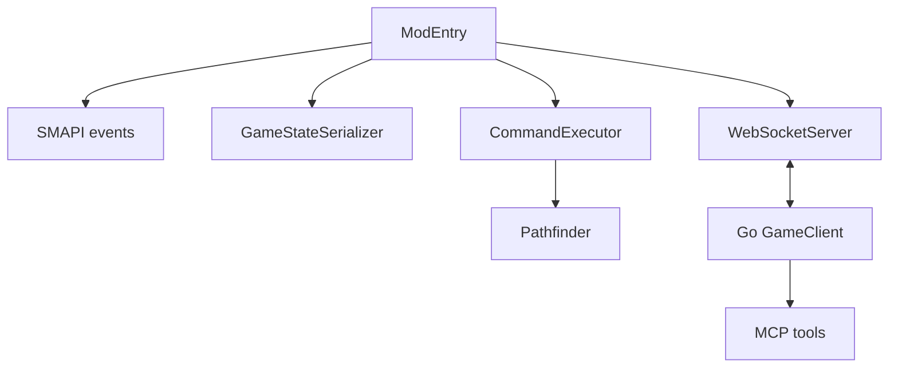
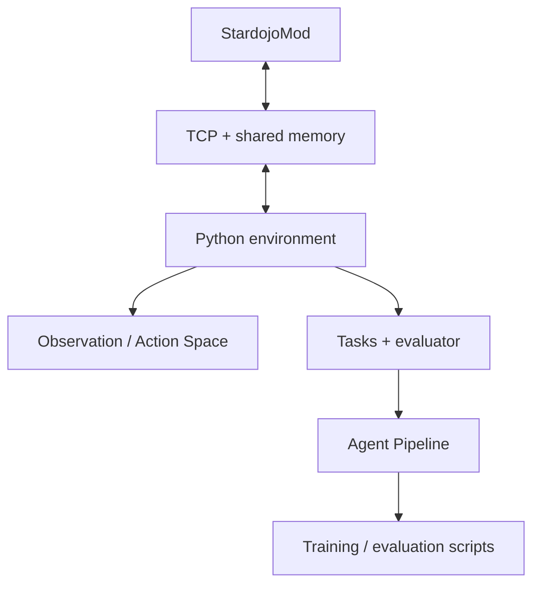

# Stardew Agent 参考项目开发阶段观察

## 文档信息

| 项目         | 内容 |
| ------------ | ---- |
| **文档标题** | Stardew Agent 参考项目开发阶段观察 |
| **文档版本** | v0.2 |
| **创建日期** | 2026-08-23 |
| **更新日期** | 2026-08-23 |
| **文档作者** | 项目维护者 |
| **文档类型** | 资料调研报告 |
| **参考资料** | [SMAPI Mod 结构](https://wiki.stardewvalley.net/Modding:Modder_Guide/APIs/Mod_structure)、[SMAPI Mod package](https://github.com/Pathoschild/SMAPI/blob/79f9bbbe3edbb7ca3369e7ad0d3dd45131b34fc0/docs/technical/mod-package.md)、[StardewMCP](https://github.com/Hunter-Thompson/stardew-mcp/tree/3ca54bbfc1d446eeb06d822a74c92cd14df82b93)、[StarDojo](https://github.com/StarDojo2025/stardojo/tree/e251401cf1e84ba07cbfa08283a7aba52290e578) |

## 目录

- [调研范围](#调研范围)
- [SMAPI Mod 的生命周期资料](#smapi-mod-的生命周期资料)
- [StardewMCP 的组件层次](#stardewmcp-的组件层次)
- [StarDojo 的组件层次](#stardojo-的组件层次)
- [其他项目的阶段性结构](#其他项目的阶段性结构)
- [阶段与依赖的对照](#阶段与依赖的对照)
- [资料限制](#资料限制)

## 调研范围

本报告只整理参考项目公开资料中出现的生命周期、组件依赖和开发阶段信息。这里的“阶段”是源码结构、README、文档或运行入口中已经出现的阶段性划分，不是 Stardew Agent 的实施路线、里程碑或验收计划。

## SMAPI Mod 的生命周期资料

[SMAPI Mod 结构文档](https://wiki.stardewvalley.net/Modding:Modder_Guide/APIs/Mod_structure)和 [Mod package 文档](https://github.com/Pathoschild/SMAPI/blob/79f9bbbe3edbb7ca3369e7ad0d3dd45131b34fc0/docs/technical/mod-package.md)描述了 Mod 的入口、Manifest、事件订阅、构建、部署和发布包等内容。

从这些资料可以观察到的生命周期节点包括：

| 节点 | 资料中出现的内容 |
| --- | --- |
| 包和 Manifest | Mod ID、名称、版本、入口类和依赖声明 |
| 入口 | SMAPI 加载 Mod 并调用入口方法 |
| 事件 | Mod 订阅游戏生命周期、GameLoop、输入或内容事件 |
| 运行 | 事件回调访问游戏 API 或处理 Mod 状态 |
| 关闭/返回标题 | 具体 Mod 根据事件清理运行时状态 |
| 构建和发布 | 编译输出、部署目录和发布压缩包 |

不同 Mod 使用的事件集合和清理逻辑不同；SMAPI 的生命周期资料没有规定 Agent 通信、Observation 或 Action。

## StardewMCP 的组件层次

StardewMCP 的固定提交可以按代码依赖观察到以下层次：

README、Mod 入口、序列化器、执行器、WebSocket Server 和 Go 客户端共同构成一条从游戏到工具的调用链。公开资料可以看到状态读取、命令执行和工具封装已分别存在；资料没有将这些组件描述为 Stardew Agent 的阶段计划。

## StarDojo 的组件层次

StarDojo 的仓库结构包含 Mod、Python 环境、Action/Observation 定义、任务、Agent Pipeline、训练或运行脚本等部分。其组件关系可以从公开目录和文档概括为：

StarDojo 的任务文档还涉及存档、初始化命令、难度、任务评估和输出记录。不同任务和运行模式可能使用不同配置；固定提交中的目录结构不等于所有环境都执行同样的步骤。

## 其他项目的阶段性结构

### BotFramework

BotFramework 的代码组织体现了从目标查询到 Brain 行为队列、再到角色控制器的运行层次。它以游戏内 Bot 行为为中心，没有看到外部 Agent 服务、LLM 工具调用或独立任务评测入口。

### Farmtronics

Farmtronics 的代码包含 Home Computer、MiniScript、BotObject、BotFarmer、BotManager、保存加载和游戏内更新。其运行阶段发生在游戏内脚本和 Bot 生命周期中，不是外部环境启动流程。

### StardewVLA

StardewVLA 的项目说明包含独立 FarmWorld、脚本专家轨迹、行为克隆、PPO 和泛化测试等研究组件。它的阶段性结构属于模拟环境训练实验，不是 SMAPI Mod 生命周期。

### Junimo-Kart-AI

Junimo-Kart-AI 的运行结构包含屏幕捕获、状态识别、键盘输入、训练和小游戏测试。它的阶段依赖屏幕和输入系统，不包含完整农场 Agent 的存档、Mod 通信或任务初始化层。

## 阶段与依赖的对照

| 资料中的阶段/组件 | 前置条件 | 后续依赖 | 资料来源 |
| --- | --- | --- | --- |
| SMAPI Mod 加载 | Manifest、入口类、依赖 | 事件回调和游戏 API | SMAPI |
| StardewMCP 状态读取 | Mod 运行、GameStateSerializer | WebSocket 状态发送、外部缓存 | StardewMCP |
| StardewMCP 动作执行 | CommandExecutor、GameLoop | 工具结果和状态更新 | StardewMCP |
| StarDojo 环境通信 | Mod、TCP、共享内存 | Python Observation/Action | StarDojo |
| StarDojo 任务评测 | 环境状态、任务配置 | evaluator、输出记录 | StarDojo |
| StardewVLA 行为克隆 | 独立 FarmWorld、专家轨迹 | PPO 或测试实验 | StardewVLA |
| Junimo-Kart-AI 视觉控制 | 屏幕捕获、输入发送 | 模型训练和小游戏测试 | Junimo-Kart-AI |

该表仅记录公开资料中出现的组件前后关系，不表示 Stardew Agent 的依赖图或开发顺序。

## 资料限制

- README 和目录结构不能完整反映各项目的实际运行顺序。
- 不同分支、提交和本地配置可能改变依赖、启动参数和训练流程。
- 公开文档对失败恢复、数据清理、版本升级和多实例运行的描述不完整。
- 阶段性组件是否能在当前操作系统、游戏版本和 SMAPI 版本中运行，需要实际环境确认。
- 本报告不把参考项目的阶段排列转换为 Stardew Agent 的路线、里程碑或工程决策。
