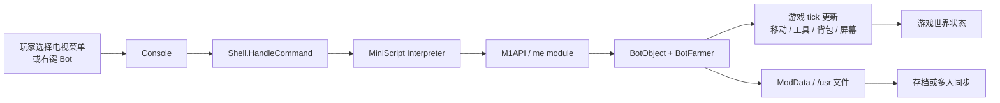

# Farmtronics 项目档案

## 文档信息

| 项目         | 内容 |
| ------------ | ---- |
| **文档标题** | Farmtronics 项目档案 |
| **文档版本** | v0.1 |
| **创建日期** | 2026-08-25 |
| **更新日期** | 2026-08-25 |
| **文档作者** | 项目维护者 |
| **文档类型** | 参考项目资料档案 |
| **参考版本** | `a59fc65bdb263d257d0ecd453202b65c6269f7a5` |
| **项目地址** | [JoeStrout/Farmtronics](https://github.com/JoeStrout/Farmtronics) |
| **固定版本** | [a59fc65bdb263d257d0ecd453202b65c6269f7a5](https://github.com/JoeStrout/Farmtronics/commit/a59fc65bdb263d257d0ecd453202b65c6269f7a5) |

## 目录

- [资料范围与结论边界](#资料范围与结论边界)
- [项目定位](#项目定位)
- [用户入口与通信边界](#用户入口与通信边界)
- [Bot 实体模型](#bot-实体模型)
- [MiniScript 执行链路](#miniscript-执行链路)
- [Home Computer 与 Bot Console](#home-computer-与-bot-console)
- [脚本 API：状态、移动与操作](#脚本-api状态移动与操作)
- [文件系统与持久化](#文件系统与持久化)
- [多人同步链路](#多人同步链路)
- [游戏生命周期与 Bot 更新](#游戏生命周期与-bot-更新)
- [任务与解锁流程](#任务与解锁流程)
- [构建、安装与版本](#构建安装与版本)
- [实现特征与限制](#实现特征与限制)
- [参考源码](#参考源码)
- [相关横向调研](#相关横向调研)

## 资料范围与结论边界

本文只描述固定提交 `a59fc65bdb263d257d0ecd453202b65c6269f7a5` 中可以从公开 README、文档和源码确认的内容。该提交对应的工程版本字段为 `1.4.1`；代码中的 API、MiniScript 版本和 SMAPI 依赖以该提交为准。

本文将 Farmtronics 记录为一个“游戏内可编程计算机与 Bot Mod”，而不是一个外部 Agent 控制项目。它的控制脚本由游戏进程内的 MiniScript interpreter 执行，输入和输出主要通过游戏内 Console、Bot 状态和游戏世界发生。

本文区分以下几种数据流：

1. 用户在游戏内 Console 输入 MiniScript；
2. MiniScript 调用 C# intrinsic，改变 Bot 或读取游戏状态；
3. Bot 在游戏 tick 中移动、使用工具、收集物品并更新屏幕；
4. 单人存档写入用户磁盘；
5. 多人模式通过 SMAPI mod messages 同步 Bot 实例、文件和聊天消息。

这些数据流都不能直接等同于“外部 CLI 与游戏通信”。本文不将 Farmtronics 的实现特征转换成 Stardew Agent 的采用建议或实施计划。

## 项目定位

Farmtronics README 将项目描述为一个 Stardew Valley Mod，添加两类游戏内计算机能力：

- **Farmtronics Home Computer**：连接到玩家小屋电视的计算机，使用 MiniScript 编程；
- **Farmtronics Bots**：可以放置到游戏世界中的 Bot，每个 Bot 携带一个同样的计算机，并可在世界中移动和执行操作。

Bot 的获得方式由游戏内流程驱动：玩家先在 Home Computer 中完成 `toDo` 任务，第二天收到包含 Bot 的邮件；读到该邮件后，Pierre 商店可以购买更多 Bot。Bot 被放置到空 tile 后，玩家右键它即可打开 Bot Console。

项目的主要抽象不是状态快照、远程命令队列或模型工具，而是“一个持有解释器和游戏内设备接口的可编程对象”。

## 用户入口与通信边界

### Home Computer 入口

`ModEntry.OnMenuChanged` 监听游戏菜单：当玩家在自己的家中打开电视天气对话框时，Mod 在选项列表中插入 Farmtronics Home Computer。玩家选择该选项后，Mod 创建或复用本地 `Shell`，再调用 Console 的 `Present()` 显示交互界面。

Console 是 `IClickableMenu` 和 `IKeyboardSubscriber`。它直接接收游戏键盘文本、回车、Esc、方向键和控制键，并把提交的字符串交给 `Shell.HandleCommand`。

### Bot Console 入口

`BotObject` 覆盖右键交互入口，并通过 `ShowMenu()`：

1. 确保 Bot 已经初始化 Shell；
2. 创建 `UIMenu`；
3. 将该 Bot 的 Console 嵌入或展示给玩家。

Bot Shell 的 `hostData` 指向 Shell 自身，Shell 又持有当前 Bot，因此同一套 MiniScript 全局函数可以在 Home Computer 和 Bot 上运行，但只有 Bot Shell 才能使用 `me.forward`、`me.inventory`、`me.useTool` 等 Bot-specific API。

### 没有外部 CLI/API

固定提交中没有：

- TCP/HTTP/WebSocket listener；
- 标准输入输出命令协议；
- 面向外部程序的 JSON/RPC endpoint；
- 由外部进程定时读取的状态文件；
- 让外部模型直接提交游戏动作的接口。

仓库确实会读写真实文件：系统磁盘来自 Mod 的 assets，主玩家的 `/usr` 磁盘来自存档目录，多人同步还会传输文件更新。但这些文件属于 MiniScript 文件系统和多人同步机制，不是外部 CLI 与游戏之间的通信协议。

整体链路如下：

## Bot 实体模型

### BotObject

Bot 以自定义 `StardewValley.Object` 的形式存在，内部 ID 是 `Farmtronics_Bot`，并使用自定义的大型可放置物品图标。它可以出现在：

- 玩家邮件附件或背包中；
- 地图对象列表中；
- Pierre 商店商品列表中；
- 箱子中，作为保存前后的中间表示。

BotObject 暴露的运行时状态包括：

- `inventory`：内部 farmer 的物品列表；
- `energy`：内部 farmer 的体力；
- `currentLocation`：内部 farmer 所在地点；
- `facingDirection`：朝向；
- `currentToolIndex`：当前工具/物品槽位；
- `Position`：以像素表示的位置；
- `screenColor` 和 `statusColor`：Bot 显示屏和状态灯颜色；
- `shouldPickupDebris`：是否自动吸附附近掉落物；
- `shell`：该 Bot 的 MiniScript Shell。

### 隐藏 BotFarmer

BotObject 在构造时创建一个 `BotFarmer`。这个对象继承 Stardew Valley 的 `Farmer`，但不是第二个联网 Farmhand，也不是通过游戏联机加入的客户端。它是 Mod 在同一游戏进程内维护的内部角色对象，用来复用 Farmer 的：

- 位置、朝向和移动状态；
- 物品栏和工具；
- 体力；
- 工具使用和 Farmer update 行为。

BotFarmer 重写了移动相关方法：

- `SetMovingUp/Right/Down/Left` 在停止时调用 `Halt`；
- `tryToMoveInDirection` 使用当前地点的 tile passability 检查，然后直接调整位置；
- `nextPositionTile` 先按朝向设置移动状态，调用基类逻辑后停止移动。

因此，Bot 是“游戏内的一个对象 + 一个不可见 Farmer 运行时”，而不是主控玩家本身或联机 Farmhand 客户端。

### Bot 数量和拥有者

BotManager 用 `List<BotObject> instances` 管理当前世界中的 Bot，用 `remoteInstances` 管理多人场景下由主机代为更新的其他玩家 Bot。每个 Bot 带有 `owner`，购买、邮件和放置时会设置拥有者的 `UniqueMultiplayerID`。

固定提交没有给出一个单独的 Bot 数量上限。商店逻辑可以在购买后继续插入新的 Bot 商品，Bot 也不允许堆叠，因为每个实例有独立名称、能量和背包。

## MiniScript 执行链路

### Shell 初始化

`Shell.Init(playerID, botContext)` 将 Shell 绑定到玩家 ID 和可选的 Bot：

1. 设置 `playerID` 和 `bot`；
2. 调用 `M1API.Init(this)` 注册 MiniScript intrinsic；
3. 创建或复用 MiniScript interpreter；
4. 为主玩家创建可写的 `/usr` RealFileDisk 和共享的 `/net` SharedRealFileDisk；
5. 为非主机玩家创建内存 `/usr` 和共享内存 `/net` disk；
6. 初始化 `curdir`、`home`、prompt 和 import paths；
7. 运行 `/sys/startup.ms` 和玩家 `/usr/startup.ms`。

Home Computer 的 Shell 没有 Bot context，`me.isBot` 返回 false；Bot Shell 有 Bot context，`me.isBot` 返回 true。

### 每帧/每 tick 推进

`ModEntry.UpdateTicking` 在游戏更新事件中：

- 如果 Home Computer Shell 存在但没有打开 Console，调用其 `console.update`；
- 调用 `BotManager.UpdateAll(gameTime)` 更新所有本地和远程 Bot。

BotObject.Update 的主要顺序是：

1. 如果 Bot 的 `currentLocation` 不是当前游戏画面的 `Game1.currentLocation`，直接返回；
2. 更新 Bot Shell 的 Console；
3. 处理延迟的镰刀动画；
4. 将当前位置推进到 `targetPos`，逐步移动内部 `BotFarmer`；
5. 当 tile 变化时，从旧地点对象列表移除 Bot，再把它放到新 tile；
6. 调用 `BotFarmer.Update`；
7. 如果启用 `shouldPickupDebris`，吸附并收集附近掉落物。

MiniScript 的长任务通过 interpreter 的 partial result/yield 继续执行。例如 `me.forward` 启动一次移动，随后每个 Update 检查 `IsMoving()`，直到目标位置到达后才返回结果；`me.useTool` 也使用类似的等待方式。

## Home Computer 与 Bot Console

### 共同语言与不同上下文

Home Computer 和 Bot 都执行 MiniScript，拥有公共的：

- `print`、`input`、`run`、`import`；
- `file` 和 `FileHandle` 文件系统 API；
- `key` 键盘输入 API；
- `Location`、`farm`、`getLocation`、`locations`；
- `world` 时间、天气、运气和聊天信息；
- `text` 屏幕文本绘制 API；
- `help`、编辑器和 `/sys/lib` 库。

Bot Shell 额外拥有 `me` 模块。旧的 `bot` 全局函数仍保留，但源码会提示使用 `me` 替代它。

### 计算机持久化

Home Computer 的用户程序和 Bot 的用户程序都存储在 `/usr` disk。主机上 `/usr` 使用按玩家 ID 分目录的真实文件系统；在非主机客户端上，`/usr` 使用内存 disk，并在多人连接时从主机同步。

系统程序、帮助文本、Demo 和标准库存放在只读 `/sys` disk，内容来自 Mod 的 assets。默认 import paths 包括当前目录、`/usr/lib` 和 `/sys/lib`。

### Console 状态

Console 自己维护：

- 文字显示网格与颜色；
- 当前输入缓冲和光标位置；
- 历史命令；
- 键盘 watcher；
- 是否处于输入模式；
- 选择、滚动和窗口状态。

这类状态属于游戏 UI 和 MiniScript interpreter，不是一个结构化 Observation。脚本要读取游戏状态，需要调用 `me.position`、`me.inventory`、`world` 或 `Location` 等 API。

## 脚本 API：状态、移动与操作

### `me` 状态字段

固定提交中的 `me` 模块包含以下公开访问项：

| API | 语义 |
| --- | ---- |
| `me.isBot` | 当前 Shell 是否绑定 Bot |
| `me.name` | Home Computer 或 Bot 名称 |
| `me.owner` | 所属玩家名称 |
| `me.facing` | Bot 朝向数字 |
| `me.energy` | Bot 当前体力 |
| `me.statusColor` | Bot 状态灯颜色 |
| `me.screenColor` | Bot 屏幕颜色 |
| `me.currentToolIndex` | 当前工具或物品栏位 |
| `me.position` | 包含 x、y 和 area 的 map |
| `me.inventory` | 物品列表，使用 TileInfo 转换成 MiniScript map |

Home Computer 调用只适用于 Bot 的方法时会得到提示，例如 `me.forward` 在没有 Bot context 时会打印 “only valid for bots”。

### 移动

Bot 的移动 API 是离散的相邻 tile 操作：

- `me.forward()`：按当前朝向移动一格；
- `me.left()`：逆时针旋转；
- `me.right()`：顺时针旋转。

`me.forward()` 没有接收地点名或远端坐标的参数。C# 侧的 `Move` 先将朝向设置为目标方向，再检查目标 tile 是否可通行，最后设置像素级 `targetPos`。Bot Update 负责实际推进。固定提交没有 Bot 跨地图 warp、全局路径规划或“移动到另一个 GameLocation”的脚本 API。

同时，Bot Update 在其 `currentLocation != Game1.currentLocation` 时直接返回，因此固定提交只会在 Bot 所在地点是当前游戏画面地点时推进可见运行、脚本 Console 和移动。Bot 的 `currentLocation` 属性虽可读取/设置于 C#，但 `me` 模块没有暴露跨地图切换接口。

### 工具和物品操作

`me` 模块可调用：

- `me.useTool()`：使用当前工具或物品，处理体力消耗和工具动画；
- `me.harvest()`：尝试收获前方地形、机器或成熟作物；
- `me.takeItem(slot)`：从前方箱子或 Bot 中取出物品；
- `me.placeItem()`：将当前物品放到前方位置，固定实现尝试尽可能放置堆叠；
- `me.collect(shouldCollect)`：设置是否拾取附近 debris；
- `me.swapItem(index1, index2)`：交换 Bot 背包槽位。

BotObject 的工具逻辑使用内部 `BotFarmer` 调用 Stardew 工具的 `DoFunction` 或 `beginUsing`。对镰刀等近战工具，代码将动作拆成开始、若干 tick 后应用效果和结束状态。对机器、蜂房、Crystalarium、Tapper 等对象，`Harvest` 包含专门的输出收取和背包放入逻辑。

### 世界信息和聊天

`world` 模块暴露：

- 当前游戏时间、季节日、星期、年份；
- 天气和每日运气；
- 当前聊天消息列表；
- `world.chat(message)`，以 Bot 名称和当前屏幕颜色向游戏聊天框发送消息。

聊天的同步通过 SMAPI Multiplayer API 发送 `AddBotChatMessage` mod message，而不是外部网络服务。

## 文件系统与持久化

### Disk 抽象

MiniScript 使用自定义 `Disk` 抽象，`DiskController` 根据 `/sys`、`/usr`、`/net` 等路径前缀选择 disk。主要实现有：

- `RealFileDisk`：将 MiniScript 路径映射到本地真实目录，支持读写文本、二进制、目录和删除；
- `MemoryFileDisk`：在内存树中读写，并在变化时发送同步消息；
- `SharedRealFileDisk`：写入真实目录后广播文件更新消息；
- `MemoryDirectory`：用于内存 disk 的目录和文件树。

`RealFileDisk.NativePath` 会对路径做规范化，并检查解析后的原生路径仍然位于 disk 的 base path 下。`sysDisk` 在 ModEntry 启动时指向 Mod assets 下的只读系统目录。

### 用户程序和存档

`SaveData` 在当前存档目录下创建 Mod 专属目录，并在其中创建：

- `usrdisks/<playerID>`：每个玩家的 `/usr` 程序盘；
- `netdisk`：共享 `/net` 盘。

Bot 的名称、能量、朝向和背包等数据写入 Bot 的 `modData`。背包通过 `NetObjectList<Item>` 序列化成 XML 字符串保存。屏幕颜色、状态灯颜色和像素位置属于运行时/多人同步字段，在真正保存时从保存数据中移除，再在载入或实例同步时恢复。

### 保存前后的 Bot/Chest 转换

在 `Saving` 和 `DayEnding` 事件中，BotManager 将地图、背包和嵌套容器中的 Bot 转成带有 Bot modData 的 vanilla Chest，随后清理运行时 Bot 实例。`Saved` 或下次载入后，再把带 `IsBot` 标记的 Chest 转回 BotObject。

这种转换使 Bot 数据可以沿用游戏的保存/载入流程；运行时真正更新和执行脚本的仍然是 BotObject 与内部 BotFarmer。

## 多人同步链路

### SMAPI mod message

Farmtronics 使用 SMAPI 的 `Helper.Multiplayer.SendMessage`，消息类型通过泛型消息类名称标识。固定提交中的消息包括：

- `AddBotInstance`：通知拥有者在某地点某 tile 添加 Bot 实例；
- `SyncMemoryFileDisk`：同步 `/usr` 或共享盘的内存目录；
- `UpdateMemoryFileDisk`：同步写文件、建目录和删除文件；
- `AddBotChatMessage`：同步 Bot 聊天消息。

`ModEntry.Entry` 注册 `ModMessageReceived`、`PeerContextReceived`、`PeerConnected` 和 `PeerDisconnected` 事件，统一交给 `MultiplayerManager` 处理。

### 文件同步

主机上的玩家 `/usr` 盘使用真实目录，远端玩家的 `/usr` 盘使用内存 disk。远端初次连接时发送 `SyncMemoryFileDisk` 请求，主机读取对应真实目录构造 `MemoryDirectory` 后返回。之后远端的写入、目录创建和删除通过 `UpdateMemoryFileDisk` 发给主机，主机更新对应玩家的真实盘。

共享 `/net` 盘使用 `SharedRealFileDisk`。写操作先写入主机的真实 `netdisk`，再发送 `UpdateMemoryFileDisk`；接收端暂时关闭再次发送的开关，避免同步回环。

### 离线玩家

当多人玩家断开时，主机为该玩家保留一个远程 Home Computer Shell，并将该玩家的 Bot 加入 `remoteInstances`，继续在主机进程中更新这些 Bot。重新连接时，BotManager 和 DiskController 会重新建立对应的运行时实例与 disk。

这个多人链路解决的是“同一个多人游戏中的 Mod 状态同步”。它不提供从另一台机器启动独立 Bot 游戏客户端的机制，也不把 Bot 变成一个独立联机玩家。

## 游戏生命周期与 Bot 更新

主要生命周期如下：

| 游戏事件 | Farmtronics 行为 |
| -------- | --------------- |
| `Entry` | 注册保存、日循环、菜单、内容、多人和传送事件，初始化资产与系统 disk |
| `SaveCreated` | 创建 Mod 存档目录和当前玩家 `/usr` 目录 |
| `SaveLoaded` | 将保存的 Chest 转回 Bot，设置主机 ID |
| `DayStarted` | 初始化 Home Computer、远程 Computer 和所有 Bot Shell，运行 startup 脚本 |
| `UpdateTicking` | 更新 Home Computer 与所有 Bot 的 Console/interpreter/移动/工具 |
| `DayEnding` | 将 Bot 转为 Chest，清除运行时实例，关闭 Home Computer |
| `Saving`/`Saved` | 在保存前后进行 Bot/Chest 转换 |
| `ReturnedToTitle` | 清空 Bot、远程 Computer 和 DiskController 实例 |
| `Player.Warped` | 重试找回多人连接后尚未定位的 Bot 实例 |

Bot 脚本不是一次性命令执行。Shell interpreter 可以持续运行，遇到需要等待输入或游戏动作的 intrinsic 时暂停，随后由 Update 再次推进；Bot 的移动和工具动画也在后续游戏 tick 中完成。

## 任务与解锁流程

项目内置一个 `Task` 枚举和 `ToDoManager`，用于 Home Computer 的教学/解锁流程：

- hello world；
- 切换目录；
- 运行 Demo；
- 编辑程序；
- 保存程序；
- 输出 1 到 100；
- 输出 FizzBuzz。

`ToDoManager` 主要通过观察 MiniScript 的输出字符串判断任务是否完成，并将结果写入玩家 `modData`。全部任务完成后，Mod 添加第二天发送的 `FarmtronicsFirstBotMail`。这是一套游戏内进度系统，不是 benchmark evaluator，也不是根据结构化 Observation 计算 reward。

## 构建、安装与版本

### Mod 工程

固定提交的 `Farmtronics.csproj` 使用 SDK-style 工程和以下配置：

- Target Framework：`net6.0`；
- `Pathoschild.Stardew.ModBuildConfig` `4.1.1`；
- `Pathoschild.Stardew.ModTranslationClassBuilder` `2.0.1`；
- `org.miniscript.MiniScript` `1.6.2`；
- `ModFolderName`：`Farmtronics`；
- `BundleExtraAssemblies`：`ThirdParty`；
- `ReleaseVersion`：`1.4.1`。

manifest 的入口 DLL 是 `Farmtronics.dll`，最低 SMAPI API 版本为 `4.0.0`，更新源包括 Nexus 和 GitHub。

### 安装与运行

README 要求从 GitHub Releases 或 NexusMods 下载压缩包，按普通 SMAPI Mod 方式解压到 Mods 目录。启动游戏后，使用电视菜单打开 Home Computer；获得并放置 Bot 后，通过右键打开 Bot Computer。

固定提交没有单独的外部客户端构建，也没有 GitHub Actions workflow。项目使用 ModBuildConfig 参与 Mod 构建和打包，具体运行仍依赖安装了 Stardew Valley 与 SMAPI 的本地环境。

## 实现特征与限制

以下内容是固定提交中的可观察实现特征：

1. Farmtronics 将 Bot 表达为可放置的自定义 Object，并用隐藏的 `BotFarmer` 复用 Farmer 的库存、体力、工具和移动能力。
2. Bot 的控制语言是游戏内 MiniScript，不需要外部 Python/CLI/MCP 客户端；Console 是用户输入和输出的主要界面。
3. Home Computer 与 Bot 共用 MiniScript 运行时和文件系统抽象，但 Bot 通过 `me` 模块获得移动、工具、收获、背包和位置 API。
4. `me.forward` 是相邻 tile 移动，不是通用地图导航；固定提交没有脚本层跨地图 warp API。
5. Bot Update 对非当前游戏地点直接返回，因此固定提交的移动、Shell 和部分运行时处理要求 Bot 所在地点是当前活跃地点。
6. 程序文件写入单人存档关联的 `/usr` 目录，系统库来自只读 `/sys`，多人时使用 SMAPI mod message 同步 `/usr` 和 `/net`。
7. Bot 状态使用 ModData 保存，保存前转换为 Chest，载入后恢复为 Bot；这是一种对游戏存档格式的适配。
8. 多人同步处理的是 Mod 状态和 Bot 运行时实例，不是创建第二个游戏客户端或加入新的联机 Farmhand。
9. ROADMAP 明确把“Bot 与 Home Computer 通过 networking 通信（除了共享文件和 world.chat）”列为未排期功能；这与固定提交没有外部网络控制协议相一致。
10. ROADMAP 同时记录多个 Bot 同时移动时可能消失、多个 Bot 购买时可能出现 conjoined 状态等已知问题；这些是项目自身在该版本文档中记录的限制。

## 参考源码

以下链接均固定到同一个提交，便于在 GitHub 上直接跳转：

- [项目 README](https://github.com/JoeStrout/Farmtronics/blob/a59fc65bdb263d257d0ecd453202b65c6269f7a5/README.md)
- [Mod 入口与生命周期事件](https://github.com/JoeStrout/Farmtronics/blob/a59fc65bdb263d257d0ecd453202b65c6269f7a5/Farmtronics/ModEntry.cs)
- [BotManager](https://github.com/JoeStrout/Farmtronics/blob/a59fc65bdb263d257d0ecd453202b65c6269f7a5/Farmtronics/Bot/BotManager.cs)
- [BotObject](https://github.com/JoeStrout/Farmtronics/blob/a59fc65bdb263d257d0ecd453202b65c6269f7a5/Farmtronics/Bot/BotObject.cs)
- [BotFarmer](https://github.com/JoeStrout/Farmtronics/blob/a59fc65bdb263d257d0ecd453202b65c6269f7a5/Farmtronics/Bot/BotFarmer.cs)
- [MiniScript Shell](https://github.com/JoeStrout/Farmtronics/blob/a59fc65bdb263d257d0ecd453202b65c6269f7a5/Farmtronics/M1/Shell.cs)
- [MiniScript Console](https://github.com/JoeStrout/Farmtronics/blob/a59fc65bdb263d257d0ecd453202b65c6269f7a5/Farmtronics/M1/Console.cs)
- [M1API 与 `me`/`world` 模块](https://github.com/JoeStrout/Farmtronics/blob/a59fc65bdb263d257d0ecd453202b65c6269f7a5/Farmtronics/M1/M1API.cs)
- [DiskController](https://github.com/JoeStrout/Farmtronics/blob/a59fc65bdb263d257d0ecd453202b65c6269f7a5/Farmtronics/M1/Filesystem/DiskController.cs)
- [RealFileDisk 与本地用户文件](https://github.com/JoeStrout/Farmtronics/blob/a59fc65bdb263d257d0ecd453202b65c6269f7a5/Farmtronics/M1/Filesystem/RealFileDisk.cs)
- [MemoryFileDisk 与共享文件更新](https://github.com/JoeStrout/Farmtronics/blob/a59fc65bdb263d257d0ecd453202b65c6269f7a5/Farmtronics/M1/Filesystem/MemoryFileDisk.cs)
- [Bot ModData 与保存字段](https://github.com/JoeStrout/Farmtronics/blob/a59fc65bdb263d257d0ecd453202b65c6269f7a5/Farmtronics/Bot/ModData.cs)
- [存档目录和用户 disk](https://github.com/JoeStrout/Farmtronics/blob/a59fc65bdb263d257d0ecd453202b65c6269f7a5/Farmtronics/SaveData.cs)
- [MultiplayerManager](https://github.com/JoeStrout/Farmtronics/blob/a59fc65bdb263d257d0ecd453202b65c6269f7a5/Farmtronics/Multiplayer/MultiplayerManager.cs)
- [多人消息基类](https://github.com/JoeStrout/Farmtronics/blob/a59fc65bdb263d257d0ecd453202b65c6269f7a5/Farmtronics/Multiplayer/BaseMessage.cs)
- [任务状态与首个 Bot 邮件](https://github.com/JoeStrout/Farmtronics/blob/a59fc65bdb263d257d0ecd453202b65c6269f7a5/Farmtronics/ToDoManager.cs)
- [项目工程文件](https://github.com/JoeStrout/Farmtronics/blob/a59fc65bdb263d257d0ecd453202b65c6269f7a5/Farmtronics/Farmtronics.csproj)
- [Mod manifest](https://github.com/JoeStrout/Farmtronics/blob/a59fc65bdb263d257d0ecd453202b65c6269f7a5/Farmtronics/manifest.json)
- [项目 Road Map 与已知问题](https://github.com/JoeStrout/Farmtronics/blob/a59fc65bdb263d257d0ecd453202b65c6269f7a5/ROADMAP.md)
- [项目 History](https://github.com/JoeStrout/Farmtronics/blob/a59fc65bdb263d257d0ecd453202b65c6269f7a5/HISTORY.md)

## 相关横向调研

- [通信架构调研](../communication-architecture.md)：比较不同游戏通信媒介和链路边界。
- [已有项目横向调研](../existing-projects.md)：记录参考项目的整体分类和事实对比。
- [Observation、Action 与 Result 契约](../observation-action-contract.md)：讨论状态、命令和结果表达的公共概念。
- [动作执行与寻路调研](../action-execution-and-pathfinding.md)：比较动作排队、执行和寻路实现。
- [Agent 循环与评测调研](../agent-loop-and-evaluation.md)：讨论 Agent loop、任务完成判断和评测数据。
- [项目档案索引](README.md)：查看其他参考项目的固定版本和完成状态。
