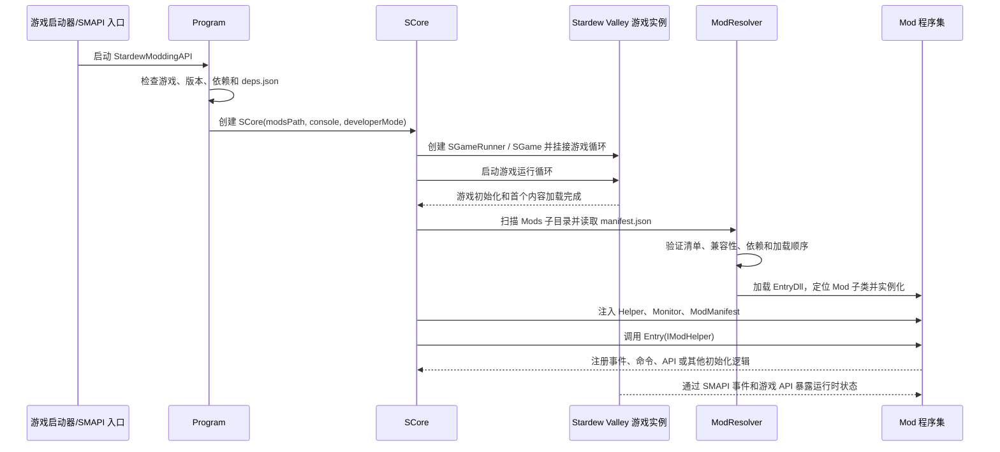
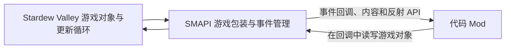

# SMAPI 项目档案

## 文档信息

| 项目         | 内容 |
| ------------ | ---- |
| **文档标题** | SMAPI 项目档案：Stardew Valley Mod 加载与扩展框架 |
| **文档版本** | v0.1 |
| **创建日期** | 2026-08-25 |
| **更新日期** | 2026-08-25 |
| **文档作者** | 项目维护者 |
| **文档类型** | 参考项目资料档案 |
| **固定提交** | [`79f9bbbe`](https://github.com/Pathoschild/SMAPI/tree/79f9bbbe3edbb7ca3369e7ad0d3dd45131b34fc0) |

## 目录

- [资料范围](#资料范围)
- [项目定位](#项目定位)
- [组件与运行链路](#组件与运行链路)
- [Mod 发现、验证与加载](#mod-发现验证与加载)
- [Mod 的程序入口与 API](#mod-的程序入口与-api)
- [事件与游戏状态边界](#事件与游戏状态边界)
- [SMAPI 提供的通信方式](#smapi-提供的通信方式)
- [Observation、Action 与 Result](#observationaction-与-result)
- [构建、运行与产物](#构建运行与产物)
- [运行时配置与开发支持](#运行时配置与开发支持)
- [可观察特征与资料限制](#可观察特征与资料限制)
- [参考资料](#参考资料)

## 资料范围

本文固定分析 [Pathoschild/SMAPI](https://github.com/Pathoschild/SMAPI) 的提交
`79f9bbbe3edbb7ca3369e7ad0d3dd45131b34fc0`。该提交对应仓库在 2026-07-01 的源码状态。

本文使用的资料包括：

- 项目说明：[docs/README.md](https://github.com/Pathoschild/SMAPI/blob/79f9bbbe3edbb7ca3369e7ad0d3dd45131b34fc0/docs/README.md)；
- SMAPI 自身的技术文档：[docs/technical/smapi.md](https://github.com/Pathoschild/SMAPI/blob/79f9bbbe3edbb7ca3369e7ad0d3dd45131b34fc0/docs/technical/smapi.md)；
- Mod 构建包文档：[docs/technical/mod-package.md](https://github.com/Pathoschild/SMAPI/blob/79f9bbbe3edbb7ca3369e7ad0d3dd45131b34fc0/docs/technical/mod-package.md)；
- Mod 接口：[src/SMAPI/IMod.cs](https://github.com/Pathoschild/SMAPI/blob/79f9bbbe3edbb7ca3369e7ad0d3dd45131b34fc0/src/SMAPI/IMod.cs)、[src/SMAPI/Mod.cs](https://github.com/Pathoschild/SMAPI/blob/79f9bbbe3edbb7ca3369e7ad0d3dd45131b34fc0/src/SMAPI/Mod.cs)；
- Mod 辅助 API：[src/SMAPI/IModHelper.cs](https://github.com/Pathoschild/SMAPI/blob/79f9bbbe3edbb7ca3369e7ad0d3dd45131b34fc0/src/SMAPI/IModHelper.cs)；
- 游戏循环、输入和多人事件：[IGameLoopEvents.cs](https://github.com/Pathoschild/SMAPI/blob/79f9bbbe3edbb7ca3369e7ad0d3dd45131b34fc0/src/SMAPI/Events/IGameLoopEvents.cs)、[IInputEvents.cs](https://github.com/Pathoschild/SMAPI/blob/79f9bbbe3edbb7ca3369e7ad0d3dd45131b34fc0/src/SMAPI/Events/IInputEvents.cs)、[IMultiplayerEvents.cs](https://github.com/Pathoschild/SMAPI/blob/79f9bbbe3edbb7ca3369e7ad0d3dd45131b34fc0/src/SMAPI/Events/IMultiplayerEvents.cs)；
- 启动和 Mod 管理：[Program.cs](https://github.com/Pathoschild/SMAPI/blob/79f9bbbe3edbb7ca3369e7ad0d3dd45131b34fc0/src/SMAPI/Program.cs)、[SCore.cs](https://github.com/Pathoschild/SMAPI/blob/79f9bbbe3edbb7ca3369e7ad0d3dd45131b34fc0/src/SMAPI/Framework/SCore.cs)、[ModResolver.cs](https://github.com/Pathoschild/SMAPI/blob/79f9bbbe3edbb7ca3369e7ad0d3dd45131b34fc0/src/SMAPI/Framework/ModLoading/ModResolver.cs)；
- 命令和多人消息：[ICommandHelper.cs](https://github.com/Pathoschild/SMAPI/blob/79f9bbbe3edbb7ca3369e7ad0d3dd45131b34fc0/src/SMAPI/ICommandHelper.cs)、[IMultiplayerHelper.cs](https://github.com/Pathoschild/SMAPI/blob/79f9bbbe3edbb7ca3369e7ad0d3dd45131b34fc0/src/SMAPI/IMultiplayerHelper.cs)。

本文描述固定提交中能够直接确认的实现，不把 SMAPI 的能力等同于某个具体 Agent Mod 的实现。

## 项目定位

SMAPI 是 Stardew Valley 的开源 Mod 框架和 API。项目说明列出的主要职责包括：

1. 游戏启动时加载 Mod；
2. 为 Mod 提供 API 和事件，使 Mod 能访问或改变游戏中原本难以扩展的部分；
3. 在加载 Mod 前重写部分编译代码，以适配 Linux、macOS 和 Windows 的差异，并在一些情况下兼容游戏更新；
4. 截获错误，在可能时恢复游戏，并在部分存档加载问题中自动修复存档；
5. 检查 Mod 更新与兼容性；
6. 通过内置的 Save Backup Mod 为存档创建每日备份并保留十份备份。

因此，SMAPI 处在“游戏运行时扩展框架”这一层，而不是以下任一层：

- 不负责理解自然语言或生成任务计划；
- 不定义通用的 Observation、Action、Result JSON 协议；
- 不提供面向外部程序的通用 TCP、WebSocket 或 HTTP 控制服务；
- 不自动把游戏对象转换成 Agent 可直接消费的状态空间。

一个具体的 Agent Mod 可以使用 SMAPI 的入口、事件、游戏对象 API 和文件/网络库自行实现这些上层能力。

## 组件与运行链路

### 主要组件

固定提交中的运行时组件可以按职责分成以下几层：

| 层 | 代表组件 | 作用 |
| --- | --- | --- |
| 启动层 | `Program` | 检查游戏、SMAPI 依赖和版本，解析启动参数，创建并运行 SMAPI 核心。 |
| 核心层 | `SCore` | 初始化日志、命令、事件、内容和多人能力；扫描并加载 Mod；驱动游戏生命周期。 |
| 游戏包装层 | `SGameRunner`、`SGame` | 替换或包装游戏实例与更新/绘制过程，将 SMAPI 回调插入游戏循环。 |
| Mod 加载层 | `ModResolver`、`AssemblyLoader`、`ModMetadata` | 扫描文件夹、读取清单、验证依赖和兼容性、加载程序集并创建 Mod 实例。 |
| Mod API 层 | `IMod`、`Mod`、`IModHelper` | 向 Mod 暴露入口、监视器、事件、数据、输入、内容、反射、命令和多人消息 API。 |
| 日志与命令层 | `LogManager`、`CommandManager` | 提供 SMAPI 控制台、日志文件和命令注册/解析。 |

### 启动到 Mod 运行

源码中，`Program.Start` 创建 `SCore` 并调用 `RunInteractively`。`SCore.RunInteractively` 创建游戏包装实例，在游戏运行期间负责初始化内容、注册控制台输入处理，并在后续初始化阶段读取 Mod 元数据和加载 Mod。

这里的“Mod 与游戏通信”是进程内调用：SMAPI 将事件管理器、游戏内容访问器、反射访问器和多人辅助器注入 Mod；Mod 通过这些对象访问游戏。外部进程若要参与，仍需要一个具体 Mod 自行增加进程间通信层。

## Mod 发现、验证与加载

### 文件和清单

SMAPI 将指定的 Mods 根目录作为扫描入口。默认路径是游戏目录下的 `Mods`；SMAPI 也支持通过 `--mods-path` 或对应环境变量指定路径。固定提交的加载代码会把 Mods 根目录下的子目录交给 Mod 工具包扫描，并读取每个目录的 `manifest.json`。

源码明确处理了以下情况：

- 目录不存在或无法验证时，初始化会失败；
- 直接放在 Mods 根目录中的松散文件不会作为正常 Mod 加载；
- 以点号开头的目录会被忽略；
- 无效、缺失或无法解析的清单会标记为失败；
- 清单中的 `EntryDll` 如果不存在，会导致该 Mod 无法通过验证；
- SMAPI 会检查恶意 Mod 和被列入黑名单的文件；
- Mod 的 `UniqueID` 必须唯一；
- `MinimumApiVersion`、`MinimumGameVersion`、更新状态和文件存在性都会参与兼容性验证。

### 依赖和加载顺序

`ModResolver.ProcessDependencies` 根据清单中的依赖关系处理加载顺序。必需依赖缺失、依赖冲突或依赖循环会影响对应 Mod 的加载状态。SMAPI 还允许在内部配置中指定需要提前或延后加载的 Mod ID，然后再处理依赖顺序。

### 程序集入口

对代码 Mod，SMAPI 通过程序集加载器载入 `EntryDll`，然后查找程序集中的非抽象 `Mod` 子类：

- 找不到 `Mod` 子类时加载失败；
- 找到多个 `Mod` 子类时加载失败；
- 找到一个入口类型后，SMAPI 创建实例；
- SMAPI 创建 `IModHelper`，并将 `Helper`、`Monitor` 和 `ModManifest` 注入 `Mod` 实例；
- 所有 Mod 完成实例化后，SMAPI 调用各个 Mod 的 `Entry`；
- `Entry` 阶段之后，SMAPI 查询 Mod 实现的 `GetApi()` 或 `GetApi(IModInfo)`，供其他 Mod 获取公开 API。

内容包走的是另一条分支：它不要求代码程序集，而是由 SMAPI 创建 `IContentPack`，并通过内容包辅助 API提供给对应的代码 Mod。

## Mod 的程序入口与 API

### 生命周期入口

Mod 可以直接继承 `StardewModdingAPI.Mod`。该基类提供以下成员：

| 成员 | 含义 |
| --- | --- |
| `Helper` | 访问 SMAPI 的事件、内容、数据、输入、命令、多人等辅助 API。 |
| `Monitor` | 写入 SMAPI 控制台和日志文件。 |
| `ModManifest` | 当前 Mod 的清单信息。 |
| `Entry(IModHelper helper)` | Mod 完成加载后的入口；通常在这里注册事件和命令。 |
| `GetApi()` / `GetApi(IModInfo)` | 可选的 Mod 间集成 API。 |
| `Dispose(bool)` | 可选的资源释放点，但源码注释明确说明并非每次游戏退出都保证调用。 |

`IMod` 接口要求 `Entry`，并允许 Mod 提供公开 API。这个接口没有规定外部客户端、任务队列或 Agent 的语义。

### `IModHelper` 的能力面

固定提交的 `IModHelper` 暴露了以下主要对象：

| API | 作用 |
| --- | --- |
| `Events` | 访问内容、显示、游戏循环、输入、多人、玩家、世界和特殊事件。 |
| `ConsoleCommands` | 注册由 SMAPI 控制台执行的命令。 |
| `GameContent` | 读取或修改游戏内容资产，并配合内容事件处理资产加载。 |
| `ModContent` | 读取 Mod 自己目录中的内容资产。 |
| `ContentPacks` | 查询或管理内容包。 |
| `Data` | 读写 Mod 的持久化数据。 |
| `Input` | 查询或改变输入状态。 |
| `Reflection` | 访问游戏私有代码。 |
| `ModRegistry` | 查询已加载 Mod 的元数据和集成 API。 |
| `Multiplayer` | 查询联网玩家、活动位置以及发送 Mod 消息。 |
| `Translation` | 读取 Mod 的本地化文本。 |

此外，`ReadConfig<TConfig>` 和 `WriteConfig<TConfig>` 负责读取、创建和保存 Mod 的配置文件。配置 API 属于 Mod 配置持久化，不是外部控制协议。

## 事件与游戏状态边界

### 游戏循环事件

`IGameLoopEvents` 将游戏生命周期拆成多个事件。源码中明确列出了：

- `GameLaunched`：游戏启动、所有 Mod 加载完成且首个更新 tick 之前；
- `UpdateTicking` / `UpdateTicked`：游戏状态更新前后，约每秒 60 次；
- `OneSecondUpdateTicking` / `OneSecondUpdateTicked`：约每秒一次的更新前后事件；
- `SaveCreating` / `SaveCreated`：创建新存档前后；
- `Saving` / `Saved`：保存已有存档前后；
- `SaveLoaded`：存档加载并完成世界初始化后；
- `DayStarted` / `DayEnding`：新的一天开始后、当天结束前；
- `TimeChanged`：游戏内时间变化后；
- `ReturnedToTitle`：返回标题画面后。

固定提交的 `SGameRunner.Update` 包装游戏更新过程，`SGame.Update` 再把游戏实例的更新交给 SMAPI 回调。SMAPI 的事件接口因此可以在游戏循环的明确时点触发，而不是通过轮询外部文件来发现游戏是否发生变化。

### 输入和显示事件

`IInputEvents` 处理键盘、控制器和鼠标输入，包括按钮按下、按钮释放、按钮变化、光标移动和滚轮滚动。`IModEvents` 还暴露显示相关事件，Mod 可以在游戏内做 UI 或绘制扩展。

输入事件记录的是玩家输入，不等于一个可供外部 Agent 直接调用的动作 API。若 Mod 要让外部指令转换成游戏行为，转换逻辑需要由该 Mod 自己实现。

### 游戏对象访问

`IModHelper` 的 `Reflection`、`GameContent`、`ModRegistry` 和事件对象共同构成 Mod 访问游戏的入口。具体能读写哪些对象，取决于 Stardew Valley 版本、SMAPI API 和 Mod 的代码；SMAPI 不会自动产生完整世界快照。

固定提交还包含内部状态跟踪器和快照类型，但这些属于 SMAPI 内部用于检测游戏状态变化和驱动框架的实现，不是 `IModHelper` 对外承诺的通用 Observation 格式。

## SMAPI 提供的通信方式

### 进程内通信：SMAPI API 和事件

最基础的链路如下：

这条链路发生在同一个游戏进程中。它不是序列化协议，调用参数是 .NET 对象和接口，数据一致性和调用时机由游戏循环与 Mod 代码共同决定。

### SMAPI 控制台命令

`ICommandHelper.Add` 允许 Mod 注册一个命令名、帮助文本和回调。回调收到命令名称与字符串参数。SMAPI 内部的 ConsoleCommands Mod 本身就是这种机制的示例：它扫描命令类型，通过 `helper.ConsoleCommands.Add` 注册命令，并在命令触发时调用处理器。

这是一条“用户或终端输入 -> SMAPI 控制台 -> Mod 回调”的链路。它有以下边界：

- 命令参数原始类型是字符串数组；
- 需要 SMAPI 控制台输入循环处于运行状态；
- API 没有规定 JSON schema、请求 ID、异步结果或外部客户端；
- 命令回调是否执行游戏操作、如何返回结果，都由具体 Mod 定义。

### 多人 Mod 消息

`IMultiplayerHelper.SendMessage<TMessage>` 可以向其他联网玩家电脑上的 Mod 发送可序列化消息，并可按目标 Mod ID 和玩家 ID 过滤。对应的 `IMultiplayerEvents.ModMessageReceived` 用于接收消息；另外还有 peer 上下文接收、连接和断开事件。

这条链路用于“联网游戏中的 Mod 到 Mod 消息”，不是本机外部 CLI 的通信通道。它要求目标玩家安装能够处理该消息的 Mod，并依赖 Stardew Valley 的多人连接。

### 文件、网络和其他 IPC

在固定提交的 SMAPI 公共 API、技术文档和核心入口中，没有看到面向外部程序的通用文件队列、TCP、WebSocket 或 HTTP 控制协议。SMAPI 自身包含用于更新检查等框架功能的网络代码，但这不构成给任意外部客户端控制游戏的 API。

因此，以下链路都属于具体 Mod 的额外实现，而不是 SMAPI 默认行为：

固定提交能确认的是 SMAPI 为 `Bridge` 提供了可加载的 Mod 入口、事件、命令、数据和游戏访问能力；不能据此确认某个具体外部协议的字段、并发、可靠性或结果语义。

## Observation、Action 与 Result

SMAPI 没有以这三个名称定义统一接口，因此只能按其公开扩展点对应描述：

| Agent 概念 | SMAPI 中可对应的扩展点 | 固定提交能确认的内容 |
| --- | --- | --- |
| Observation | 游戏循环事件、玩家/世界事件、游戏内容 API、反射和 Mod 自己构造的数据 | Mod 可以在事件回调中读取游戏对象并自行形成状态；SMAPI 不规定字段、采样频率或序列化格式。 |
| Action | `Input`、游戏对象 API、反射、控制台命令回调和 Mod 自己的动作函数 | Mod 可以把代码调用或命令参数转换成游戏操作；SMAPI 不规定动作名称、参数、完成条件或失败码。 |
| Result | 事件后读取、Mod 日志、Mod 数据、Mod 自己的返回/结果消息 | SMAPI 提供日志和生命周期事件，但没有统一的动作结果、请求关联或确认协议。 |

一个外部 Agent Mod 如果需要完整的 Observation/Action/Result 闭环，至少还要在 SMAPI API 之上定义：

- 状态快照的字段与版本；
- 外部请求如何进入游戏线程；
- 动作是否排队、取消、超时和重试；
- 动作完成或失败的判断；
- 结果如何关联原始请求；
- 游戏返回标题、存档加载、多人连接变化时如何标记状态有效性。

这些问题在 SMAPI 的接口中没有被统一解决，属于上层 Mod 或外部工具的实现范围。

## 构建、运行与产物

### 运行 SMAPI

SMAPI 的入口程序在启动时检查游戏程序集、游戏版本、SMAPI 组件版本和依赖文件。通过检查后，SMAPI 创建 `SCore`，挂接游戏更新和绘制过程，然后启动游戏。

SMAPI 的技术文档说明，Linux/macOS 下部分 SMAPI 内部命令行参数不能可靠地通过游戏启动器传递，因此可使用环境变量。与 Mod 目录和开发模式相关的配置包括：

- `SMAPI_MODS_PATH`：指定 Mod 根目录；
- `SMAPI_DEVELOPER_MODE`：启用或关闭开发模式日志；
- `SMAPI_NO_TERMINAL`：不输出到控制台；
- `SMAPI_USE_CURRENT_SHELL`：在 Linux/macOS 中使用当前 shell 输出；
- `SMAPI_PREFER_TERMINAL_NAME`：指定希望使用的终端名称。

### 从源码构建 SMAPI

技术文档记录的源码构建方式包括：

- 使用官方 SMAPI Release 对一般使用者更合适；
- 在 IDE 中打开解决方案并构建 `SMAPI` 项目；
- 项目会根据当前操作系统和 Stardew Valley 安装位置调整构建设置；
- Debug 模式重建解决方案时，会把 SMAPI 文件复制到游戏目录；
- 在 Visual Studio 或 Rider 中启动 `SMAPI` 项目可以附加调试器；
- 项目使用自定义构建的 Harmony，构建目录中包含 `0Harmony.dll`。

固定提交的 `src/SMAPI/SMAPI.csproj` 目标框架是 `net6.0`，输出类型是可执行程序，目标平台是 x64，并引用 Stardew Valley、MonoGame、xTile 和 SMAPI Toolkit 等程序集。SMAPI 自身构建需要可用的游戏程序集与构建依赖；这与只构建一个 Mod 的条件不同。

### Mod 的构建包

SMAPI 项目还维护 `Pathoschild.Stardew.ModBuildConfig` NuGet 包，用于 Mod 项目的 MSBuild 配置。官方文档列出的行为包括：

- 在 Linux、macOS 和 Windows 上兼容；
- 自动探测游戏路径，或通过 `GamePath` 指定路径；
- 为项目提供游戏和 SMAPI 引用；
- 构建时自动把 Mod 文件复制到游戏的 Mods 目录；
- 重建时在项目 `bin` 目录生成可上传的 release zip；
- 支持内容包、manifest token、代码警告和单元测试项目配置；
- 可通过 `EnableModDeploy`、`EnableModZip`、`EnableGameDebugging` 等属性控制行为。

官方文档特别说明，Visual Studio 的游戏调试入口在 Windows 上可用；由于 Mono wrapper 限制，Linux/macOS 不提供同样的调试方式。构建本身和真实游戏运行/调试是两个不同的验证层次。

## 运行时配置与开发支持

### 日志与错误处理

SMAPI 为每个 Mod 提供 `IMonitor`，同时维护控制台和日志文件。项目说明将错误截获、错误日志和部分自动恢复列为框架职责。开发模式当前主要影响 `TRACE` 级别日志是否显示。

### 更新和兼容性

加载流程会先读取 Mod 元数据，再验证清单、SMAPI 版本、游戏版本、依赖和文件。SMAPI 还保留内部 Mod 数据，用于记录已知状态、更新信息、兼容性提示和警告。不能把这些元数据检查理解成对 Mod 行为正确性的证明；它主要是加载前的兼容性和安全检查。

### 配置和内容

SMAPI 的内部配置文件可以改变部分框架行为，例如 Mod 目录、开发模式和加载顺序。具体 Mod 还可以用 `ReadConfig` / `WriteConfig` 保存自己的配置，用 `Data` 保存 Mod 持久化数据，用 `GameContent` 和内容事件管理游戏资产。

这些持久化机制的对象和生命周期不同：

| 机制 | 面向对象 | 典型生命周期 |
| --- | --- | --- |
| SMAPI 内部配置 | SMAPI 框架 | 启动或重新加载设置时读取。 |
| Mod 配置文件 | 某个 Mod 的用户设置 | Mod 初始化时读取，配置变化时由 Mod 写回。 |
| `IDataHelper` | 某个 Mod 的内部持久化数据 | 由 Mod 按自己的 key 和数据结构读写。 |
| 游戏存档 | Stardew Valley 世界和角色状态 | 按游戏存档创建、加载和保存生命周期变化。 |

## 可观察特征与资料限制

### 可观察的实现特征

从固定提交可以直接确认的实现特征包括：

- SMAPI 将 Mod 加载、游戏循环注入、事件分发、内容访问、日志和兼容性检查集中在一个运行时框架中；
- Mod 以带 `manifest.json` 的目录和 `EntryDll` 作为主要代码包形态；
- Mod 入口通过继承 `Mod` 并实现 `Entry` 建立；
- 事件 API 覆盖游戏启动、更新 tick、存档、日期、时间、输入和多人连接等生命周期；
- Mod 可以注册控制台命令，也可以向联网玩家的 Mod 发送消息；
- 多数高层数据格式和动作语义由具体 Mod 自己定义，而不是 SMAPI 统一定义；
- 构建包支持跨平台编译、自动部署和 release zip，但真实游戏调试能力因平台不同而不同。

### 固定资料未覆盖的内容

以下内容不能仅依据本文固定提交得出结论：

- 某个 Agent Mod 应该选择文件、TCP、WebSocket 还是其他外部通信方式；
- 外部 CLI 与 Mod 之间的具体 JSON 字段、版本协商、并发策略和故障恢复；
- 通过 API 控制某个特定角色时，角色移动、跨地图、交互和动画的完整可行边界；
- 某个 Mod 在不同游戏版本、操作系统、多人模式和高负载下的实际行为；
- 仅构建成功是否能证明事件订阅、存档操作、角色控制和通信链路在真实游戏中正确。

这些问题需要阅读具体 Mod 的实现或进行编译、启动游戏和运行实验后才能确认。

## 参考资料

- [SMAPI 仓库](https://github.com/Pathoschild/SMAPI/tree/79f9bbbe3edbb7ca3369e7ad0d3dd45131b34fc0)（固定提交）；
- [SMAPI 项目说明](https://github.com/Pathoschild/SMAPI/blob/79f9bbbe3edbb7ca3369e7ad0d3dd45131b34fc0/docs/README.md)；
- [SMAPI 技术文档](https://github.com/Pathoschild/SMAPI/blob/79f9bbbe3edbb7ca3369e7ad0d3dd45131b34fc0/docs/technical/smapi.md)；
- [SMAPI Mod 构建包文档](https://github.com/Pathoschild/SMAPI/blob/79f9bbbe3edbb7ca3369e7ad0d3dd45131b34fc0/docs/technical/mod-package.md)；
- [SMAPI Modding API 文档](https://smapi.io/docs)。

本文不引用本地工作副本、绝对路径或仓库外目录。
