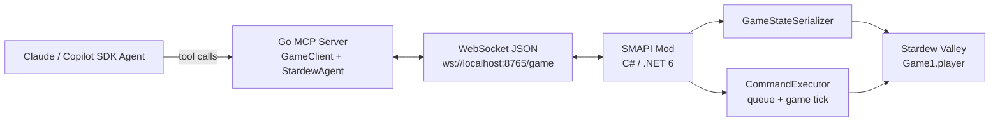
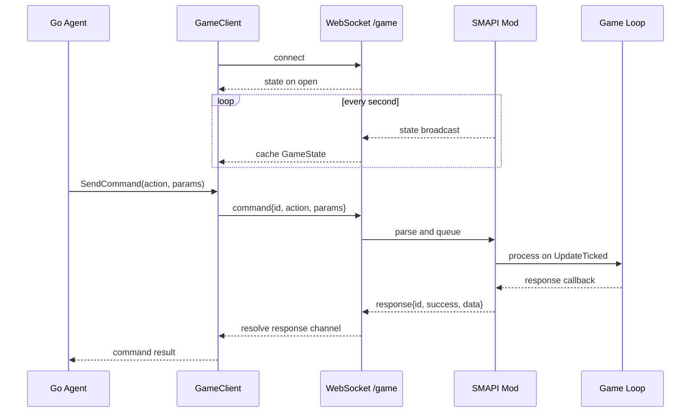
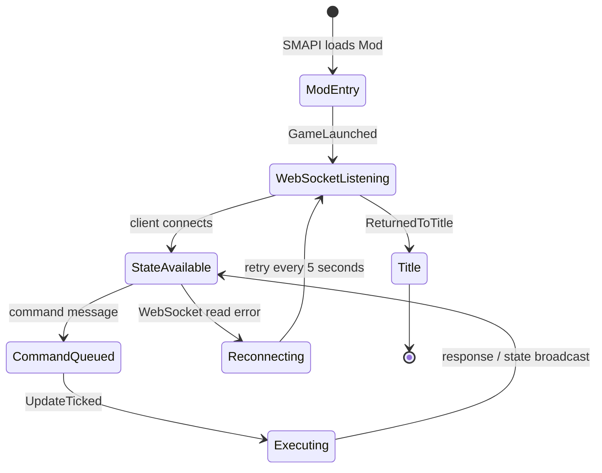

# StardewMCP 项目档案

## 文档信息

| 项目         | 内容 |
| ------------ | ---- |
| **文档标题** | StardewMCP 项目档案 |
| **文档版本** | v0.1 |
| **创建日期** | 2026-08-25 |
| **更新日期** | 2026-08-25 |
| **文档作者** | 项目维护者 |
| **文档类型** | 参考项目资料档案 |
| **参考资料** | [StardewMCP 固定提交 `3ca54bb`](https://github.com/Hunter-Thompson/stardew-mcp/tree/3ca54bbfc1d446eeb06d822a74c92cd14df82b93) |

## 目录

- [项目身份与资料范围](#项目身份与资料范围)
- [项目定位](#项目定位)
- [总体架构](#总体架构)
- [WebSocket 通信链路](#websocket-通信链路)
- [SMAPI Mod](#smapi-mod)
- [游戏状态表达](#游戏状态表达)
- [命令执行与寻路](#命令执行与寻路)
- [Go 客户端与 Agent 循环](#go-客户端与-agent-循环)
- [命令范围](#命令范围)
- [生命周期与错误处理](#生命周期与错误处理)
- [构建与运行](#构建与运行)
- [可观察的实现特征](#可观察的实现特征)
- [资料限制与待验证事实](#资料限制与待验证事实)
- [参考源码](#参考源码)

## 项目身份与资料范围

项目名称为 **Stardew Valley MCP Bridge**，公开仓库为 [Hunter-Thompson/stardew-mcp](https://github.com/Hunter-Thompson/stardew-mcp)。本档案固定分析提交 [`3ca54bbfc1d446eeb06d822a74c92cd14df82b93`](https://github.com/Hunter-Thompson/stardew-mcp/commit/3ca54bbfc1d446eeb06d822a74c92cd14df82b93)，提交信息为 `chore: add readme`，提交时间为 2026-02-05。

资料范围包括该提交中的：

- 根目录 `README.md` 的架构、构建、运行和工具说明；
- `mod/StardewMCP/` 下的 SMAPI Mod、WebSocket Server、状态序列化、命令执行器和寻路器；
- `mcp-server/` 下的 Go WebSocket 客户端、Copilot SDK Agent 和命令调用代码；
- `manifest.json`、`.csproj`、`go.mod` 中的版本和依赖。

本文以固定提交的源码为主要事实来源，并把 README 的项目说明作为单独资料来源。没有启动游戏验证的运行行为标记在资料限制中。

## 项目定位

README 将项目描述为一个通过 Model Context Protocol 连接 Stardew Valley 和 AI Assistant 的桥接项目。固定提交中的游戏控制对象是 `Game1.player`，即当前游戏中的主农场主；源码没有 Companion NPC、Shadow Farmer 或第二个本地角色的控制层。

项目由两部分组成：

- **SMAPI Mod**：在游戏进程内启动 WebSocket Server，读取游戏状态，在游戏循环中执行收到的命令；
- **Go MCP Server / Agent**：连接 Mod 的 WebSocket，缓存状态，把动作和状态读取包装为 Agent 工具，并通过 GitHub Copilot SDK 运行自主 Agent。

这里的 MCP 是外部 Agent 的工具层。Mod 与 Go 进程之间使用的是项目自定义的 WebSocket JSON 消息，而不是 MCP 消息直接穿过游戏进程。

## 总体架构



组件职责如下：

| 组件 | 位置 | 可观察职责 |
| ---- | ---- | ---------- |
| Mod 入口 | [`ModEntry.cs`](https://github.com/Hunter-Thompson/stardew-mcp/blob/3ca54bbfc1d446eeb06d822a74c92cd14df82b93/mod/StardewMCP/ModEntry.cs) | 注册游戏事件，启动 WebSocket Server，驱动命令处理和状态广播 |
| WebSocket Server | [`WebSocketServer.cs`](https://github.com/Hunter-Thompson/stardew-mcp/blob/3ca54bbfc1d446eeb06d822a74c92cd14df82b93/mod/StardewMCP/WebSocketServer.cs) | 监听端口、接收 JSON、发送 state/response/pong/error |
| 状态序列化器 | [`GameStateSerializer.cs`](https://github.com/Hunter-Thompson/stardew-mcp/blob/3ca54bbfc1d446eeb06d822a74c92cd14df82b93/mod/StardewMCP/GameStateSerializer.cs) | 从 `Game1.player` 和当前地点构造结构化游戏状态 |
| 命令执行器 | [`CommandExecutor.cs`](https://github.com/Hunter-Thompson/stardew-mcp/blob/3ca54bbfc1d446eeb06d822a74c92cd14df82b93/mod/StardewMCP/CommandExecutor.cs) | 排队、执行、跟踪移动和异步工具动作 |
| 寻路器 | [`Pathfinder.cs`](https://github.com/Hunter-Thompson/stardew-mcp/blob/3ca54bbfc1d446eeb06d822a74c92cd14df82b93/mod/StardewMCP/Pathfinder.cs) | 在当前地点的 tile 图上执行 A* |
| Go 游戏客户端 | [`main.go`](https://github.com/Hunter-Thompson/stardew-mcp/blob/3ca54bbfc1d446eeb06d822a74c92cd14df82b93/mcp-server/main.go) | 建立连接、缓存状态、按请求 ID 等待响应、心跳和重连 |
| Go Agent | [`copilot_agent.go`](https://github.com/Hunter-Thompson/stardew-mcp/blob/3ca54bbfc1d446eeb06d822a74c92cd14df82b93/mcp-server/copilot_agent.go) | 注册游戏工具、组织目标循环、调用 GitHub Copilot SDK |

## WebSocket 通信链路

### 连接建立

Mod 在 `GameLaunched` 事件中启动 WebSocket Server，固定默认端口为 `8765`，服务路径为 `/game`，完整地址为 `ws://localhost:8765/game`。Go 程序默认使用相同地址，也可以通过 `-url` 参数覆盖。

连接建立后，`GameBridge.OnOpen` 立即发送一条 `state` 消息。Mod 每次 `OneSecondUpdateTicked` 事件还会向当前连接广播一次状态。固定实现通过 `_currentBridge` 保存当前 Bridge 对象，因此源码表现为单个当前 WebSocket Bridge 的广播路径。

### 消息结构

客户端到 Mod 的消息类型由 `WebSocketMessage` 表示：

```json
{
  "id": "request-id",
  "type": "command",
  "action": "move_to",
  "params": { "x": 10, "y": 12 }
}
```

Mod 到客户端的消息由 `WebSocketResponse` 表示：

```json
{
  "id": "request-id",
  "type": "response",
  "success": true,
  "message": "Movement completed",
  "data": {}
}
```

固定实现中可以观察到四种主要返回类型：

| 类型 | 触发方式 | 内容 |
| ---- | -------- | ---- |
| `state` | 连接打开、每秒广播或主动 `get_state` | 当前完整游戏状态 |
| `response` | 命令执行完成或立即返回 | 请求 ID、成功标志、消息和可选数据 |
| `pong` | 客户端发送 `ping` | 复用请求 ID 的心跳响应 |
| `error` | 消息格式错误、未知类型或处理异常 | `success=false` 和错误消息 |

命令通过 `id` 与响应关联。Mod 收到 `command` 后把 `id` 和完成回调交给 `CommandExecutor`，实际完成时再通过 WebSocket 发送 `response`。

### 客户端连接维护

Go 的 `GameClient` 维护连接、互斥锁、当前状态、响应 channel 映射和连接标志：

- `listen` goroutine 持续读取 WebSocket 消息并按类型分发；
- `handleStateUpdate` 把状态消息解析为 `GameState` 并替换缓存；
- `SendCommand` 生成基于纳秒时间的请求 ID，将 channel 放入响应映射后发送 JSON；
- 普通命令等待对应响应，超时时间为 15 秒；
- `keepAlive` 每 15 秒发送一次 `ping`；
- 读连接失败时进入重连流程，每 5 秒尝试重新连接。

重连代码会建立新的 listener 和 heartbeat goroutine。固定源码没有把断线期间未完成的命令持久化到磁盘，也没有显示跨重连恢复待等待请求的机制。



## SMAPI Mod

### 事件与运行时边界

[`ModEntry.cs`](https://github.com/Hunter-Thompson/stardew-mcp/blob/3ca54bbfc1d446eeb06d822a74c92cd14df82b93/mod/StardewMCP/ModEntry.cs) 注册以下事件：

- `GameLaunched`：启动端口为 8765 的 WebSocket Server；
- `SaveLoaded`：记录当前农场主和农场名称；
- `UpdateTicked`：在世界可用时处理命令队列；
- `OneSecondUpdateTicked`：在世界可用时广播状态；
- `ReturnedToTitle`：记录返回标题事件。

`UpdateTicked` 是游戏内命令消费的入口。WebSocket 的接收回调只负责解析消息、构造 `GameCommand` 并将其加入 `ConcurrentQueue`，不直接在 WebSocket 回调中访问游戏对象。

### WebSocket Server

`WebSocketServer.Start` 使用 `WebSocketSharp.Server.WebSocketServer` 监听端口，并为 `/game` 注册 `GameBridge`。`GameBridge` 处理：

- `command`：构造 `GameCommand`，设置完成回调并入队；
- `get_state`：直接序列化并发送当前状态；
- `ping`：返回 `pong`；
- 其他类型：返回未知消息类型错误。

如果启动 Server 失败，Mod 记录错误日志；固定实现没有把端口选择、认证或访问控制放在协议层中。默认监听地址为本地 WebSocket 地址，README 和命令行参数均以 localhost 场景为主。

## 游戏状态表达

### 顶层状态

[`GameStateSerializer.cs`](https://github.com/Hunter-Thompson/stardew-mcp/blob/3ca54bbfc1d446eeb06d822a74c92cd14df82b93/mod/StardewMCP/GameStateSerializer.cs) 从 `Game1.player` 和 `Game1.currentLocation` 生成以下顶层字段：

| 字段 | 内容 |
| ---- | ---- |
| `player` | 姓名、tile 坐标、地点、体力、生命、金钱、当前工具、朝向、移动状态、背包和路径状态 |
| `time` | 时间、日期、季节、星期、是否夜间和距离早晨的分钟数 |
| `world` | 天气、是否户外、农场、温室、可建造地点和地点类型 |
| `surroundings` | ASCII 地图、附近 tile、对象、地形、NPC、怪物、资源、杂物、建筑、动物、门和前方 tile |
| `map` | 地点名称、显示名、地图尺寸、是否矿井、矿井层级和唯一名称 |
| `quests` | 当前任务 ID、标题、描述、目标、剩余天数、奖励和完成标志 |
| `relationships` | NPC 好感点数、心数、今日/本周礼物、今日交谈和关系状态 |
| `skills` | Farming、Mining、Foraging、Fishing、Combat 等等级和经验 |

状态使用 `System.Text.Json` 的 camelCase 命名策略，固定提交的 `GameStateSerializer` 将序列化异常降级为最小 `GameState` JSON，而不是让异常向 WebSocket 层继续传播。

### 61×61 周边扫描

源码将 `ScanRadius` 固定为 30 tile，因此 ASCII 地图和多数周边扫描覆盖 61×61 的区域。ASCII 地图使用字符表达环境：

| 字符 | 源码注释中的含义 |
| ---- | ---------------- |
| `@` | 玩家 |
| `.` | 地面 |
| `#` | 墙、建筑或不可通行区域 |
| `~` | 水 |
| `T` | 树或树状地形 |
| `O` | 对象、石头或杂物 |
| `C` | 作物 |
| `H` | 锄过的土地 |
| `"` | 草 |
| `>` | 传送点或门 |
| `;` | 藏宝点 |
| `!` | NPC |
| `M` | 怪物 |

除 ASCII 地图外，结构化 `Nearby*` 数组记录对象名称、显示名称、坐标、所需工具、是否可通行、是否可拾取、作物状态、怪物生命、建筑门位置和动物状态等字段。

`TileInFront` 单独记录玩家朝向前方的 tile，并包含对象、地形、NPC、是否可交互和所需工具。Agent 内嵌的游戏知识要求在使用工具前通过前方 tile 验证目标，这种验证约束来自 `copilot_agent.go` 中的提示文本和工具流程，不是 Mod 层统一的 Action Schema。

## 命令执行与寻路

### 队列与游戏 tick

`CommandExecutor` 使用 `ConcurrentQueue<GameCommand>`。`ProcessPendingCommands` 每次更新时：

1. 应用已启用的作弊模式效果；
2. 在没有进行重复工具动作时最多取出一个待处理命令；
3. 继续处理已有移动路径；
4. 继续处理重复工具动作；
5. 继续处理蓄力工具动作。

因此命令进入游戏线程后仍然可能跨多个 tick 完成。队列本身没有持久化，Mod 进程退出或连接断开时，内存中的未执行命令不会写入恢复文件。

### 移动

`move_to` 针对当前 `Game1.player` 计算路径。执行器先检查目标是否已经到达，再调用 [`Pathfinder.FindPath`](https://github.com/Hunter-Thompson/stardew-mcp/blob/3ca54bbfc1d446eeb06d822a74c92cd14df82b93/mod/StardewMCP/Pathfinder.cs)。找到路径后保存路径、索引、最终目标和完成回调，后续由 `ProcessMovement` 逐步推进。

Pathfinder 的可观察实现特征包括：

- A* 搜索，最大迭代次数为 50,000；
- 四方向相邻 tile，不包含对角线；
- Manhattan distance 作为启发式函数；
- 检查地图边界、地图层、SMAPI/游戏 passability、对象、地形、资源丛、农场建筑、家具和水域；
- 目标 tile 不可通行时直接返回无路径；
- 到达目标后从路径中移除起点，返回剩余 tile 列表。

移动过程中，执行器使用游戏配置中的方向键模拟输入。它通过位置变化和卡住计数判断是否需要重新计算路径；字段 `MaxRecalculationAttempts` 为 5。到达、无路、卡住重算次数耗尽等情况都会通过保存的回调发送结果。

### 工具与输入模拟

工具执行器不是直接把每个游戏 API 方法暴露给外部，而是部分通过 `IModHelper.Input.Press` 模拟玩家输入：

- `use_tool` 将光标设置到玩家朝向前方的 tile，关闭“最后一次鼠标移动”标志，再按游戏配置中的使用工具按键；
- `use_tool_repeat` 在 1 到 100 次之间重复使用当前工具，每次之间等待约 30 tick 的冷却；
- `hold_tool` 持续按住使用工具键来模拟蓄力工具；
- `interact` 模拟行动键，并在响应中提示调用方读取状态确认实际效果；
- `switch_tool` 通过 `CurrentToolIndex` 切换 0 到 11 号背包槽；
- `select_item` 按名称查找并选择背包项目。

部分命令直接调用游戏对象，例如赠送礼物、制作物品、购买/出售、动物操作、炸弹和作弊动作。动作是否真正改变了游戏世界，依赖对应游戏前置条件和执行时的菜单、动画、体力、地点等状态。

## Go 客户端与 Agent 循环

### GameClient

`mcp-server/main.go` 中的 `GameClient` 是 WebSocket 传输客户端，不是文件 Bridge。它负责保存：

- `conn`：当前 WebSocket 连接；
- `state`：最近一次收到的 `GameState`；
- `responses`：请求 ID 到等待 channel 的映射；
- `connected` 和 `url`：连接状态及重连地址。

`SendCommand` 只在连接存在时发送命令，等待对应请求 ID 的 `response`，15 秒没有收到结果则清理映射并返回超时错误。`GetState` 返回当前缓存的状态副本引用；状态更新由读取 goroutine 加锁替换。

### Agent 工具层

[`copilot_agent.go`](https://github.com/Hunter-Thompson/stardew-mcp/blob/3ca54bbfc1d446eeb06d822a74c92cd14df82b93/mcp-server/copilot_agent.go) 创建 GitHub Copilot SDK Client，通过 `copilot.DefineTool` 将游戏能力注册为 Agent 工具。固定提交中的普通工具包括读取 surroundings、移动、交互、使用工具、重复使用、转向、选择物品、切换槽位、吃物品、进门、查找目标和清理目标等。

`clear_target` 是 Go 层组合工具：根据状态寻找目标，选择所需工具，移动到可操作位置，转向目标，再执行一次或多次工具操作。它不是 Mod 中的单个游戏动作，而是 Agent/客户端侧的操作编排。

项目还定义了大量 cheat 工具。README 将其描述为需要先调用 `cheat_mode_enable` 的快速测试和自动化能力；固定提交的 Mod 执行器包含时间、金钱、物品、体力、关系、作物、地形、矿井、工具升级和选择性 tile 操作等作弊分支。

### 自主循环

程序启动时 `-auto` 默认值为 true。连接游戏后，若启用自动模式，程序会创建 `StardewAgent`，使用命令行的 `-goal` 文本启动 Copilot SDK Session。Agent 循环会读取缓存状态、组织当前目标、把状态和执行规则放入提示文本，再由模型调用已注册工具。

`toolMutex` 用于防止工具并发执行。Agent 内嵌的游戏知识要求移动到目标旁边、面向目标、检查 `TileInFront`、使用合适工具并再次读取状态确认结果。项目源码可以确认这些是该 Go Agent 的提示与工具编排约束，不能据此推断 Copilot SDK 或模型本身的实际成功率。

## 命令范围

固定提交的 Mod `ExecuteCommand` 按类别分发命令，主要包括：

| 类别 | 代表命令 | 主要作用 |
| ---- | -------- | -------- |
| 移动与基础动作 | `move_to`、`stop`、`interact`、`face_direction` | 移动、停止、行动键和朝向 |
| 工具与背包 | `use_tool`、`use_tool_repeat`、`hold_tool`、`switch_tool`、`select_item`、`place_item`、`eat_item`、`trash_item`、`ship_item` | 使用工具、选择物品和管理背包 |
| 钓鱼 | `cast_fishing_rod`、`reel_fish` | 抛竿和收杆 |
| 商店与社交 | `open_shop_menu`、`buy_item`、`sell_item`、`give_gift`、`check_mail` | 菜单、交易、礼物和邮件 |
| 制作与导航 | `craft_item`、`warp_to_location`、`enter_door` | 制作、传送和进入门/传送点 |
| 战斗与动物 | `attack`、`equip_weapon`、`pet_animal`、`milk_animal`、`shear_animal`、`collect_product` | 战斗和动物照料 |
| 矿井 | `use_bomb` | 使用炸弹 |
| 状态 | `get_state` | 返回状态已由 WebSocket Server 单独处理 |
| Cheat | `cheat_*` | 快速设置、批量操作、时间控制和选择性 tile 操作 |

这份命令集合描述的是固定提交中的内部 action 名称，不是一个跨项目通用协议。命令参数、成功条件和是否异步由 `CommandExecutor` 中对应方法决定。

## 生命周期与错误处理



固定源码中的错误和恢复行为包括：

- WebSocket 消息 JSON 解析失败时返回 `error`；
- 未知消息类型返回 `error`；
- 未知 action 返回 `success=false` 的 `response`；
- 命令执行异常被记录并通过失败响应回传；
- A* 找不到路径时返回失败响应；
- 移动执行中检测到卡住时重新计算路径，超过次数后失败；
- Go 客户端读连接失败后定时重连；
- Go 客户端等待单个命令响应超过 15 秒返回超时。

代码没有显示一个统一的取消请求协议。`stop` 可以清理当前移动状态，但并不等价于取消所有已经进入游戏 API 的工具、菜单或动画动作。

## 构建与运行

README 列出的前置条件包括：

- Stardew Valley；
- SMAPI 4.0.0+；
- .NET 6.0 SDK，用于 Mod；
- Go 1.23+，用于 MCP Server；
- GitHub Copilot access，用于 Copilot SDK 驱动的 Agent。

Mod 的 [`StardewMCP.csproj`](https://github.com/Hunter-Thompson/stardew-mcp/blob/3ca54bbfc1d446eeb06d822a74c92cd14df82b93/mod/StardewMCP/StardewMCP.csproj) 目标框架为 `net6.0`，使用 `Pathoschild.Stardew.ModBuildConfig` `4.*`。README 给出的构建步骤是进入 Mod 目录执行 `dotnet build`，再进入 `mcp-server` 执行 `go build -o stardew-mcp`。

运行顺序由 README 描述为：

1. 通过 SMAPI 启动 Stardew Valley；
2. 进入存档，使 Mod 处于世界可用状态；
3. 运行 `stardew-mcp`，默认连接 `ws://localhost:8765/game`；
4. 选择默认自动模式、`-auto=false` 连接模式或 `-goal` 指定目标。

固定提交没有提供自动安装 Mod、自动启动游戏或管理游戏窗口的完整运行器。游戏环境与 Go 进程需要在同一台机器上通过本地 WebSocket 通信。

## 可观察的实现特征

以下是固定提交中可以定位到代码或 README 的实现特征，不表示 Stardew Agent 应采用这些做法：

1. **游戏通信使用双向 WebSocket**：状态广播和命令响应共用连接，客户端用消息类型区分；
2. **状态是结构化的实时快照**：Mod 每秒广播，周边地图以 61×61 ASCII 和结构化数组同时表达；
3. **命令在游戏 tick 中执行**：网络接收回调只排队，游戏对象操作由 `UpdateTicked` 驱动；
4. **请求 ID 贯穿调用链**：WebSocket 消息、Mod 完成回调、Go 等待 channel 使用同一个 ID；
5. **长动作有异步完成回调**：移动、重复工具和蓄力工具不在启动时结束，完成或失败时再回传；
6. **Agent 层存在动作编排**：`clear_target` 将选工具、移动、朝向和执行组合成一个外部工具；
7. **客户端内置连接恢复**：心跳、读失败检测和重连都在 Go GameClient 内实现；
8. **控制对象是主玩家**：动作执行器直接读取和修改 `Game1.player`，项目没有独立 Companion 角色抽象；
9. **作弊能力与正常动作共用协议**：Cheat 以 `cheat_*` action 名称进入同一个 Mod 命令分发器，但由内部状态控制是否允许执行。

## 资料限制与待验证事实

- 本档案没有在 Stardew Valley + SMAPI 中运行固定提交，因此 WebSocket 端口占用、状态广播频率、输入模拟、菜单操作和真实命令结果仍待运行验证。
- `WebSocketSharp`、SMAPI 游戏循环和 `Game1` 对象的线程边界由代码结构表达，但固定提交没有提供完整的并发测试或性能测试结果。
- A* 的 passability 检查覆盖对象、地形、建筑、家具和资源丛，但资料没有证明它对所有地点、传送点、门、矿井层和动态阻挡都能正确寻路。
- `interact` 和部分工具响应会先报告输入已触发，并要求调用方再读取状态验证结果；因此 `success=true` 不必然表示目标世界状态已经改变。
- Go 客户端在重连时没有显示持久化未完成命令或跨进程请求恢复机制；断线期间的动作和响应关联边界需要运行实验确认。
- README 中的 Copilot SDK、模型、目标循环和作弊工具描述属于该固定提交的项目实现；资料没有提供跨任务成功率、成本、延迟或长期自主运行评测。
- 固定提交代表 2026-02-05 的代码状态，不能据此推断仓库当前主分支的实现和维护状态。

## 参考源码

- [项目 README](https://github.com/Hunter-Thompson/stardew-mcp/blob/3ca54bbfc1d446eeb06d822a74c92cd14df82b93/README.md)
- [ModEntry.cs](https://github.com/Hunter-Thompson/stardew-mcp/blob/3ca54bbfc1d446eeb06d822a74c92cd14df82b93/mod/StardewMCP/ModEntry.cs)
- [WebSocketServer.cs](https://github.com/Hunter-Thompson/stardew-mcp/blob/3ca54bbfc1d446eeb06d822a74c92cd14df82b93/mod/StardewMCP/WebSocketServer.cs)
- [GameStateSerializer.cs](https://github.com/Hunter-Thompson/stardew-mcp/blob/3ca54bbfc1d446eeb06d822a74c92cd14df82b93/mod/StardewMCP/GameStateSerializer.cs)
- [CommandExecutor.cs](https://github.com/Hunter-Thompson/stardew-mcp/blob/3ca54bbfc1d446eeb06d822a74c92cd14df82b93/mod/StardewMCP/CommandExecutor.cs)
- [Pathfinder.cs](https://github.com/Hunter-Thompson/stardew-mcp/blob/3ca54bbfc1d446eeb06d822a74c92cd14df82b93/mod/StardewMCP/Pathfinder.cs)
- [mcp-server/main.go](https://github.com/Hunter-Thompson/stardew-mcp/blob/3ca54bbfc1d446eeb06d822a74c92cd14df82b93/mcp-server/main.go)
- [mcp-server/copilot_agent.go](https://github.com/Hunter-Thompson/stardew-mcp/blob/3ca54bbfc1d446eeb06d822a74c92cd14df82b93/mcp-server/copilot_agent.go)
- [StardewMCP.csproj](https://github.com/Hunter-Thompson/stardew-mcp/blob/3ca54bbfc1d446eeb06d822a74c92cd14df82b93/mod/StardewMCP/StardewMCP.csproj)
- [manifest.json](https://github.com/Hunter-Thompson/stardew-mcp/blob/3ca54bbfc1d446eeb06d822a74c92cd14df82b93/mod/StardewMCP/manifest.json)

## 相关横向调研

- [通信实现调研](../communication-architecture.md)
- [Observation、Action 与 Result 形态调研](../observation-action-contract.md)
- [动作执行与寻路实现调研](../action-execution-and-pathfinding.md)
- [任务循环与评测实现调研](../agent-loop-and-evaluation.md)
- [参考项目总览](../existing-projects.md)
