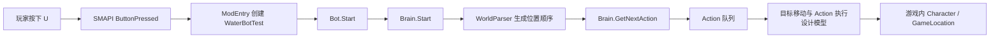

# Stardew Valley BotFramework 项目档案

## 文档信息

| 项目         | 内容 |
| ------------ | ---- |
| **文档标题** | Stardew Valley BotFramework 项目档案 |
| **文档版本** | v0.1 |
| **创建日期** | 2026-08-25 |
| **更新日期** | 2026-08-25 |
| **文档作者** | 项目维护者 |
| **文档类型** | 参考项目资料档案 |
| **参考版本** | `252d28496c545749497d46869d0f0bb7369e2c4d` |
| **项目地址** | [andyruwruw/stardew-valley-bot-framework](https://github.com/andyruwruw/stardew-valley-bot-framework) |
| **固定版本** | [252d28496c545749497d46869d0f0bb7369e2c4d](https://github.com/andyruwruw/stardew-valley-bot-framework/commit/252d28496c545749497d46869d0f0bb7369e2c4d) |

## 目录

- [资料范围与结论边界](#资料范围与结论边界)
- [项目定位](#项目定位)
- [通信与入口](#通信与入口)
- [Bot、Character 与控制对象](#botcharacter-与控制对象)
- [Target 与 Action 模型](#target-与-action-模型)
- [Brain 与执行生命周期](#brain-与执行生命周期)
- [地图、寻路与跨地图路径](#地图寻路与跨地图路径)
- [固定提交中的实际执行边界](#固定提交中的实际执行边界)
- [示例 WaterBotTest](#示例-waterbottest)
- [构建、安装与测试](#构建安装与测试)
- [实现特征与限制](#实现特征与限制)
- [参考源码](#参考源码)
- [相关横向调研](#相关横向调研)

## 资料范围与结论边界

本文只描述固定提交 `252d28496c545749497d46869d0f0bb7369e2c4d` 中可以从公开 README、文档和源码确认的内容。该提交时间为 2021-03-10，目标工程使用 .NET Framework 4.5.2 和较早版本的 SMAPI ModBuildConfig；不能据此推断当前 Stardew Valley 或 SMAPI 版本仍然兼容。

项目 README 描述了一个“供开发者创建 bot mod 的框架”，并将核心关系概括为：让一个 `Stardew.Character` 对 Tile、Object 或 Character 类型的 Target 执行 Action，并处理单个或多个 GameLocation 中的路线和目标顺序。

本文区分两层事实：

1. **设计模型**：接口、抽象类、枚举和项目文档所表达的框架意图。
2. **固定提交的代码路径**：入口事件实际调用哪些方法，以及哪些方法仍然是空实现或只记录日志。

本文不把 BotFramework 的设计模型转成 Stardew Agent 的采用建议或实施方案。

## 项目定位

BotFramework 是运行在 Stardew Valley 游戏进程内的 SMAPI Mod/类库，不是一个单独的服务进程，也不是一个面向外部 Agent 的远程控制协议。它没有 Python 客户端、HTTP/WebSocket server、文件队列、JSON 状态快照或 CLI 命令。

README 给出的使用方式是：

1. 安装 SMAPI 和 BotFramework Mod。
2. 开发者创建自己的 SMAPI Mod 或在框架中创建 Bot 子类。
3. 在 Bot 中覆盖默认 Targets 和 Locations，提供 validator、condition 与 action 委托。
4. 由游戏内事件触发 Bot `Start()`。

项目自身提供的 `WaterBotTest` 是一个示例 Bot。它把当前玩家作为默认控制对象，配置 `Farm` 和 `BusStop` 两个位置，并创建一个用于筛选 `HoeDirt` 的 `TargetTile`。

## 通信与入口

### 不存在外部通信链路

固定提交中没有监听 socket、读取文件、命名管道、标准输入输出协议或外部 API。所有组件都在同一个游戏进程的 C# Mod 中运行，所谓“Bot 指令”是开发者代码创建的对象和委托调用，不是外部客户端发来的消息。

### 游戏内按键入口

`ModEntry.Entry` 注册两个 SMAPI 事件：`GameLaunched` 和 `Input.ButtonPressed`。在游戏已经加载存档、`Context.IsWorldReady` 为真且玩家按下 `SButton.U` 时，入口执行：

1. 记录玩家名称和按键日志；
2. 创建 `WaterBotTest`；
3. 调用 `bot.Start()`。

这就是固定提交中可确认的示例触发方式。README 中的安装步骤只要求将 Mod 放入 Mods 目录并通过 SMAPI 启动游戏，没有提供外部 CLI 或网络控制方式。

### 游戏内链路

上图的最后两步是框架的设计模型；在固定提交的示例路径中，目标发现和执行仍存在未实现部分，详见[固定提交中的实际执行边界](#固定提交中的实际执行边界)。

## Bot、Character 与控制对象

### Bot 抽象类

`Bot` 持有三个核心对象：

- `_brain`：`Brain`，负责 Target 分组、Action 队列和世界路径；
- `_character`：`CharacterController`，作为被控制 Character 的 facade；
- `_active`：Bot 是否已经启动的状态字段。

它提供两组配置接口：

- `SetTargets`：设置一个或多个 `ITarget`；
- `SetLocations`：按 `GameLocation` 对象或地点名称设置工作范围。

当调用 `Start()` 时，如果用户没有预先设置 Targets 或 Locations，Bot 会调用 `DefaultTargets()` 和 `DefaultLocations()`。基类默认的 `DefaultLocations` 使用 `Game1.currentLocation`。

### 默认对象是主控玩家

无参数构造函数执行 `Bot() : this(Game1.player)`，因此固定示例默认控制的是 `Game1.player`。带 `Character` 参数的构造函数可以把另一个 `StardewValley.Character` 交给 `CharacterController`，但固定提交没有看到创建新的 companion、Farmhand 或 NPC，也没有看到把 Character 加入游戏世界的生命周期代码。

`ICharacterController` 目前只公开：

- `GetCharacter()`；
- `GetCurrentLocation()`。

`CharacterController` 也只实现这两个读取方法。`MovementController` 继承 `PathFindController` 并提供多组构造函数，但固定提交中没有把它接入 Bot 的运行循环。

因此，BotFramework 的“可控制 Character”是作为已有游戏对象传入的抽象，不等同于“框架会在游戏里生成第二个角色”。

## Target 与 Action 模型

### Target 的职责

`Target<T>` 把“寻找什么”和“找到后做什么”放在同一个声明中，核心字段包括：

| 字段 | 含义 |
| ---- | ---- |
| `name` | Target 类型的唯一名称 |
| `validator` | 判断一个候选对象是否属于目标 |
| `condition` | 在当前 Character、地点、前后目标上下文下判断是否应处理 |
| `action` | 到达目标后执行的委托 |
| `callOrder` | 在每个地点开始、每个目标前或每个目标后执行 |
| `query` | 查询全部、最近、最远或范围内目标 |
| `selectors` | 将目标转换成自身 tile、周围 tile 或方向相关 tile |
| `actionableRange` | 允许执行动作的距离 |
| `doForClosestLimit` | 最近目标查询的数量限制 |
| `withinRangeLimit` | 范围查询的限制 |

具体 Target 类型有：

- `TargetTile`：目标是框架自己的 `Tile`；
- `TargetObject`：目标是 `StardewValley.Object`；
- `TargetCharacter`：目标是 `StardewValley.Character`；
- `TargetAction`：表示无具体目标的动作类型，但固定提交的地点解析器没有实现对应分支。

### 查询与调用顺序

`CallOrder` 有三个值：

- `AtLocationStart`：进入地点或开始地点处理时生成；
- `BeforeEach`：在普通目标处理前生成；
- `AfterEach`：在普通目标处理后生成。

`QueryBehavior` 有四种值：

- `DoForAll`；
- `DoForClosest`；
- `DoForFarthest`；
- `WithinRange`。

`PostQuerySelector` 用于把目标替换为相关 tile，例如目标自身、周围 tile、被包围 tile，以及北、南、东、西和对角方向的 tile。这个模型把“搜索对象”和“站在哪个 tile 上执行动作”分开表达。

### Action 的数据结构

泛型 `Action<T>` 保存：

- 来源 `ITarget`；
- 要操作的 direct object；
- 目标所在的 `ILocationParser`；
- `ActionType`。

`ActionType` 表达三种意图：

- `Navigate`：只移动到地点或 warp tile；
- `NavigateAndExecute`：移动到目标并执行动作；
- `Execute`：不需要目标的直接动作。

`ActionTile`、`ActionObject` 和 `ActionCharacter` 只是针对不同 direct object 类型的薄封装。它们保存动作描述，但不包含通用的游戏输入发送或动作回调逻辑。

## Brain 与执行生命周期

### 初始化

`Bot.Start()` 的顺序是：

1. 补齐默认 Targets 和 Locations；
2. 写入“Bot has been triggered to start”日志；
3. 调用可覆写的 `StartCallback()`；
4. 将 `_active` 设置为 `true`；
5. 调用 `Brain.Start(currentLocation)`；
6. 取出一个 `IAction` 并记录其字符串表示。

`Brain.Start` 调用 `WorldParser.GenerateActionableLocations`，将配置的地点包装成 `LocationParser`，生成从当前地点开始的地点访问顺序和地点图。

### Action 队列优先级

`Brain` 分别维护三条队列：

- `_atLocationStartQueue`；
- `_beforeEachQueue`；
- `_afterEachQueue`。

`GetNextAction()` 的设计顺序是：

1. 三条队列都为空时，先按当前地点生成 `AtLocationStart` 动作；
2. 当前地点动作完成后，生成 `AfterEach` 动作；
3. `AfterEach` 队列清空后，生成 `BeforeEach` 动作；
4. 从 `AfterEach`、`BeforeEach`、`AtLocationStart` 队列依次取出动作；
5. 三条队列都为空时返回 `null`。

源码中的注释和文档把 `AfterEach` 视为较高优先级，把 `AtLocationStart` 视为地点开始时的普通目标队列。真正的跨 tick 执行循环、动作完成后再次调用 `GetNextAction()` 的逻辑没有出现在固定提交的 `Bot.Start()` 中。

### 回调位置

`Bot` 提供 `StartCallback`、`InterruptedCallback` 和 `FinishCallback` 三个可覆写方法。固定提交的 `Start()` 只调用 `StartCallback`；另外两个回调没有在固定入口中被调用。它们是扩展点，而不是已经接入的完整生命周期通知。

## 地图、寻路与跨地图路径

### LocationParser

`LocationParser` 是 `GameLocation` 的读取 facade，负责：

- 通过地点对象或名称获取地点；
- 延迟加载地图宽高和 `Tile` 矩阵；
- 延迟加载 warp 列表；
- 将 warp 坐标转换成对应的 `Tile`；
- 判断 tile 是否可通行。

`Tile` 保存地点名、X/Y 坐标、terrain feature 和 visited 标记，并通过 `GameLocation.isCollidingPosition` 判断可通行性。固定提交的 tile 检查使用的是 `Game1.player` 作为碰撞判断中的 farmer 参数，即使 `Bot` 的抽象允许传入其他 Character。

### 地点图

`WorldParser` 将配置的多个 GameLocation 包装成 `LocationParser`，以 warp 建立地点图。`WorldTour` 先通过广度优先搜索发现配置地点之间的连接，并生成成本矩阵；随后继承自 `TourTemplate` 的逻辑按贪心方式选择访问顺序。

对于下一个地点，`WorldPath` 在地点图上运行 `PathTemplate`。`PathTemplate` 的注释明确写出它使用 Dijkstra 思路，并以 `O(v^2)` 的方式扫描未访问节点；它用前驱表重建从当前地点到目标地点的地点序列。

跨地图移动不是连续的坐标寻路。`WorldParser.ActionToWarp` 从当前地点的 warp 列表中找到指向下一个地点的 warp，并生成一个 `ActionTile`，其 `ActionType` 为 `Navigate`。如何将这个 Navigate action 交给 Character 的 movement controller，在固定提交的运行入口中没有实现。

### 单地图目标查询

项目文档把 `DoForAll`、`DoForClosest`、`DoForFarthest` 和 `WithinRange` 描述为目标查询策略，并将 breadth-first search 作为最近或范围查询的算法。但固定提交的 `LocationParser.GetTargetTiles` 只有四个分支注释：加载地图并查找、广度优先搜索等；这些分支没有加入实际的 target/action 生成代码。

## 固定提交中的实际执行边界

### 已接入的部分

从固定提交源码可以确认，以下部分具有实际代码路径：

- SMAPI Mod 加载和 `GameLaunched`、`ButtonPressed` 事件注册；
- `U` 按键触发 `WaterBotTest`；
- Bot 对 Character、Targets 和 Locations 的对象初始化；
- Brain 的 Target 分组、队列结构和地点图初始化；
- 地图矩阵、tile 读取、warp 读取和地点级路径算法的数据结构；
- Action、Target、Location 和查询枚举的公开模型；
- .NET Framework 工程、SMAPI ModBuildConfig 和 manifest。

### 未完成或未接入的部分

固定提交中还可以直接看到以下边界：

1. `LocationParser.GetActions` 对 `TargetAction`、`TargetCharacter` 和 `TargetObject` 分支为空；`TargetTile` 分支调用的 `GetTargetTiles` 也只包含占位注释。
2. `Bot.Start()` 只调用一次 `Brain.GetNextAction()` 并记录结果，没有持续的 UpdateTicked loop、路径控制器赋值、动作回调或完成检测。
3. `Action<T>` 仅保存 target、direct object、location parser 和 action type；固定提交没有通用的执行器把它转换成游戏中的工具使用、交互或输入操作。
4. 示例 `WaterBotTest.action` 只写入 “Action thing happened” 日志，没有实际浇水或调用 Stardew 工具。
5. 当目标查询没有生成 Action 时，`Brain.GetNextAction()` 会返回 `null`，而 `Bot.Start()` 随后直接调用 `action.ToString()`；固定示例路径存在未处理空 Action 的代码边界。
6. `MovementController` 虽然继承 `PathFindController`，但没有在固定提交的 `Bot` 或 `Brain` 执行路径中被使用。
7. 没有从 Mod 外部读取实时目标、返回 Observation、上报 Action Result 或接收模型输出的协议。

因此，README 中“框架处理路线、目标顺序和动作执行”的表述应理解为项目的框架目标和 API 设计，而不能等同于固定提交已经完成了端到端的目标搜索和动作执行。

## 示例 WaterBotTest

`WaterBotTest` 展示了开发者扩展 Bot 的表面 API：

1. 继承 `Bot`，使用默认构造函数，因此控制对象是 `Game1.player`。
2. 覆盖 `DefaultTargets()`，创建名为 `Waterable` 的 `TargetTile`。
3. validator 判断 tile 的 terrain feature 是否为 `HoeDirt`。
4. action 委托接收 `Character who`、`GameLocation where` 和 `Tile what`。
5. 覆盖 `DefaultLocations()`，配置 `Farm` 和 `BusStop`。

项目 Usage 文档用同样的抽象展示“对所有未浇水 tile 浇水”“访问 NPC”“处理对象”等示例；但固定提交的 WaterBotTest action 本身只记录日志，Target 查询也尚未完成。因此，示例主要展示扩展接口和期望的数据流，而不是一个已完成的农场自动化 Bot。

## 构建、安装与测试

### Mod 工程

README 的安装流程要求：

1. 安装最新 SMAPI；
2. 下载并解压 BotFramework；
3. 将 Mod 放入 Mods 目录；
4. 通过 SMAPI 运行游戏。

工程文件是传统 .NET Framework 项目：

- Target Framework Version 为 `v4.5.2`；
- 使用 `Pathoschild.Stardew.ModBuildConfig` `3.2.2`；
- 输出类型是 `Library`；
- 引用若干 .NET Framework 程序集；
- manifest 的入口 DLL 是 `BotFramework.dll`；
- manifest 的最低 SMAPI API 版本为 `3.0.0`。

固定提交没有 GitHub Actions、跨平台 dotnet 工程、外部 CLI 包或 release 产物配置。

### 测试工程

仓库包含一个 `BotFrameworkTests` 项目，目标框架同为 .NET Framework 4.5.2，使用 MSTest TestAdapter 和 TestFramework `2.1.1`。固定提交中的测试类只有空的示例测试方法，没有验证 Target 查询、地点路径、Action 执行或 Mod 生命周期的有效断言。

## 实现特征与限制

以下内容是固定提交中的可观察特征：

1. BotFramework 将自动化行为建模为 `Character -> Target -> Action`，目标可以是 tile、对象或角色，地点则是另一层独立配置。
2. `CallOrder`、`QueryBehavior`、`PostQuerySelector` 和 `ActionType` 把目标筛选、目标顺序、站位和动作意图拆成可组合字段。
3. 框架同时考虑单地图目标和多地图访问，使用 warp 图、地点访问顺序和地点级最短路径组织跨地图导航。
4. 角色控制抽象允许构造函数接收 `Character`，但默认实例是 `Game1.player`；固定提交没有 companion 创建、farmhand 加入或多角色管理协议。
5. 入口交互是游戏内 `U` 按键，所有状态和控制都在游戏进程内完成，没有外部通信链路。
6. 代码结构包含许多面向扩展的接口和 template method，但 Target 搜索、Action 执行和持续生命周期在固定提交中尚未贯通。
7. README 和文档表达的框架能力范围比固定提交的可执行代码更宽，阅读时需要同时查看实现入口和占位分支。
8. 工程目标是较旧的 .NET Framework 4.5.2，并依赖早期 SMAPI 构建配置；这与现代 SDK-style .NET 6 Mod 工程是不同的构建形态。

## 参考源码

以下链接均固定到同一个提交，便于在 GitHub 上直接跳转：

- [项目 README](https://github.com/andyruwruw/stardew-valley-bot-framework/blob/252d28496c545749497d46869d0f0bb7369e2c4d/README.md)
- [Mod 入口与 U 按键触发](https://github.com/andyruwruw/stardew-valley-bot-framework/blob/252d28496c545749497d46869d0f0bb7369e2c4d/BotFramework/ModEntry.cs)
- [Bot 抽象类](https://github.com/andyruwruw/stardew-valley-bot-framework/blob/252d28496c545749497d46869d0f0bb7369e2c4d/BotFramework/Bot.cs)
- [Brain 与 Action 队列](https://github.com/andyruwruw/stardew-valley-bot-framework/blob/252d28496c545749497d46869d0f0bb7369e2c4d/BotFramework/Brain.cs)
- [Target 抽象类](https://github.com/andyruwruw/stardew-valley-bot-framework/blob/252d28496c545749497d46869d0f0bb7369e2c4d/BotFramework/Targets/Target.cs)
- [Tile/Object/Character Target](https://github.com/andyruwruw/stardew-valley-bot-framework/tree/252d28496c545749497d46869d0f0bb7369e2c4d/BotFramework/Targets)
- [Action 抽象与三类 Action](https://github.com/andyruwruw/stardew-valley-bot-framework/tree/252d28496c545749497d46869d0f0bb7369e2c4d/BotFramework/Actions)
- [地点解析与目标 Action 生成入口](https://github.com/andyruwruw/stardew-valley-bot-framework/blob/252d28496c545749497d46869d0f0bb7369e2c4d/BotFramework/Locations/LocationParser.cs)
- [世界路径与地点访问顺序](https://github.com/andyruwruw/stardew-valley-bot-framework/tree/252d28496c545749497d46869d0f0bb7369e2c4d/BotFramework/World)
- [Dijkstra 风格路径模板](https://github.com/andyruwruw/stardew-valley-bot-framework/blob/252d28496c545749497d46869d0f0bb7369e2c4d/BotFramework/TemplateMethods/PathTemplate.cs)
- [地点访问顺序模板](https://github.com/andyruwruw/stardew-valley-bot-framework/blob/252d28496c545749497d46869d0f0bb7369e2c4d/BotFramework/TemplateMethods/TourTemplate.cs)
- [Character 控制接口与 PathFindController 包装](https://github.com/andyruwruw/stardew-valley-bot-framework/tree/252d28496c545749497d46869d0f0bb7369e2c4d/BotFramework/Characters)
- [WaterBotTest 示例](https://github.com/andyruwruw/stardew-valley-bot-framework/blob/252d28496c545749497d46869d0f0bb7369e2c4d/BotFramework/WaterBotTest.cs)
- [Mod manifest](https://github.com/andyruwruw/stardew-valley-bot-framework/blob/252d28496c545749497d46869d0f0bb7369e2c4d/BotFramework/manifest.json)
- [Mod 工程与构建配置](https://github.com/andyruwruw/stardew-valley-bot-framework/blob/252d28496c545749497d46869d0f0bb7369e2c4d/BotFramework/BotFramework.csproj)
- [使用说明](https://github.com/andyruwruw/stardew-valley-bot-framework/blob/252d28496c545749497d46869d0f0bb7369e2c4d/documentation/USAGE.md)
- [框架参考文档](https://github.com/andyruwruw/stardew-valley-bot-framework/blob/252d28496c545749497d46869d0f0bb7369e2c4d/documentation/REFERENCE.md)
- [固定提交中的测试工程](https://github.com/andyruwruw/stardew-valley-bot-framework/tree/252d28496c545749497d46869d0f0bb7369e2c4d/BotFrameworkTests)

## 相关横向调研

- [通信架构调研](../communication-architecture.md)：比较不同游戏通信媒介和链路边界。
- [已有项目横向调研](../existing-projects.md)：记录参考项目的整体分类和事实对比。
- [Observation、Action 与 Result 契约](../observation-action-contract.md)：讨论状态、命令和结果表达的公共概念。
- [动作执行与寻路调研](../action-execution-and-pathfinding.md)：比较动作排队、执行和寻路实现。
- [Agent 循环与评测调研](../agent-loop-and-evaluation.md)：讨论 Agent loop、任务完成判断和评测数据。
- [项目档案索引](README.md)：查看其他参考项目的固定版本和完成状态。
