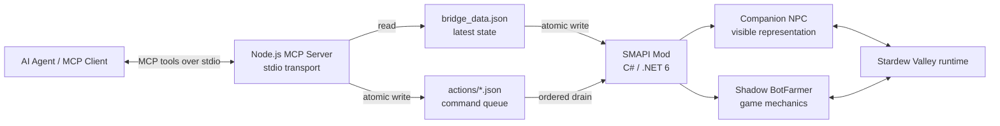
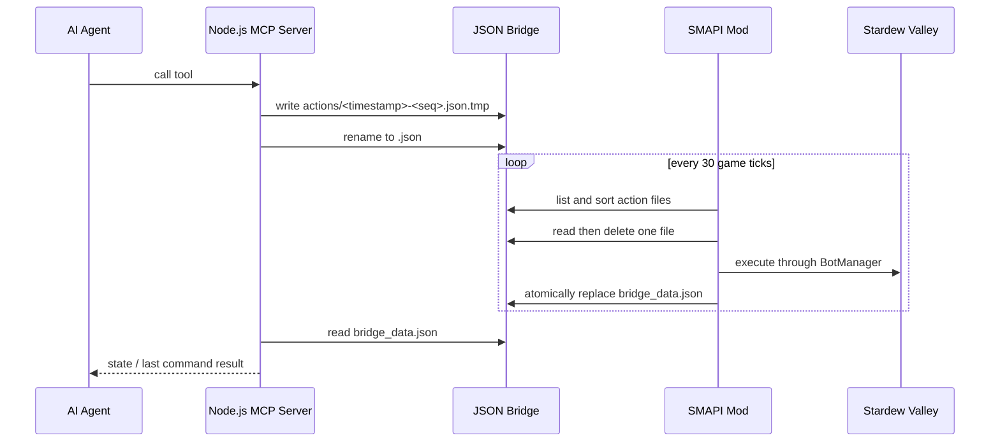
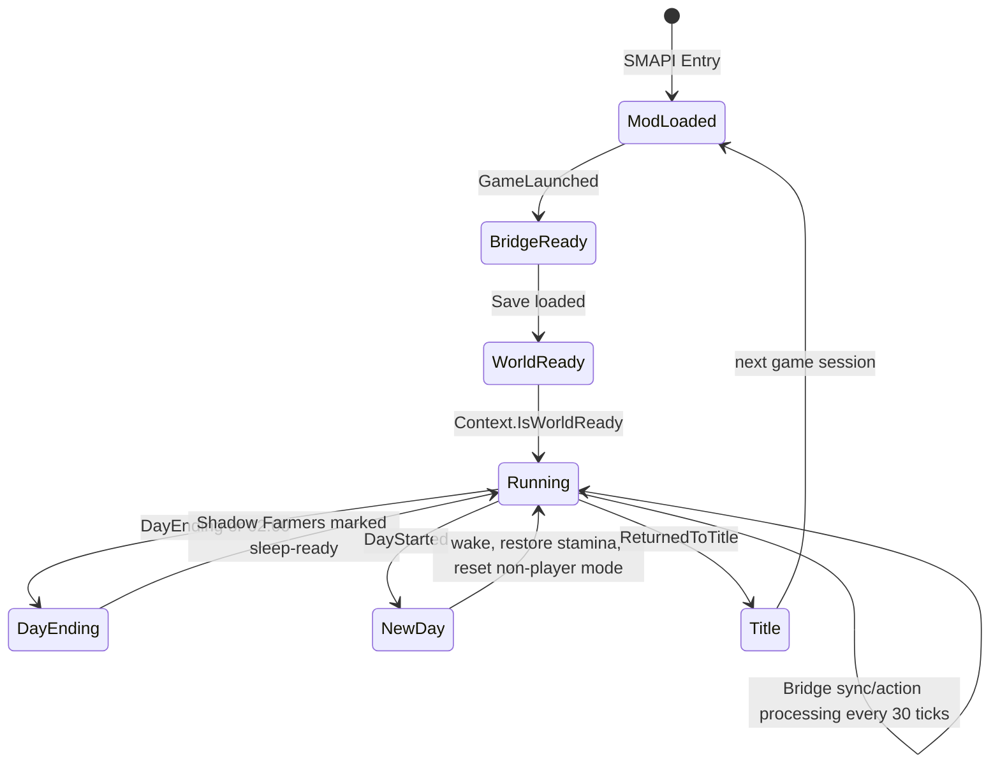

# StardewValley-MCP 项目档案

## 文档信息

| 项目         | 内容 |
| ------------ | ---- |
| **文档标题** | StardewValley-MCP 项目档案 |
| **文档版本** | v0.1 |
| **创建日期** | 2026-08-25 |
| **更新日期** | 2026-08-25 |
| **文档作者** | 项目维护者 |
| **文档类型** | 参考项目资料档案 |
| **参考资料** | [StardewValley-MCP 固定提交 `6cb2ffa`](https://github.com/amarisaster/StardewValley-MCP/tree/6cb2ffa7160e6202ea8a7da4f827b1869f4a1daf) |

## 目录

- [项目身份与资料范围](#项目身份与资料范围)
- [项目定位](#项目定位)
- [总体架构](#总体架构)
- [游戏通信链路](#游戏通信链路)
- [SMAPI Mod](#smapi-mod)
- [Companion 与 Shadow Farmer](#companion-与-shadow-farmer)
- [控制模式](#控制模式)
- [MCP 工具接口](#mcp-工具接口)
- [状态与结果](#状态与结果)
- [生命周期与时序](#生命周期与时序)
- [构建与运行](#构建与运行)
- [可观察的实现特征](#可观察的实现特征)
- [资料限制与待验证事实](#资料限制与待验证事实)
- [参考源码](#参考源码)

## 项目身份与资料范围

项目名称为 **Stardew MCP Bridge**，公开仓库为 [amarisaster/StardewValley-MCP](https://github.com/amarisaster/StardewValley-MCP)。本档案固定分析提交 [`6cb2ffa7160e6202ea8a7da4f827b1869f4a1daf`](https://github.com/amarisaster/StardewValley-MCP/commit/6cb2ffa7160e6202ea8a7da4f827b1869f4a1daf)，提交信息为 `Fix sprite ratio + follow flickering`，提交时间为 2026-06-04。

资料范围包括该提交中的：

- 根目录 `README.md` 的项目说明、架构图、工具清单和运行步骤；
- `smapi-mod/` 下的 Mod 入口、Bridge 文件处理、Companion、Shadow Farmer、AI 模式和环境扫描代码；
- `mcp-server/` 下的 Node.js MCP Server、stdio 传输和 JSON 文件读写代码；
- `manifest.json`、`.csproj` 和 `package.json` 中的版本、依赖和构建配置。

本文把 README 中的项目声明与源码中可直接观察到的行为分开记录。没有通过实际游戏运行确认的内容标记为资料限制或待验证事实。

## 项目定位

README 将项目描述为通过 Model Context Protocol 控制 Stardew Valley Companion 的桥接项目。其控制对象不是游戏原生的第二个网络玩家，而是由 Mod 创建的可见 Companion NPC 和配套的隐藏 Shadow Farmer。项目同时包含两类控制形态：

- **自主模式**：Companion 可以跟随、务农、采矿、钓鱼或停留；
- **Player Mode**：关闭该 Companion 的自主 AI，由 MCP 工具直接控制移动、工具、战斗、钓鱼和交互。

项目的 MCP 只位于外部 Agent 与 Node.js Server 之间。Node.js Server 与游戏 Mod 之间没有使用 MCP 协议，而是通过一个状态 JSON 文件和一个动作 JSON 文件目录通信。

## 总体架构

组件职责可以从源码按边界划分：

| 组件 | 位置 | 可观察职责 |
| ---- | ---- | ---------- |
| MCP Server | [`mcp-server/src/index.ts`](https://github.com/amarisaster/StardewValley-MCP/blob/6cb2ffa7160e6202ea8a7da4f827b1869f4a1daf/mcp-server/src/index.ts) | 注册 MCP 工具、读取状态 JSON、写入动作 JSON、返回工具文本结果 |
| Bridge 状态 | Mod 目录中的 `bridge_data.json` | 保存时间、天气、主玩家、Companion、NPC 和同步时间 |
| 动作队列 | Mod 目录中的 `actions/*.json` | 以独立 JSON 文件承载动作，Mod 按文件名顺序读取并删除 |
| Mod 入口 | [`smapi-mod/ModEntry.cs`](https://github.com/amarisaster/StardewValley-MCP/blob/6cb2ffa7160e6202ea8a7da4f827b1869f4a1daf/smapi-mod/ModEntry.cs) | 注册 SMAPI 事件、同步状态、处理动作和加载资源 |
| Companion 管理 | [`smapi-mod/BotManager.cs`](https://github.com/amarisaster/StardewValley-MCP/blob/6cb2ffa7160e6202ea8a7da4f827b1869f4a1daf/smapi-mod/BotManager.cs) | 创建 Companion、分发全局和定向动作、收集状态 |
| 行为模式 | [`smapi-mod/CompanionAI.cs`](https://github.com/amarisaster/StardewValley-MCP/blob/6cb2ffa7160e6202ea8a7da4f827b1869f4a1daf/smapi-mod/CompanionAI.cs) | 每 tick 运行 Follow、Farm、Mine、Fish、Idle 或 Player 模式 |
| 角色配对 | [`smapi-mod/CompanionFarmer.cs`](https://github.com/amarisaster/StardewValley-MCP/blob/6cb2ffa7160e6202ea8a7da4f827b1869f4a1daf/smapi-mod/CompanionFarmer.cs) | 维护可见 NPC 与 Shadow Farmer 的位置、地点、工具和物品同步 |

## 游戏通信链路

### Node.js Server 到动作文件

Node.js Server 从 `STARDEW_ACTION_DIR` 环境变量读取动作目录；未设置时使用相对于编译后 Server 目录的 `../../smapi-mod/actions`。`sendAction` 的行为包括：

1. 创建动作目录；
2. 使用毫秒时间戳和进程内单调序号组成文件名；
3. 将 JSON 写入同名 `.tmp` 文件；
4. 使用 rename 发布正式的 `.json` 文件；
5. 返回 `Command sent.`。

源码注释将每个动作文件描述为不可变队列项，并说明按文件名排序可以避免单个共享文件覆盖带来的丢命令或重复执行问题。文件名序号只在当前 Node.js Server 进程内递增；时间戳承担跨时刻排序作用。

### Mod 到状态文件

Mod 把状态文件固定为自身 Mod 目录中的 `bridge_data.json`。在 `UpdateTicked` 中：

- Companion AI 每帧更新，用于移动、寻路、卡住检测、自动战斗和钓鱼状态；
- 每 30 个 tick 同步一次状态并处理动作，代码注释将其近似为每 0.5 秒一次；
- 状态 JSON 先写入 `bridge_data.json.tmp`，再以覆盖方式移动到正式路径。

这种状态文件是“当前状态快照”，代码中没有为它建立历史版本或轮转目录。动作文件则在 Mod 读取后立即删除，成功处理和处理异常都不会保留原动作文件。

### Mod 内部执行边界

Mod 的 `ProcessActions` 只在 `Context.IsWorldReady` 时运行。它读取动作目录中所有 `.json` 文件，按字符串排序后逐个读取和删除，再交给 `BotManager.ProcessAction`。动作本身最终在 SMAPI 的游戏循环事件中被消费，而不是由 Node.js 直接调用游戏对象。

## SMAPI Mod

### 入口和资源

[`ModEntry.cs`](https://github.com/amarisaster/StardewValley-MCP/blob/6cb2ffa7160e6202ea8a7da4f827b1869f4a1daf/smapi-mod/ModEntry.cs) 在 `Entry` 中注册以下游戏循环和资源事件：

- `GameLaunched`：加载 Companion portrait 和 sprite；
- `UpdateTicked`：更新所有 Companion，并以较低频率进行 Bridge I/O；
- `DayStarted`：恢复 Shadow Farmer 状态并执行新一天处理；
- `DayEnding` 和 2:00 AM：把 Shadow Farmer 标记为睡眠就绪；
- `TimeChanged`：处理强制进入下一天时的睡眠就绪信号；
- `ReturnedToTitle`：移除 Companion 并清理管理器状态；
- `AssetRequested`：注入 Companion portrait、角色 sprite 和 `Data/Characters` 条目。

`Data/Characters` 中当前注入 `Companion1` 和 `Companion2` 两个角色数据，分别从 `assets/Companion1_*` 和 `assets/Companion2_*` 读取图片资源。`CompanionNPC` 还重写绘制逻辑，为自定义 sprite 使用非均匀宽度比例。

### 构建配置

固定提交中的 [`StardewMCPBridge.csproj`](https://github.com/amarisaster/StardewValley-MCP/blob/6cb2ffa7160e6202ea8a7da4f827b1869f4a1daf/smapi-mod/StardewMCPBridge.csproj) 具有以下特征：

- 程序集名称为 `StardewMCPBridge`；
- 目标框架为 `net6.0`；
- Mod 版本为 `0.3.0`；
- 使用 `Pathoschild.Stardew.ModBuildConfig` `4.1.1`；
- 通过 `GAME_PATH` 给 ModBuildConfig 提供游戏目录。

[`manifest.json`](https://github.com/amarisaster/StardewValley-MCP/blob/6cb2ffa7160e6202ea8a7da4f827b1869f4a1daf/smapi-mod/manifest.json) 声明最低 SMAPI API 版本为 `4.0.0`，入口程序集为 `StardewMCPBridge.dll`。

## Companion 与 Shadow Farmer

### 两层对象

每个 Companion 由两个对象组成：

1. **可见 `CompanionNPC`**：加入当前地点的角色列表，使用自定义 sprite，负责玩家看到的移动、绘制和位置；
2. **隐藏 `BotFarmer`**：继承 `Farmer`，保存工具、物品、体力、生命和地点，负责调用游戏工具、战斗、钓鱼等机制。

[`CompanionFarmer.cs`](https://github.com/amarisaster/StardewValley-MCP/blob/6cb2ffa7160e6202ea8a7da4f827b1869f4a1daf/smapi-mod/CompanionFarmer.cs) 在构造时创建 Shadow Farmer、分配新的 Multiplayer ID、设置 36 格背包并加入初始工具。Shadow Farmer 的 `draw` 被重写为空操作；配对的 NPC 负责视觉表现。

代码注释明确说明 Shadow Farmer 不加入 `Game1.otherFarmers`。该集合被项目视为网络同步的远程玩家集合，Shadow Farmer 不是由网络层创建的完整农场手对象；当前实现因此直接驱动它的游戏 API，而不是把它注册为网络联机玩家。

### 位置与地点

`SyncFromNpc` 把可见 NPC 的像素位置、当前地点和朝向同步到 Shadow Farmer。`WarpTo` 同时从旧地点移除 NPC、清除 NPC 的路径控制器、设置 NPC 和 Shadow Farmer 的新地点与位置，并把 NPC 加入目标地点。

Player Mode 公开了 `warp_companion` 工具，可以指定地点名和 tile 坐标；自主模式也包含跟随主玩家、进入矿井或在必要时回到农场的代码路径。源码因此能确认该项目存在“Companion 视觉对象和 Shadow Farmer 同步跨地点”的实现，但不能仅从静态代码确认所有地点、菜单、事件和存档边界都能稳定工作。

### 当前 Companion 数量

固定提交的 MCP Server 使用 `Companion1` 和 `Companion2` 作为 `COMPANION_ENUM`。Mod 的 `spawn` 全局动作也只调用 `SpawnBot("Companion1", ...)` 和 `SpawnBot("Companion2", ...)`。因此公开接口和默认创建流程明确覆盖两个 Companion；源码没有提供可由 MCP 参数指定任意数量或任意名称的 spawn 工具。

## 控制模式

`CompanionAI` 定义六种模式：

| 模式 | 源码中可观察的行为 |
| ---- | ------------------ |
| `follow` | 通过 `PathFindController` 跟随主玩家；距离过远时传送到主玩家附近；在战斗区域攻击附近怪物 |
| `farm` | 扫描当前地点的农作物、杂物等任务，按优先级和距离选择目标并执行收获、浇水或清理 |
| `mine` | 前往矿井、寻找岩石、使用镐和攻击附近怪物，并处理梯子或地点移动 |
| `fish` | 寻找水域、移动到目标位置、抛竿并由每 tick 的鱼竿状态处理钩鱼 |
| `idle` | 不运行上述自主任务，保持当前状态 |
| `player` | 不运行常规自主 AI；由带 `companion` 字段的动作直接驱动，Player Mode 仍可运行自动战斗和钓鱼状态 |

自主模式中的移动主要通过 NPC 的路径控制器完成；不同模式还包含卡住检测、距离阈值传送和失败后的备用位置设置。Player Mode 的 `move_to` 在建立路径失败时直接把 NPC 位置设为目标 tile，返回结果文本会说明路径失败后的传送。

## MCP 工具接口

### 传输与配置

Node.js Server 通过 [`StdioServerTransport`](https://github.com/amarisaster/StardewValley-MCP/blob/6cb2ffa7160e6202ea8a7da4f827b1869f4a1daf/mcp-server/src/index.ts) 对 MCP Client 提供 stdio 服务。它不监听 HTTP 或 WebSocket 端口。与游戏的文件路径通过环境变量配置：

| 环境变量 | 作用 | 未设置时的默认行为 |
| -------- | ---- | ------------------ |
| `STARDEW_BRIDGE_PATH` | 状态 JSON 路径 | 使用相对于 Server 编译目录的 `../../smapi-mod/bridge_data.json` |
| `STARDEW_ACTION_DIR` | 动作目录 | 使用相对于 Server 编译目录的 `../../smapi-mod/actions` |

### 工具分组

固定提交的 README 将工具分为 13 个全局工具和 12 个 Player Mode 工具，共 25 个：

| 分组 | 工具 |
| ---- | ---- |
| 状态与全局控制 | `stardew_get_state`、`stardew_spawn`、`stardew_follow`、`stardew_stay`、`stardew_farm`、`stardew_mine`、`stardew_fish`、`stardew_water_all`、`stardew_harvest_all`、`stardew_warp`、`stardew_set_mode`、`stardew_chat`、`stardew_action` |
| Player Mode 读取 | `stardew_get_surroundings`、`stardew_get_inventory`、`stardew_get_companion_state` |
| Player Mode 移动与姿态 | `stardew_move_to`、`stardew_warp_companion`、`stardew_face_direction` |
| Player Mode 游戏动作 | `stardew_use_tool`、`stardew_interact`、`stardew_attack`、`stardew_cast_fishing_rod`、`stardew_set_auto_combat`、`stardew_eat_item` |

MCP 工具调用在 Server 侧主要完成参数检查和动作文件写入。对于动作工具，返回文本是 `Command sent.`，不是游戏动作已经成功完成的证明；游戏结果在后续 Bridge 状态中的 `lastCommandResult` 里出现。

## 状态与结果

### 全局状态

Mod 周期性写入的 `bridge_data.json` 包含：

- 游戏时间、日期、季节和天气；
- 当前地点；
- 主农场主姓名、生命、体力、金钱和像素位置；
- 所有已创建 Companion 的状态；
- 当前地点中的 NPC 姓名和像素位置；
- UTC 同步时间字符串 `syncedAt`。

### Companion 状态

每个 Companion 的基础状态包含姓名、像素位置、tile 位置、地点、状态描述、模式、体力百分比、生命、最大生命和自动战斗开关。

当模式为 `player` 时，额外包含：

- 半径为 8 tile 的结构化周边扫描；
- 非空地形、不可通行 tile、水、作物、对象、可破坏性和可交互性；
- 范围内怪物的姓名、位置和生命；
- 范围内非 Companion NPC 的姓名和位置；
- Shadow Farmer 的非空背包项目；
- 该 Companion 最近一次直接命令的成功标志和详情。

`SurroundingsScanner` 只把“有内容、不可通行或是水”的 tile 放入结果，而不是返回完整的矩形网格。源码扫描的中心是 Companion 可见 NPC 的 tile，而不是主农场主的位置。

### Result 生命周期

`ProcessCompanionCommand` 在 Mod 内同步执行动作并把 `{ action, success, detail }` 写入内存中的 `commandResults`。下一次 `SyncGameState` 时，Player Mode 的 Companion 状态会把这个结果序列化到 `lastCommandResult`。返回结果不会建立独立的结果文件，也没有请求 ID 与结果文件之间的持久化关联。

对于箱子交互，代码会把箱子内项目列表加入该 Companion 的最近结果；其他工具主要返回动作成功与否和文本详情。某些游戏 API 调用失败时，代码会返回失败；吃物品还包含一个在 `eatObject` 异常时直接恢复体力/生命并扣减堆叠的备用路径。

## 生命周期与时序

项目针对游戏生命周期的处理包括：

- 进入世界前不处理动作和 Companion AI；
- 每帧更新 Companion，Bridge 文件 I/O 降低为每 30 tick 一次；
- 主玩家进入睡眠流程时，把 Shadow Farmer 的睡眠字段置为就绪，避免额外的农场手阻塞日结；
- 新一天恢复 Shadow Farmer 体力和生命；非 Player Mode 重置为 Follow，Player Mode 保留；
- 如果 Companion 在矿井或火山地牢，日结后把它传送回 Farm；
- 返回标题时移除 NPC、清空 Companion 字典和最近命令结果。

## 构建与运行

README 的公开运行前置条件包括：

- Stardew Valley 1.6+；
- SMAPI 4.0+；
- Node.js 18+；
- Mod 构建使用 .NET 6 SDK；
- MCP Server 使用 Node.js、TypeScript 和 `@modelcontextprotocol/sdk`。

Mod 的构建方式是进入 `smapi-mod` 后设置游戏路径并执行 `dotnet build`。MCP Server 的构建方式是进入 `mcp-server` 后执行 `npm install` 和 `npm run build`。README 给出的配置示例通过 MCP Client 启动 `mcp-server/build/index.js`，并可用环境变量覆盖两个 Bridge 路径。

源码中没有看到 Mod 自动启动游戏、安装 SMAPI 或管理游戏窗口的逻辑。游戏需要先由用户或其他运行环境通过 SMAPI 启动，再由 MCP Server 连接文件 Bridge。

## 可观察的实现特征

以下内容是该固定提交中可以直接定位到源码的实现特征，不是对这些特征的价值排序：

1. **MCP 与游戏通信解耦**：MCP 只负责外部工具协议，游戏内 Mod 使用普通 JSON 文件；
2. **状态与命令使用不同文件形态**：状态是一个原子替换的当前快照，命令是按文件排序和删除的动作队列；
3. **视觉对象与机制对象分离**：NPC 负责可见外观，Shadow Farmer 负责调用 Farmer/Tool API；
4. **动作既有自主模式也有定向模式**：Follow、Farm、Mine、Fish 是代码内行为循环，Player Mode 将动作入口交给外部工具；
5. **状态围绕 Companion 组织**：Player Mode 的视野、背包和最近结果以 Companion 为单位加入 Bridge；
6. **游戏内时间与生命周期被显式处理**：睡眠、日切、矿井回收和返回标题都有对应事件或清理逻辑；
7. **异步感来自轮询和后续状态读取**：MCP Server 写入动作后立即返回，调用方通过下一轮 Bridge 状态观察实际结果。

## 资料限制与待验证事实

- 本档案没有在 Stardew Valley + SMAPI 中运行该固定提交，因此 Companion 跨地点、工具、战斗、钓鱼、睡眠和存档恢复的真实行为仍待验证。
- README 声明支持 Player 2/3，但固定提交的公开 MCP 枚举和默认 spawn 流程只显式创建 `Companion1` 和 `Companion2`；是否能安全扩展更多 Companion，源码没有提供完整验证结论。
- `WarpTo` 可以直接更换 Companion 的地点对象，但静态代码不能证明所有地点的地图坐标、事件、菜单和 NPC 列表交互都与原生农场手一致。
- 动作文件读取后立即删除，状态文件只保留最新内容；代码没有提供请求重放、结果历史、状态快照历史或跨进程锁的实现。
- MCP 工具返回 `Command sent.`，实际结果依赖后续状态同步；资料没有提供统一的请求超时、重试、取消或断线恢复协议。
- README 给出了 Node.js、SMAPI 和游戏版本前置条件，但固定提交没有提供跨平台完整的自动化运行验证矩阵。
- 项目声明的“自主模式”“直接 Player Mode”和具体动作能力来自 README 与源码；其稳定性、性能和长期任务完成率不能由静态资料推导。

## 参考源码

- [项目 README](https://github.com/amarisaster/StardewValley-MCP/blob/6cb2ffa7160e6202ea8a7da4f827b1869f4a1daf/README.md)
- [ModEntry.cs](https://github.com/amarisaster/StardewValley-MCP/blob/6cb2ffa7160e6202ea8a7da4f827b1869f4a1daf/smapi-mod/ModEntry.cs)
- [BotManager.cs](https://github.com/amarisaster/StardewValley-MCP/blob/6cb2ffa7160e6202ea8a7da4f827b1869f4a1daf/smapi-mod/BotManager.cs)
- [CompanionAI.cs](https://github.com/amarisaster/StardewValley-MCP/blob/6cb2ffa7160e6202ea8a7da4f827b1869f4a1daf/smapi-mod/CompanionAI.cs)
- [CompanionFarmer.cs](https://github.com/amarisaster/StardewValley-MCP/blob/6cb2ffa7160e6202ea8a7da4f827b1869f4a1daf/smapi-mod/CompanionFarmer.cs)
- [BotFarmer.cs](https://github.com/amarisaster/StardewValley-MCP/blob/6cb2ffa7160e6202ea8a7da4f827b1869f4a1daf/smapi-mod/BotFarmer.cs)
- [SurroundingsScanner.cs](https://github.com/amarisaster/StardewValley-MCP/blob/6cb2ffa7160e6202ea8a7da4f827b1869f4a1daf/smapi-mod/SurroundingsScanner.cs)
- [CompanionActions.cs](https://github.com/amarisaster/StardewValley-MCP/blob/6cb2ffa7160e6202ea8a7da4f827b1869f4a1daf/smapi-mod/CompanionActions.cs)
- [CompanionNPC.cs](https://github.com/amarisaster/StardewValley-MCP/blob/6cb2ffa7160e6202ea8a7da4f827b1869f4a1daf/smapi-mod/CompanionNPC.cs)
- [StardewMCPBridge.csproj](https://github.com/amarisaster/StardewValley-MCP/blob/6cb2ffa7160e6202ea8a7da4f827b1869f4a1daf/smapi-mod/StardewMCPBridge.csproj)
- [manifest.json](https://github.com/amarisaster/StardewValley-MCP/blob/6cb2ffa7160e6202ea8a7da4f827b1869f4a1daf/smapi-mod/manifest.json)
- [mcp-server/src/index.ts](https://github.com/amarisaster/StardewValley-MCP/blob/6cb2ffa7160e6202ea8a7da4f827b1869f4a1daf/mcp-server/src/index.ts)
- [mcp-server/package.json](https://github.com/amarisaster/StardewValley-MCP/blob/6cb2ffa7160e6202ea8a7da4f827b1869f4a1daf/mcp-server/package.json)

## 相关横向调研

- [通信实现调研](../communication-architecture.md)
- [Observation、Action 与 Result 形态调研](../observation-action-contract.md)
- [动作执行与寻路实现调研](../action-execution-and-pathfinding.md)
- [参考项目总览](../existing-projects.md)
