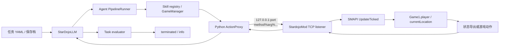

# StarDojo 项目档案

## 文档信息

| 项目         | 内容 |
| ------------ | ---- |
| **文档标题** | StarDojo 项目档案 |
| **文档版本** | v0.1 |
| **创建日期** | 2026-08-25 |
| **更新日期** | 2026-08-25 |
| **文档作者** | 项目维护者 |
| **文档类型** | 参考项目资料档案 |
| **参考版本** | `e251401cf1e84ba07cbfa08283a7aba52290e578` |
| **项目地址** | [StarDojo2025/stardojo](https://github.com/StarDojo2025/stardojo) |
| **固定版本** | [e251401cf1e84ba07cbfa08283a7aba52290e578](https://github.com/StarDojo2025/stardojo/commit/e251401cf1e84ba07cbfa08283a7aba52290e578) |

## 目录

- [资料范围与结论边界](#资料范围与结论边界)
- [项目定位](#项目定位)
- [整体组件](#整体组件)
- [完整运行链路](#完整运行链路)
- [游戏通信协议](#游戏通信协议)
  - [连接建立与请求分发](#连接建立与请求分发)
  - [请求格式](#请求格式)
  - [文本响应](#文本响应)
  - [观测响应的两条路径](#观测响应的两条路径)
- [SMAPI Mod 内部执行](#smapi-mod-内部执行)
- [Observation 结构](#observation-结构)
- [Action 结构](#action-结构)
- [任务初始化与评估](#任务初始化与评估)
- [Agent 执行循环](#agent-执行循环)
- [生命周期、平台与构建](#生命周期平台与构建)
- [实现特征与限制](#实现特征与限制)
- [参考源码](#参考源码)
- [相关横向调研](#相关横向调研)

## 资料范围与结论边界

本文只描述固定提交 `e251401cf1e84ba07cbfa08283a7aba52290e578` 中可以从公开 README、文档和源码确认的内容。源码中的类名、方法名和字段名以该提交为准；项目后续提交可能已经改变这些实现。

本文将 StarDojo 作为一个“游戏环境与 Agent benchmark”记录，而不是将它概括为一个通用的远程控制协议。项目同时包含三类内容：

1. 用 SMAPI Mod 在游戏进程内采集状态、执行动作和初始化任务。
2. 用 Python `ActionProxy` 连接本地 TCP 服务，并把游戏数据转换成 Gymnasium 风格的环境观测。
3. 用任务 YAML、保存档和 evaluator 定义可重复的任务场景，驱动 Agent 进行多步执行。

本文不把这些实现特征转换成 Stardew Agent 的采用建议、架构决策或实施计划。

## 项目定位

StarDojo README 将项目描述为使用 StardewModdingAPI 为语言模型提供 Stardew Valley benchmark 和测试环境。仓库中公开的运行形式包括：

- 单任务运行；
- 多任务串行运行；
- 多任务并行运行，README 标注该模式为 Linux only；
- 可自定义的 observation space、action space 和 task；
- 可选的截图输入、截图缓存和视频输出。

因此，StarDojo 的主要抽象不是“给一个外部 CLI 暴露若干游戏命令”，而是 Gymnasium 环境中的一次 `step`：先获取游戏观测，再由 Agent 规划一个或多个 skill，随后执行 skill，最后由任务 evaluator 判断是否完成。

## 整体组件

固定提交中的关键组件可以按以下层次划分：

| 层次 | 组件 | 主要职责 |
| ---- | ---- | ---- |
| 游戏进程内 | `StardojoMod` | 监听本地 TCP、把请求切换到游戏主线程、调用动作或状态导出方法 |
| 游戏进程内 | `ActionsAPI`、`InitTaskAPI` | 暴露移动、交互、菜单、观测、读档和测试初始化等方法 |
| 本地通信客户端 | Python `ActionProxy` | 建立 TCP 连接，发送百分号分隔请求，读取文本或共享内存响应 |
| 环境封装 | `StarDojo`、`StarDojoLLM` | 生成 Observation、保存截图、组织 Agent step、返回 Gymnasium 风格结果 |
| skill 层 | Stardew skill registry 与 atomic skills | 把 Agent 的结构化 skill 调用映射到 `ActionProxy` |
| 任务层 | `TaskBase`、任务实现、YAML task suite | 加载保存档、执行初始化命令、比较前后观测并输出完成状态 |
| Agent 层 | `PipelineRunner`、`GameManager` | 读取任务和观测，规划 skill 序列，按顺序执行并记录结果 |

整体关系如下：



截图有两条来源：游戏 Mod 将当前帧的 RGBA 像素数据放入观测响应，`StarDojo` 可以将其保存为 JPEG；同时，Agent 框架还提供基于桌面窗口的截图与窗口控制组件。固定提交的 Stardew 原子 skill 主要通过 `ActionProxy` 工作，不应把这两条截图路径混成同一个通信协议。

## 完整运行链路

以仓库 README 中的单任务入口为例，运行过程可以拆成以下阶段：

1. Python 进程读取环境变量和配置，取得 `STARDEW_APP_PATH`。
2. `StarDojo` 创建 `ActionProxy`。当 `new_game=True` 时，它检查端口，并以 `--port-id` 与 `--sample-rate` 参数启动 StardewModdingAPI。
3. `StardojoMod.Entry` 注册事件、启动 TCP listener，并创建与端口对应的 memory-mapped file。
4. `StarDojoLLM` 创建任务代理。如果有任务，它通过 `InitTaskProxy` 发送读档和初始化命令，然后准备观测读取器。
5. 每次 `step` 先通过 `observe_v2` 获取游戏状态和截图。
6. 当 `needs_pausing=True` 时，规划期间先暂停游戏；Agent 根据处理后的观测和可用 skill 返回 skill 列表。
7. `GameManager.execute_actions` 逐个调用 skill。skill 再通过 `ActionProxy` 发送动作请求，Mod 在游戏 tick 中执行实际操作。
8. 动作完成后再次读取观测，并调用当前任务的 `evaluate`。环境返回观测、固定的 `reward=0`、完成状态、截断状态和执行记录。
9. 达到任务完成或最大 step 数后，运行脚本可以将游戏退回标题界面并结束 Agent pipeline。

这条链路的关键点是：任务完成判断位于 Python 任务层，游戏 Mod 本身只负责执行请求和导出数据；Mod 不负责理解“当前 benchmark 任务是否成功”。

## 游戏通信协议

### 连接建立与请求分发

`StardojoMod` 在 `Entry` 中以后台任务启动 `TcpListener`，监听 `127.0.0.1` 和当前端口，默认端口是 `10783`。启动参数 `--port-id` 可以覆盖端口，随后 memory-mapped file 名称也随端口变化。

每个 TCP 客户端连接由一个 `HandleClientAsync` 处理。客户端发送数据后，Mod 将请求转交到下一次 `UpdateTicked` 回调中执行：

1. `HandleMessage` 注册一次性的 `UpdateTicked` handler。
2. handler 在游戏主线程中调用 `HandleMessageInMain`。
3. `HandleMessageInMain` 解析方法名和参数，先在 `ActionsAPI` 中查找，再在 `InitTaskAPI` 中查找。
4. 对非暂停、恢复和观测类方法，Mod 会等待当前游戏状态可执行，例如没有正在使用工具、没有淡入淡出、没有活动菜单等阻塞条件。
5. 反射调用静态 API 方法。如果返回的是泛型 `Task`，Mod 会继续等待其结果，再把结果写回客户端。

这使得动作操作发生在 SMAPI 的游戏事件线程上，而 TCP 接收和响应写回发生在 Mod 的异步处理逻辑中。动作 API 中的移动方法还会等待自动寻路完成、发生传送或菜单变化后再返回。

### 请求格式

请求不是 JSON、HTTP 或带长度字段的二进制帧，而是一个 ASCII/UTF-8 字符串：

```text
method%argument-1%argument-2%...
```

Mod 使用 `%` 分割字符串，第一段作为方法名，其余段按字符串参数传给反射方法。例如，Python 客户端中的以下调用会产生对应请求：

```text
move_relative%1%0
observe_v2%3
choose_option%1%0%0
```

固定提交中，服务端对 TCP 流的读取以一次 `ReadAsync` 返回的数据块为单位处理，并没有在请求中实现独立的换行、长度前缀或 JSON envelope。因此，这个协议的请求边界依赖客户端发送方式和服务端当前读取行为。

### 文本响应

对于返回值不是 `byte[]` 的方法，Mod 将返回值转成字符串，并在末尾追加文本结束标记：

```text
<return-value><EOF>
```

Python `ActionProxy` 持续读取 TCP，直到累计响应以 `<EOF>` 结尾，再去除结束标记。无返回值的方法在服务端仍会返回默认的 `Message received<EOF>` 形式。

### 观测响应的两条路径

固定提交同时保留两种观测方法，二者的返回通道不同。

| 请求 | Mod API | 序列化 | 返回通道 | 当前 Python 主路径 |
| ---- | ------- | ------ | -------- | ------------------ |
| `observe%size` | `ActionsAPI.observe` | CBOR bytes | memory-mapped file | 否 |
| `observe_v2%size` | `ActionsAPI.observe_v2` | JSON string | TCP + `<EOF>` | 是 |

旧的 `observe` 路径会将 `GatherGameData` 结果转成 CBOR，写入 memory-mapped file。写入协议使用固定区域：偏移 `0` 是 ready flag，偏移 `4` 存放数据长度，偏移 `8` 开始存放字节；写入时先把 flag 置为 `0`，写长度和数据后再置为 `1`。Python `SharedMemoryReader` 轮询 flag，读出指定长度的 CBOR 数据，再把 flag 写回 `0`。

当前 `ActionProxy.observe` 实际发送的是 `observe_v2%3`。因为 `_post_message` 只将包含 `observe` 且不包含 `observe_v2` 的请求切到 memory-mapped file，`observe_v2` 会沿用普通文本响应路径。因此，当前环境的状态读取实际是 JSON over TCP，并不是每一次观测都写入新的快照文件。

代码中的 C# memory-mapped file 大小设置为 8 MiB，而 Python 读取器将映射大小设置为 4 MiB。固定提交没有通过配置统一这两个常量；这是源码中可以直接观察到的跨端配置差异，实际能否触发读取问题取决于观测数据大小和操作系统映射行为。

## SMAPI Mod 内部执行

### 动作 API

`ActionsAPI` 把游戏内操作包装成可通过字符串方法名调用的静态方法。固定提交可以确认的动作包括：

- 相对移动、按方向移动、转向和自动寻路；
- 使用当前工具或物品、选择背包槽位、与对象或 NPC 交互；
- 制作物品、附加或拆除工具附件；
- 打开地图、退出菜单、选择对话或商店选项；
- 暂停、恢复、等待游戏开始、读档和返回标题界面；
- 获取完整观测、指定范围的 surroundings 和单格 tile 信息。

移动调用使用 `PathFindController` 在当前地图中寻找路径，并将路径控制器赋给 `Game1.player.controller`。如果目标格被 NPC 占据，代码会尝试寻找相邻可达格；到达终点、发生传送或菜单变化时，异步动作完成回调会结束等待。

### 观测收集

`GatherGameData(size, mod)` 收集的顶层数据包括：

- `Player`：名称、生命、体力、金钱、地图、坐标、朝向、背包、当前选中物品、技能、职业和关系字段；
- `NPCs`：NPC 数据；
- `GameState`：时间、日期、季节、年份和天气；
- `Farm`：动物、建筑和宠物；
- `CurrentMenuData`：当前菜单及对话、商店、箱子等菜单字段；
- `ScreenShot`：当前帧像素数据；
- `Buildings`、`Crops`、`Furnitures`、`Exits`、`ShopCounters`；
- `MetaData`：视口尺寸；
- `CallBackData`：例如 `OnDayStarted` 回调计数；
- `SurroundingsData`：以范围参数采集的周边 tile 信息。

`ScreenShot` 由像素数据编码进观测。在 Python 层，`observe_v2` 返回 JSON 后，代码从 `ScreenShot` 读取 base64 数据，按 `MetaData.ViewportSize` 还原成 RGBA 数组，再按配置保存为 JPEG 或写入视频。

固定提交的 `GameData` 类中 `Progression` 字段被注释掉，但 Python 的 Gymnasium observation schema 和部分任务 evaluator 仍声明或访问进度字段。这个差异应作为该提交的数据契约事实记录，而不能直接视为两个层次已经完全一致。

## Observation 结构

### Gymnasium 原始空间

`env/observation.py` 使用 `gymnasium.spaces.Dict` 声明结构化空间，顶层包括：

- `Player`：名称、健康、体力、金钱、地点、坐标、背包和五项技能；
- `NPCs`：名称、地点和友好度；
- `Locations`：tile、建筑、角色、室外标记和季节；
- `GameState`：日期、季节、年份、时间、天气和婚礼日；
- `Farm`：作物、动物和建筑；
- `Progression`：社区中心、矿层、骷髅洞穴、成就；
- `CurrentMenuData`：菜单类型和菜单详情。

缺少的字段会由 `fill_observation_space` 按空间声明补默认值。这个补齐函数处理的是 Python 层字典，不会改变游戏 Mod 实际发送的 JSON。

### Agent 使用的处理后观测

`StarDojo.obs_preprocess` 在原始观测上增加或整理以下字段：

| 字段 | 内容 |
| ---- | ---- |
| `health`、`energy`、`money` | 以字符串形式提供的玩家基础状态 |
| `location`、`position`、`facing_direction` | 地图、tile 坐标和可读方向 |
| `inventory`、`chosen_item` | 背包及当前选中物品 |
| `time`、`day`、`season` | 时间和日期 |
| `farm_animals`、`farm_pets`、`farm_buildings` | 农场对象 |
| `surroundings` | 当前范围内的 tile；会把绝对坐标转换为原始观测记录 |
| `crops`、`exits`、`buildings`、`furniture` | 地图内容和可达出口 |
| `npcs`、`shop_counters`、`current_menu` | 可交互实体和菜单 |
| `image_paths` | 截图缓存中的路径列表 |
| `basic_knowledge` | 供 Agent 使用的固定操作提示 |

在 `StarDojoLLM` 中，周边 tile 会进一步被处理成相对坐标和文本描述，背包会转成包含 slot index 和数量的文本，游戏时间会转成 AM/PM 字符串。LLM Agent 使用的是这个处理后的表示；RL/调试路径可以保留更接近原始 JSON 的观测。

## Action 结构

### Gymnasium 离散动作空间

`StarDojo` 声明一个十维 `MultiDiscrete`：

```text
[2, 2, 8, 150, 36, 5, 1, 200, 200, 1000]
```

`convert_discrete_into_commands` 将十个位置解释为移动、转向、功能动作、制作物品 ID、背包槽位、方向、菜单选项、目标坐标和数量。这个接口用于环境/RL 形式的离散动作调用。

### LLM skill 接口

LLM 运行路径没有直接让模型生成十维数组，而是从已注册 skill 中选择结构化调用。固定提交中启用的基础 Stardew skills 包括：

- `move(x, y)`：发送相对移动；
- `craft(item)`：按物品名称发送制作请求；
- `use(direction)`：转向后使用当前工具或物品；
- `choose_item(slot_index)`：选择背包槽位；
- `interact(direction)`：转向后交互或收获；
- `choose_option(option_index, quantity, direction)`：选择对话、商店或箱子选项；
- `attach_item(slot_index)`、`unattach_item()`；
- `menu(option, menu_name)`：打开地图或关闭当前菜单。

`navigate` 在固定提交的基础 skill 文件中被注释掉，因此文档中公开的可用 LLM skill 集合不应将它视为默认启用动作。仓库文档列出的 action space 比固定提交实际启用的 skill 更宽，二者需要区分。

### 动作结果

skill 执行结果由 `GameManager.execute_actions` 汇总为执行信息，包含已执行 skill、最后一个 skill、错误标记和错误详情。`StarDojoLLM.step` 把该信息放入 `info["records"]`，再调用任务 evaluator。

很多基础 skill 的 Python 包装函数只发送请求而不返回游戏操作结果；动作是否产生目标变化主要通过下一次观测以及任务 evaluator 判断。移动等 C# 异步 API 则会返回布尔成功值，Python `ActionProxy.move` 会解析这个结果并在失败时尝试相邻位置重试。

## 任务初始化与评估

### 任务描述

任务由 YAML 文件定义，字段包括任务描述、目标对象、数量、工具、保存档、初始化命令、evaluator 类型和难度。任务加载器根据文件名和索引创建对应的任务实现。

仓库固定提交包含 farming、exploration、crafting、combat、social、open 等任务类别，并提供 lite 变体。目标覆盖农场清理、耕地、播种、浇水、收获、动物互动、地点移动、采集、制作、战斗、购买、出售、建筑和部分社交/进度操作。

### 初始化链路

`TaskBase.init_task` 使用 `InitTaskProxy` 加载保存档并执行初始化命令。`InitTaskProxy` 与普通 `ActionProxy` 使用同一个本地 TCP 服务和相同的百分号分隔请求，但它主要发送设置体力、金钱、物品、地形、作物、建筑、角色、日期、时间、任务或关系等测试准备操作。

因此，任务开始前可以通过保存档和初始化命令把游戏置于相对固定的状态；这些命令属于 benchmark 的测试准备层，不是 LLM skill 的默认动作集合。

### evaluator

任务 evaluator 读取当前观测并按任务类型比较状态。常见判断方式包括：

- 比较前后 surroundings 中的 tile、地形、作物和障碍变化；
- 比较背包中物品数量变化；
- 比较地图位置、动物状态、建筑状态或技能值；
- 检查菜单、任务、地点、日期推进或特定游戏事件字段；
- 对制作任务直接检查目标物品是否出现在背包。

`StarDojoLLM.step` 将 evaluator 返回字典中的 `completed` 映射为 Gymnasium 的 `terminated`。该固定提交中的普通 step reward 始终为 `0`，任务完成量通过 `info` 和 evaluator 返回结果表达，而不是通过即时 reward 表达。

## Agent 执行循环

固定提交的 LLM 运行入口以 `run_stardojo` 为主。它加载环境配置、任务、LLM 和 embedding 配置，按任务难度设置最大 turn 数，创建 `PipelineRunner` 和 `StarDojoLLM`，随后重复调用 `step`。

一次 `StarDojoLLM.step` 的内部顺序为：

1. 取得处理前的游戏观测，并加上上一轮 action。
2. 如果需要暂停，则通过 Stardew 的 UI control 暂停游戏，使规划阶段不推进游戏时间。
3. 调用 `agent.run_planning`，输入文本观测和可选图像观测，得到 skill 列表。
4. 恢复游戏。
5. 通过 `GameManager.execute_actions` 顺序执行 skill；每个 skill 结束后有固定的 post-action wait。
6. 记录最后一个 action 和执行信息。
7. 重新获取观测，调用 evaluator，返回 observation、`0`、完成标记、`False` 和 info。

截图输入既可以来自 Mod 观测中携带的像素数据，也可以由环境层保存为图片路径供 Agent 使用。游戏窗口暂停/激活和桌面截图由单独的 `StardewUIControl`、`IOEnvironment` 组件处理，不属于 TCP 请求格式本身。

## 生命周期、平台与构建

### 依赖与启动

项目 README 列出的基础依赖是 Stardew Valley、SMAPI 和 Python 3.10，仓库提供 shell 与 PowerShell setup 脚本。环境通过 `STARDEW_APP_PATH` 找到 StardewModdingAPI 可执行文件；固定提交的 Python 分支按 Windows、Linux 和 Darwin 区分启动命令。

当 `new_game=True` 时，Python 代码会检查 TCP 端口并启动游戏进程；Linux 路径使用 `xvfb-run`，Windows 路径可附加后台启动参数，Darwin 路径直接启动配置的可执行文件。当 `new_game=False` 时，代码假定游戏和 Mod 已经启动，再通过 `wait_for_server` 等待 TCP 服务可连接。

### Mod 构建

固定提交的 Mod 工程目标框架为 .NET 6，依赖包括 `Pathoschild.Stardew.ModBuildConfig`、Newtonsoft.Json、Harmony、PeterO.Cbor 和 MessagePack。工程通过 `Stardew Valley.dll` 与 `StardewModdingAPI.dll` 引用本机游戏安装文件，依赖路径在项目文件中按 macOS Steam 安装位置写出。

Mod manifest 的 `MinimumApiVersion` 为 `3.0.0`，入口 DLL 是 `StardojoMod.dll`。项目 README 描述了直接下载 Mod 或从 C# solution 构建后放入 Mods 目录的方式。

### 退出与资源

任务结束时运行脚本可以调用 `exit_to_title`，并关闭 Agent pipeline 和视频 writer。Mod 中的 TCP listener 在正常运行期间持续接受连接；固定提交没有展示一个由外部请求触发的显式优雅关闭协议。

## 实现特征与限制

以下内容是固定提交可以观察到的实现特征，不是对项目未来版本的评价：

1. StarDojo 把游戏通信、环境规范、任务初始化、任务评估和 LLM skill 执行放在同一个仓库内，外部 Agent 不必自行定义这些层之间的契约。
2. 游戏动作和测试初始化共用本地 TCP listener，但分别由 `ActionsAPI` 和 `InitTaskAPI` 暴露；初始化命令可以改变大量世界状态，LLM 默认 skill 集合则更窄。
3. 请求协议是方法名加 `%` 分隔参数，响应使用 `<EOF>` 文本结束标记；没有通用 JSON 请求 envelope、请求 ID 或响应 ID。
4. 观测方法存在 CBOR + memory-mapped file 和 JSON + TCP 两条实现；固定提交的 Python 主路径使用后者。
5. 观测数据同时包含结构化游戏字段和截图像素，Python 层又提供面向 Agent 的字段规整和文本化处理。
6. 动作完成的语义分为三层：C# 方法可以等待异步动作完成，Python skill 包装通常只发送命令，任务 evaluator 最终通过后续观测判断目标是否完成。
7. 原始观测声明、C# `GameData` 实际字段和任务 evaluator 的字段访问并非完全一致；例如进度字段在 C# 聚合类中被注释，但 Python 层仍保留相关 schema 或 evaluator 访问。
8. C# 与 Python 对 memory-mapped file 大小的常量不同；同时请求读取以 TCP `ReadAsync` 数据块为边界，固定提交没有独立的请求帧协议。
9. 部分文档描述的动作范围比固定提交中默认注册的 LLM skill 更宽，`navigate` 等能力在基础 skill 文件中处于注释状态。
10. 项目提供截图、窗口激活和暂停控制组件，但这些桌面级能力与 SMAPI Mod 的状态/动作 TCP 协议是并列组件。

## 参考源码

以下链接均固定到同一个提交，便于在 GitHub 上直接跳转：

- [项目 README](https://github.com/StarDojo2025/stardojo/blob/e251401cf1e84ba07cbfa08283a7aba52290e578/README.md)
- [SMAPI Mod 入口与 TCP listener](https://github.com/StarDojo2025/stardojo/blob/e251401cf1e84ba07cbfa08283a7aba52290e578/StardojoMod/ModEntry.cs)
- [动作 API](https://github.com/StarDojo2025/stardojo/blob/e251401cf1e84ba07cbfa08283a7aba52290e578/StardojoMod/actions/ActionsAPI.cs)
- [动作实现、寻路与观测聚合](https://github.com/StarDojo2025/stardojo/blob/e251401cf1e84ba07cbfa08283a7aba52290e578/StardojoMod/actions/Actions.cs)
- [Python TCP/共享内存客户端](https://github.com/StarDojo2025/stardojo/blob/e251401cf1e84ba07cbfa08283a7aba52290e578/env/actions.py)
- [Gymnasium 环境与观测预处理](https://github.com/StarDojo2025/stardojo/blob/e251401cf1e84ba07cbfa08283a7aba52290e578/env/stardew_env.py)
- [LLM 环境 step 与任务运行入口](https://github.com/StarDojo2025/stardojo/blob/e251401cf1e84ba07cbfa08283a7aba52290e578/env/llm_env.py)
- [原子 skill 定义](https://github.com/StarDojo2025/stardojo/blob/e251401cf1e84ba07cbfa08283a7aba52290e578/agent/stardojo/environment/stardew/atomic_skills/basic_skills.py)
- [Gymnasium observation schema](https://github.com/StarDojo2025/stardojo/blob/e251401cf1e84ba07cbfa08283a7aba52290e578/env/observation.py)
- [任务基类与 evaluator](https://github.com/StarDojo2025/stardojo/blob/e251401cf1e84ba07cbfa08283a7aba52290e578/env/tasks/base.py)
- [任务加载器](https://github.com/StarDojo2025/stardojo/blob/e251401cf1e84ba07cbfa08283a7aba52290e578/env/tasks/utils/load_task.py)
- [任务初始化客户端](https://github.com/StarDojo2025/stardojo/blob/e251401cf1e84ba07cbfa08283a7aba52290e578/env/tasks/utils/init_task.py)
- [Stardew UI control](https://github.com/StarDojo2025/stardojo/blob/e251401cf1e84ba07cbfa08283a7aba52290e578/agent/stardojo/environment/stardew/ui_control.py)
- [Mod 工程与依赖](https://github.com/StarDojo2025/stardojo/blob/e251401cf1e84ba07cbfa08283a7aba52290e578/StardojoMod/StardojoMod.csproj)
- [项目文档中的 observation space](https://github.com/StarDojo2025/stardojo/blob/e251401cf1e84ba07cbfa08283a7aba52290e578/docs/docs_src/observation_space.md)
- [项目文档中的 action space](https://github.com/StarDojo2025/stardojo/blob/e251401cf1e84ba07cbfa08283a7aba52290e578/docs/docs_src/action_space.md)

## 相关横向调研

- [通信架构调研](../communication-architecture.md)：比较不同游戏通信媒介和链路边界。
- [已有项目横向调研](../existing-projects.md)：记录参考项目的整体分类和事实对比。
- [Observation、Action 与 Result 契约](../observation-action-contract.md)：讨论状态、命令和结果表达的公共概念。
- [动作执行与寻路调研](../action-execution-and-pathfinding.md)：比较动作排队、执行和寻路实现。
- [Agent 循环与评测调研](../agent-loop-and-evaluation.md)：讨论 Agent loop、任务完成判断和评测数据。
- [项目档案索引](README.md)：查看其他参考项目的固定版本和完成状态。
